# 量化
## 需求
在模型部署后做推理的过程中，有下面两个问题
1. 算力需求过大
2. 显存开销太大
## 定义与数学表达
[优质blog](https://leimao.github.io/article/Neural-Networks-Quantization/)  
1. 量化：把float32数据变换到int8  
2. 反量化：基于量化时的参数把整型数据变换到回float32。（GEMM算完后的整型一般不是int8, 因为在做int8 GEMM时容易溢出，所以更常用int16或int32表示）  
3. 伪量化：在量化完后直接用量化参数反量化回来，实际GEMM是float32类型的。数学上和量化+反量化是等价的，但是在工程实现上无需在GEMM后再做反量化，工程实现简单。  </br> 使用场景：QAT，PTQ在模型原型上验证量化导致的指标误差。    

数学上量化与反量化的近似性(以对称量化为例)：

$$ \begin{align}
\hat{A}_n &= \hat{b}_n + \sum_m \hat{\mathbf{W}}_{n,m} \hat{\mathbf{x}}_m \\
&= \hat{b}_n + \sum_m \left( s_w \mathbf{W}^{\text{int}}_{n,m} \right) \left( s_x \mathbf{x}^{\text{int}}_m \right) \\
&= \hat{b}_n + s_w s_x \sum_m \mathbf{W}^{\text{int}}_{n,m} \mathbf{x}^{\text{int}}_m
\end{align}
$$

量化图示：
<center class='img'>
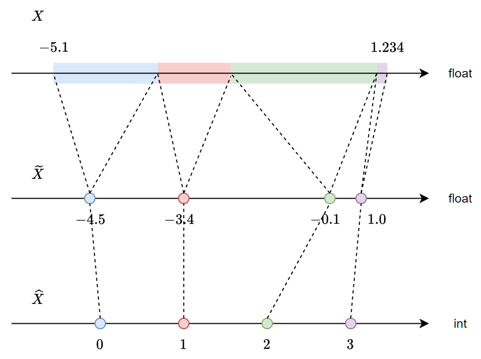
</center>

不同类型数据的分布和采样点数, 以[float32](https://www.h-schmidt.net/FloatConverter/IEEE754.html)和int8为例  

|数据类型|数据点|数据范围|
|-|-|-|
|float32|2^32|−3.4028235×10^38 ~ 3.4028235.4013×10^38|
|int8|2^8|−128 ~ 127|

## 收益
以float32 -> int8为例，暂时忽略量化相关的参数， 因为相对于矩阵的存储， 量化参数非常少。  
存储降低的情况： 31bit/number -> 8bit/number , 4倍存储下降。  
计算需求的降低： 31bit float GEMM -> 8bit float GEMM + elementwise multiply(可以通过折叠消除) + quant + dequant. [收益示例](#gemm-acclerate)  ( GEMM: general matrix multiply )

## 核心问题
只讨论非MOE结构。（MOE存在路由变动问题， 路由变动后由于token会路由到其他expert， 误差相对于量化误差会大很多， 常见做法是不对moe层做量化） </br>
指标的变化受量化导致的数值变动影响。因此，如何降低量化导致的数值变动是核心问题。  </br>
数据分布范围对量化的影响，以两通道的数据分布举例：通道1的最值是127, 通道2的最值是0.5，采用同一套量化参数对两通道量化，通道2的所有数值都会变成0。通道间的数值差异导致的部分数据量化误差变大的情况也可以在同一通道内发生。（因此会有outlier导致误差变大）
## 量化分类
### 方案分类
|量化方案分类|主要做法|优点|缺点|
|-|-|-|-|
|QAT(量化感知训练)|让模型在训练过程中感知到量化误差，依靠伪量化实现|训练后精度高|训练成本大，需要有标数据|
|PTQ(训练后量化)|在训练完成后对权重（与激活值）做量化|高效，只需要校准数据或者无需数据|精度可能较低|

问题：伪量化本身不可导，使用梯度直通让数学上不可微的量化操作可以传递梯度。后文有具体[实现](#qat-ste-code)

### 量化方式分类
对称量化与非对称量化

示意图<p align="center">
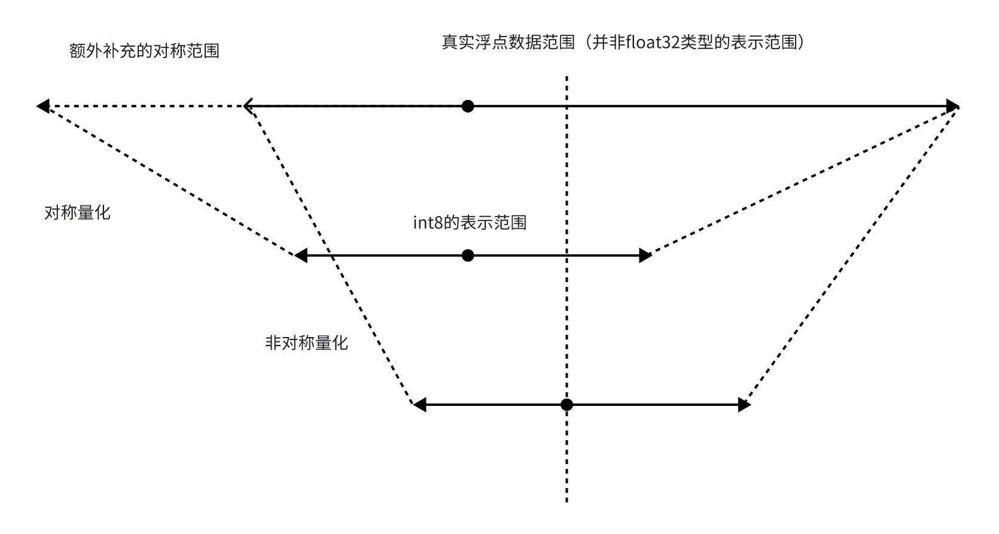
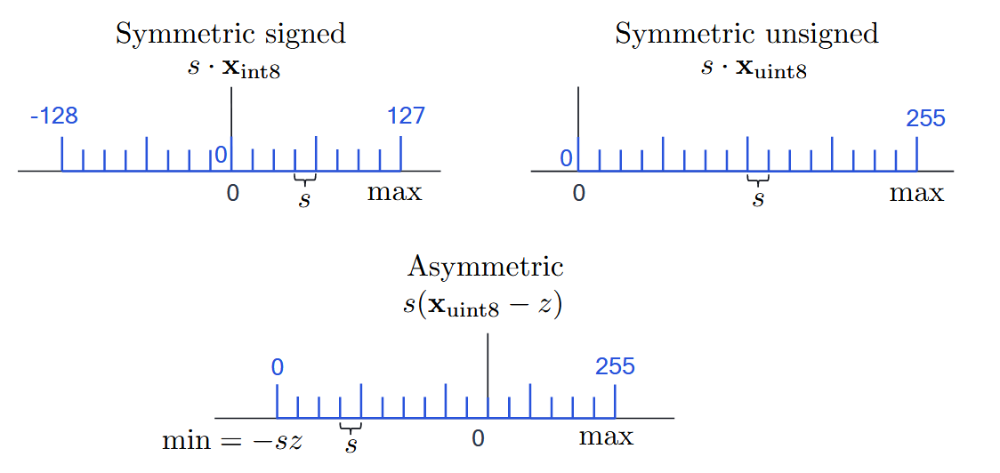
</p>


|量化类型|特点|
|-|-|
|对称量化|零点没有偏移，因此量化参数只有scale，没有zero_point, 但是由于原始数据分布不对称会有空间浪费|
|非对称量化|零点有偏移，包含zero_point量化参数，但是范围更吻合，量化损失较小|

计算量对比

$$
\begin{align}
\widehat{\mathbf{W}}\widehat{\mathbf{x}} 
&= s_w \left( \mathbf{W}_{\text{int}} - z_w \right) s_x \left( \mathbf{x}_{\text{int}} - z_x \right) \\[4pt]
&= s_w s_x \mathbf{W}_{\text{int}} \mathbf{x}_{\text{int}}
- \textcolor{red}{s_w z_w s_x \mathbf{x}_{\text{int}}}
- \textcolor{blue}{s_w s_x z_x \mathbf{W}_{\text{int}}}
+ \textcolor{yellow}{s_w z_w s_x z_x}.
\end{align}
$$

后三项是非对称量化相对于对称量化在反量化过程中产生的额外计算，黄色部分是标量常量（可以折叠到蓝色部分中），蓝色部分是矩阵常量（权重信息是已知的，所以可以提前计算好存储下来，但是仍然有矩阵加法的开销），红色部分是激活值相关的计算，需要在前向计算中才能获取到值（额外计算量是elementwise乘和矩阵加法）。  
相对于对称量化计算量增加较多，因此不太采用非对称量化方案。
## 整体计算过程示意
<center class=img>
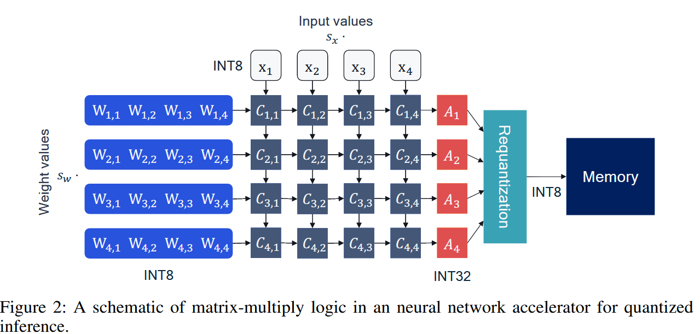
</center>

说明： int8一般表示得比较满，使用int8存储结果几乎一定会溢出，因此int8的GEMM结果常采用int32存储
## 论文及分类    
1. 综述:
[A White Paper on Neural Network Quantization](https://arxiv.org/pdf/2106.08295)  

2. 训练前分布约束技术：   
[PACT: Parameterized Clipping Activation for Quantized Neural Networks](https://arxiv.org/pdf/1805.06085)   
[R2 Loss: Range Restriction Loss for Model Compression and Quantization](https://arxiv.org/pdf/2303.08253)  
[Robust Quantization: One Model to Rule Them All](https://arxiv.org/pdf/2002.07686)  
3. PTQ技术(目前主要面向Transformer结构, 实际的计算是Linear, 但是在语音中conformer中是有conv结构的, 也需要关注面向conv的量化方案)：   
最直观降低误差的手段:  
    [LLM.int8(): 8-bit Matrix Multiplication for Transformers at Scale](https://arxiv.org/pdf/2208.07339)     
基于数据的观察：   
    [SmoothQuant: Accurate and Efficient Post-Training Quantization for Large Language Models](https://arxiv.org/pdf/2211.10438)    
    [ZeroQuant: Efficient and Affordable Post-Training Quantization for Large-Scale Transformers](https://arxiv.org/pdf/2206.01861)    
    [AWQ: Activation-aware Weight Quantization for LLM Compression and Acceleration](https://arxiv.org/pdf/2306.00978)  
数学分析：   
    [Up or Down? Adaptive Rounding for Post-Training Quantization](https://arxiv.org/pdf/2004.10568)  
    [Data-Free Quantization Through Weight Equalization and Bias Correction](https://arxiv.org/pdf/1906.04721)  

## LLM.int8()
[可用代码](https://github.com/bitsandbytes-foundation/bitsandbytes)  
思想: 把量化误差较大的通道不量化，对通道进行分离，部分通道使用float GEMM, 部分通道使用int GEMM。不量化的通道如何选择？激活值比较大的通道。
<center class=img>
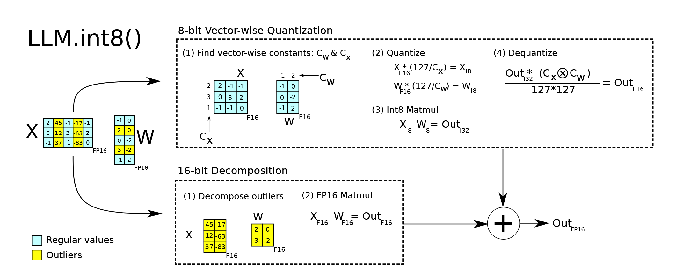
</center>
问题：矩阵分解其实成本比较高。是否有对阈值设置的说明? 

实验结果 

<div align="center">

### Quantization Performance Comparison

</div>

| Parameters | 125M | 1.3B | 2.7B | 6.7B | 13B |
|-------------|------|------|------|------|------|
| <span style="color:yellow">32-bit Float</span> | 25.65 | 15.91 | 14.43 | 13.30 | 12.45 |
| <span style="color:yellow">Int8 absmax</span> | 87.76 | 16.55 | 15.11 | 14.59 | 19.08 |
| <span style="color:yellow">Int8 zeropoint</span> | 56.66 | 16.24 | 14.76 | 13.49 | 13.94 |
| <span style="color:yellow">Int8 absmax row-wise</span> | 30.93 | 17.08 | 15.24 | 14.13 | 16.49 |
| <span style="color:yellow">Int8 absmax vector-wise</span> | 35.84 | 16.82 | 14.98 | 14.13 | 16.48 |
| <span style="color:yellow">Int8 zeropoint vector-wise</span> | 25.72 | 15.94 | 14.36 | 13.38 | 13.47 |
| <span style="color:yellow">Int8 absmax row-wise + decomposition</span> | 30.76 | 16.19 | 14.65 | 13.25 | 12.46 |
| <span style="color:yellow">Absmax LLM.int8() (vector-wise + decomp)</span> | 25.83 | 15.93 | 14.44 | <span style="color:green">13.24</span> | <span style="color:green">12.45</span> |
| <span style="color:yellow">Zeropoint LLM.int8() (vector-wise + decomp)</span> | <span style="color:green">25.69</span> | <span style="color:green">15.92</span> | <span style="color:green">14.43</span> | <span style="color:green">13.24</span> | <span style="color:green">12.45</span> |

## smoothquant
思想：基于数据观察。
1. 激活通道间最大值分布差异较大，权重通道间分布差异较小
    <center class=img>
    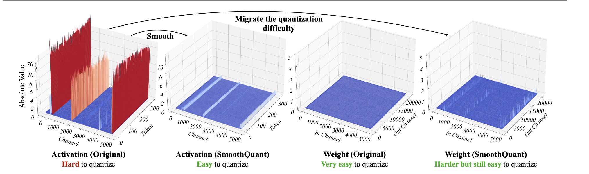
    </center>
2. 大值通道的量化误差会比较大
3. 通过等价的数学变换把激活值的大值往权重转移
$$ \mathbf{Y} = (\mathbf{X} \, \mathrm{diag}(\mathbf{s})^{-1}) \cdot (\mathrm{diag}(\mathbf{s}) \mathbf{W}) = \hat{\mathbf{X}} \hat{\mathbf{W}}
 $$
 <center class=img>
 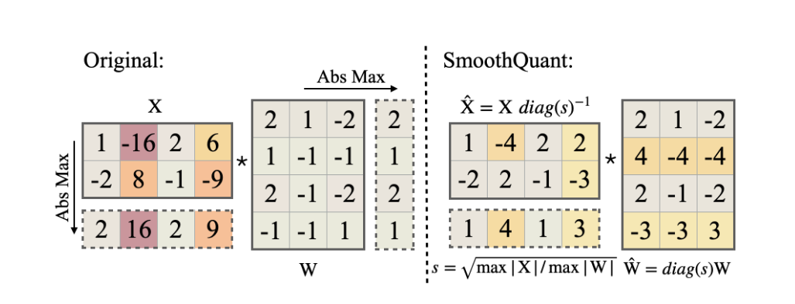
 </center>

实验结果

<div align="center">

### Quantization Method Comparison

</div>

| Method | Weight | Activation |
|---------|---------|-------------|
| W8A8 | per-tensor | per-tensor dynamic |
| ZeroQuant | group-wise | per-token dynamic |
| LLM.int8()| per-channel | per-token dynamic + FP16 |
| Outlier Suppression | per-tensor | per-tensor static |
|---|---|---|
| SmoothQuant-O1 | per-tensor | per-token dynamic |
| SmoothQuant-O2 | per-tensor | per-tensor dynamic |
| SmoothQuant-O3 | per-tensor | per-tensor static |

<div align="center">

### OPT-175B Quantization Evaluation

</div>

| OPT-175B | LAMBADA | HellaSwag | PIQA | WinoGrande | OpenBookQA | RTE | COPA | Average ↑ | WikiText ↓ |
|-----------|----------|------------|------|-------------|-------------|-----|------|-------------|--------------|
| **FP16** | 74.7% | 59.3% | 79.7% | 72.6% | 34.0% | 59.9% | 88.0% | 66.9% | 10.99 |
| **W8A8** | 0.0% | 25.6% | 53.4% | 50.3% | 14.0% | 49.5% | 56.0% | 35.5% | 93080 |
| **ZeroQuant** | 0.0% | 26.0% | 51.7% | 49.3% | 17.8% | 50.9% | 55.0% | 35.8% | 84648 |
| **LLM.int8()** | 74.7% | <span style="color:green">59.2%</span> | <span style="color:green">79.7%</span> | <span style="color:green">72.1%</span> | 34.2% | <span style="color:green">60.3%</span> | 87.0% | 66.7% | <span style="color:green">11.0</span> |
| **Outlier Suppression** | 0.0% | 25.8% | 52.5% | 48.6% | 16.6% | 53.4% | 55.0% | 36.0% | 96151 |
|---|---|---|---|---|---|---|---|---|---|
| **SmoothQuant-O1** | 74.7% | <span style="color:green">59.2%</span> | <span style="color:green">79.7%</span> | 71.2% | <span style="color:green">33.4%</span> | 58.1% | 89.0% | 66.5% | 11.11 |
| **SmoothQuant-O2** | <span style="color:green">75.0%</span> | 59.0% | 79.2% | 71.2% | 33.0% | 59.6% | 88.0% | 66.4% | 11.14 |
| **SmoothQuant-O3** | 74.6% | 58.9% | <span style="color:green">79.7%</span> | 71.2% | <span style="color:green">33.4%</span> | 59.9% | <span style="color:green">90.0%</span> | <span style="color:green">66.8%</span>| 11.17 |


## AWQ(activation-aware weight quantization)
是weight-only的方案，但是量化bit数较低。为3-4bit  
思路：
1. 权重对于模型性能的贡献是不平衡的，其中只有部分权重（0.1%-1%）是显著的，跳过这些权重的量化会显著降低量化带来的性能下降。
   <center class=img>
   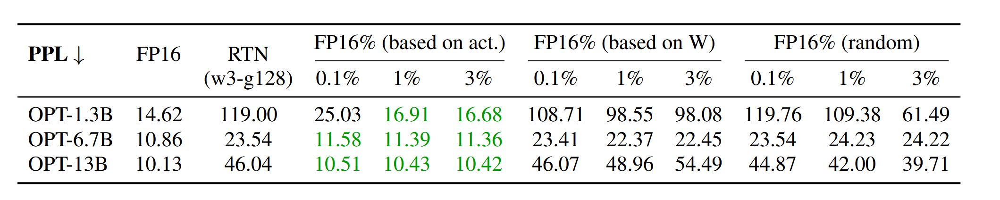
   </center>
2. 不同于LLM.int8()方案，如果将对应的显著通道权重不量化，依然会面临kernel复杂的问题。通过对显著通道的权重做放大来降低量化误差。可以以（255, 0.5）的例子说明，对max为0.5的通道做放大，然后量化，反量化后在除以放大系数，可以显著降低量化损失。并且可以直接使用per-tensor量化。  
最左侧是RTN，中间是LLM.int8(), 右侧是AWQ。 
   <center class="img">
   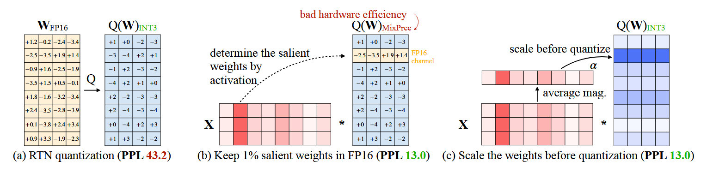
   </center>
3. 自动化检索出显著的通道权重。 $$ \mathcal{L}(\mathbf{s}) = \left\| Q(\mathbf{W} \cdot \mathrm{diag}(\mathbf{s})) (\mathrm{diag}(\mathbf{s})^{-1} \cdot \mathbf{X}) - \mathbf{W}\mathbf{X} \right\| $$
4. 3中的$Q()$是量化函数，是不可导的。可以使用梯度直通等近似方案学习，但是论文提出这样的收敛过程不够稳定。一般不可导的处理有三种方案：近似估计，离散分布松弛成连续的（adaround使用的方法），离散值的空间检索（grid search）。论文采用了第三种grid search的方案。公式如下，$\mathbf{s}_{\mathbf{X}}$是激活值每个通道的均值，$\alpha$是指数调整系数。在$[0-1]$之间做grid search。策略比较简单，只有一个超参$\alpha$需要确定。

$$\mathbf{s} = \mathbf{s}_{\mathbf{X}}^{\alpha},\qquad\alpha^{*} = \arg\min_{\alpha} \mathcal{L}\left(\mathbf{s}_{\mathbf{X}}^{\alpha}\right)$$


5. 基于AWQ实现了边缘设备LLM部署框架[TinyChat](https://github.com/mit-han-lab/TinyChatEngine)。框架的核心是高效的权重读取和kernel fusion (做个补充说明)

实验结果
<div align="center">

### OPT (PPL↓) Comparison

</div>

| **OPT (PPL↓)** | 1.3B | 2.7B | 6.7B | 13B | 30B |
|----------------|------|------|------|------|------|
| **FP16** | 14.62 | 12.47 | 10.86 | 10.13 | 9.56 |
|---|---|---|---|---|---|
| **RTN** | 119.47 | 298.00 | 23.54 | 46.04 | 18.80 |
| **1% FP16** | 16.91 | 13.69 | <span style="color:green">11.39</span> | <span style="color:green">10.43</span> | 9.85 |
| *s = 2* | 18.63 | 14.94 | 11.92 | 10.80 | 10.32 |
| **AWQ** | <span style="color:green">16.32</span> | <span style="color:green">13.58</span> | <span style="color:green">11.39</span> | 10.56 | <span style="color:green">9.77</span> |

</div>

1. S = 2 是直接设置显著通道的权重值的配置


## Bias Correction (DFQ)
主要测试模型是CV的模型，应该比较适配conv结构，语音模型可以参考。是一个weight-only的方案。  
能做到DFQ（data_free_quantization有条件的： 模型有BN层， 那LN是不是可以， 从统计的角度看是可以的）  
conv的权重没有transformer的linear中的那么平坦。
<center class=img>
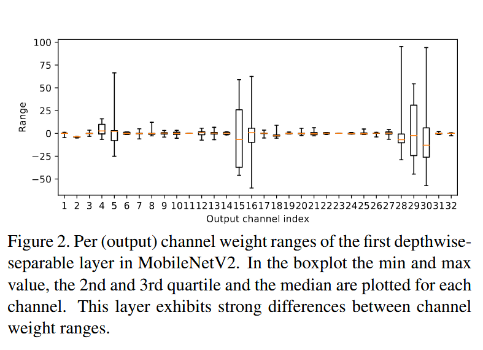
</center>  
跨层的权重均衡  
理论公式： 
$$ \begin{aligned}
\mathbf{y} &= f(\mathbf{W}^{(2)} f(\mathbf{W}^{(1)} \mathbf{x} + \mathbf{b}^{(1)}) + \mathbf{b}^{(2)}) \\
&= f(\mathbf{W}^{(2)} \mathbf{S} \hat{f}(\mathbf{S}^{-1} \mathbf{W}^{(1)} \mathbf{x} + \mathbf{S}^{-1} \mathbf{b}^{(1)}) + \mathbf{b}^{(2)}) \\
&= f(\hat{\mathbf{W}}^{(2)} \hat{f}(\hat{\mathbf{W}}^{(1)} \mathbf{x} + \hat{\mathbf{b}}^{(1)}) + \mathbf{b}^{(2)})
\end{aligned} $$
上面公式有一个需要回答的点：公式是针对matrix multiply的，但是作用的模型是MobileNetV2, 实际结构是conv。所以需要一个理解conv和矩阵计算等价性的[工具](./assets/html/conv_im2col_demo.html) [视频](https://www.youtube.com/watch?v=Ks8GCpRtyAA)  
在卷积和矩阵乘等价后，公式中每个通道上的缩放其实就对应的每个conv kernel的缩放。  
缩放的系数怎么确定（论文没有回答做pooling时怎么办）？  
先定义：$$ \hat{\mathbf{p}}_{i}^{(1)} = \frac{\hat{\mathbf{r}}_{i}^{(1)}}{\hat{\mathbf{R}}^{(1)}} $$  分子是每个通道的最大值，分母是整个矩阵的最大值  
优化目标：$$ \max_{\mathbf{S}} \sum_{i} \hat{\mathbf{p}}_{i}^{(1)} \hat{\mathbf{p}}_{i}^{(2)} $$ S是缩放系数，会影响分子的大小，也可能间接影响分母的大小  
两层时的解析解：$$ \mathbf{s}_{i} = \frac{1}{\mathbf{r}_{i}^{(2)}} \sqrt{\mathbf{r}_{i}^{(1)} \mathbf{r}_{i}^{(2)}} $$  
最后每两层不断迭代，直到基本收敛。

高偏置吸收（有些鸡肋）  
原因：上面的操作是对weight进行的操作，当conv kernel的系数w，b被放缩时，b的变动可能会导致activation进行整体偏移。b相当于直流分量，是独立于激活值的，b太大会导致卷积结果中出现outliers，因此对b做调整，进行减小。  
$$ \begin{aligned}
\mathbf{y} &= \mathbf{W}^{(2)} \mathbf{h} + \mathbf{b}^{(2)} \\
&= \mathbf{W}^{(2)} \big(r(\mathbf{W}^{(1)} \mathbf{x} + \mathbf{b}^{(1)}) + \mathbf{c} - \mathbf{c}\big) + \mathbf{b}^{(2)} \\
&= \mathbf{W}^{(2)} \big(r(\mathbf{W}^{(1)} \mathbf{x} + \hat{\mathbf{b}}^{(1)}) + \mathbf{c}\big) + \mathbf{b}^{(2)} \\
&= \mathbf{W}^{(2)} \hat{\mathbf{h}} + \hat{\mathbf{b}}^{(2)}
\end{aligned} $$

其实作用不大，relu不是严格满足第三行到第四行的变化的，会在零点部分有误差。论文通过对c进行选择 $ \mathbf{c} = \max(0, \beta - 3\gamma) $，让较小数量（0.135%）的数据受到影响。但是c的作用本来就是抑制大b，数值不能大的话，起不到好的抑制作用。所以不如不用，还引入了近似。

<center class=img>
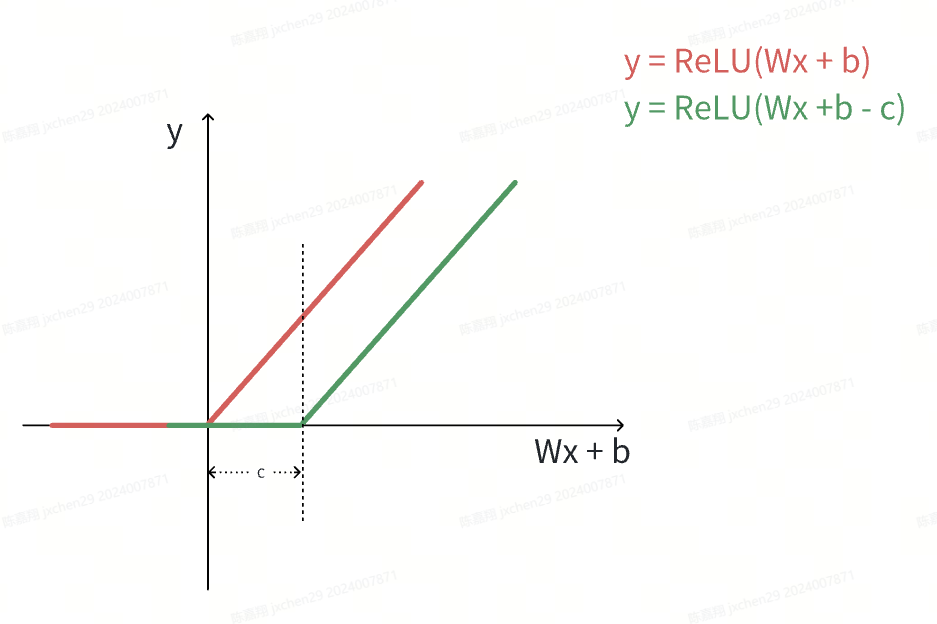
</center>

量化偏置修正  
定义：$$ \epsilon = \widetilde{\mathbf{W}} - \overline{\mathbf{W}}  $$
误差：$$ \widetilde{\mathbf{y}} = \mathbf{y} + \epsilon \mathbf{x} $$
期望：$$ \begin{aligned}
\mathbb{E}[\mathbf{y}] &= \mathbb{E}[\mathbf{y}] + \mathbb{E}[\epsilon \mathbf{x}] - \mathbb{E}[\epsilon \mathbf{x}] \\
&= \mathbb{E}[\widetilde{\mathbf{y}}] - \mathbb{E}[\epsilon \mathbf{x}].
\end{aligned} $$

为什么要修正：希望做完量化后的计算期望不变，但是由于数据分布可能不能满足，那就把期望的变动找出来减掉，这样可以降低误差。

最后一项可以中的 $\epsilon$在量化完成后是常量 ，只需要知道 $\mathbb{E}[\mathbf{x}]$就可以获得结果。这个数据在有BN的情况下可以直接获取。

## AdaRound
思路：
1. 通过数学分析量化误差证明在考虑二阶误差的情况下RTN（round to nearest）不一定是最优解。

\begin{aligned}
\mathbb{E} \big[ \mathcal{L}(\mathbf{x}, \mathbf{y}, \mathbf{w} + \Delta \mathbf{w}) - \mathcal{L}(\mathbf{x}, \mathbf{y}, \mathbf{w}) \big]
&\overset{(a)}{\approx} \mathbb{E} \Big[ \Delta \mathbf{w}^T \cdot \nabla_{\mathbf{w}} \mathcal{L}(\mathbf{x}, \mathbf{y}, \mathbf{w}) \\
&\quad + \frac{1}{2} \Delta \mathbf{w}^T \cdot \nabla_{\mathbf{w}}^2 \mathcal{L}(\mathbf{x}, \mathbf{y}, \mathbf{w}) \cdot \Delta \mathbf{w} \Big] \\
&= \Delta \mathbf{w}^T \cdot \mathbf{g}^{(\mathbf{w})} + \frac{1}{2} \Delta \mathbf{w}^T \cdot \mathbf{H}^{(\mathbf{w})} \cdot \Delta \mathbf{w},
\end{aligned}

用2个元素的矢量简化w，当假设下面这种情况时（不失一般性）:   
$ \Delta \mathbf{w}^T = [\, \Delta w_1 \;\; \Delta w_2 \,] $
与
$ \mathbf{H}^{(\mathbf{w})} =
\begin{bmatrix}
1 & 0.5 \\
0.5 & 1
\end{bmatrix} 
$
得到误差形式：
$$ \Delta \mathbf{w}^T \cdot \mathbf{H}^{(\mathbf{w})} \cdot \Delta \mathbf{w}
= \Delta \mathbf{w}_1^2 + \Delta \mathbf{w}_2^2 + \Delta \mathbf{w}_1 \Delta \mathbf{w}_2 $$
这种情况下，每个w都做RTN就不一定误差最小了。  
2. 实验验证随机取整的上限优于RTN。准确率与误差成反比。
   <center class=img>
   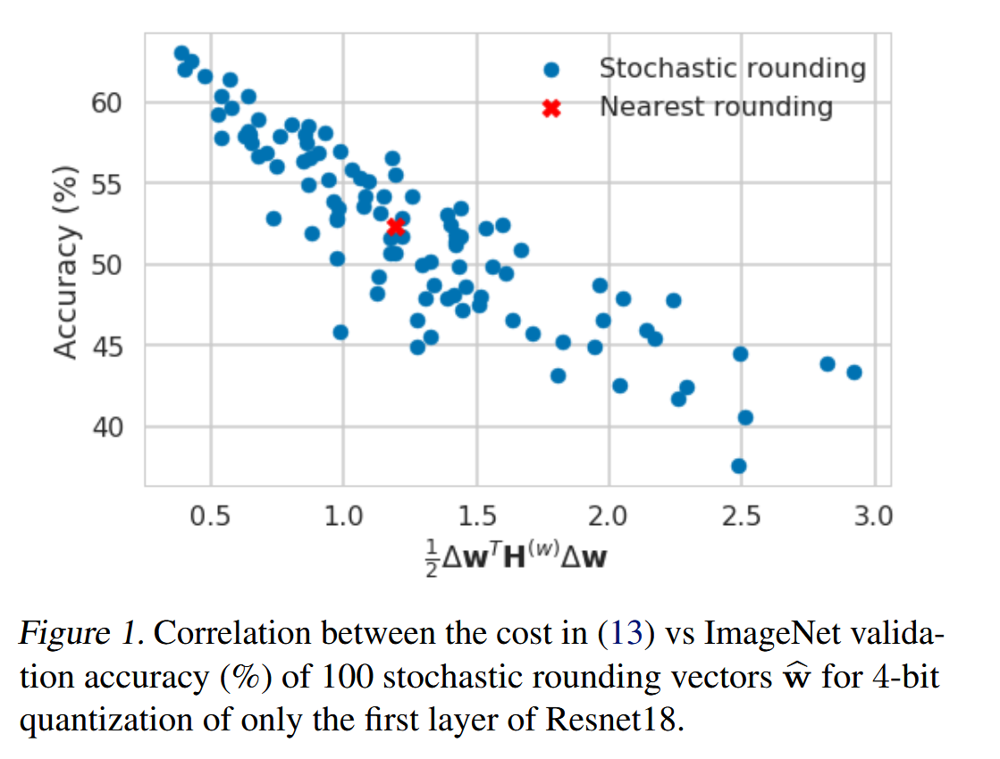
   </center>
3. 如何找到一个较好的取整方案。取整本身是离散优化问题，直接做的话需要遍历解空间，太大了，基本没法解。<br>     
4. 引入辅助变量，对空间进行松弛（让解可以搜索非离散值），将问题变成连续的优化问题。    
   优化问题定义：   

 
   $$ 
   \arg\min_{\mathbf{V}} \left\| \mathbf{W}\mathbf{x} - \widetilde{\mathbf{W}}\mathbf{x} \right\|_F^2 + \lambda f_{\mathrm{reg}}(\mathbf{V})
   $$

   $$
   \widetilde{\mathbf{W}} = \mathbf{s} \cdot \mathrm{clip}\!\left( \left\lfloor \frac{\mathbf{W}}{\mathbf{s}} \right\rfloor + h(\mathbf{V}), \mathbf{n}, \mathbf{p} \right)
   $$

   $$
   h(\mathbf{V}_{i,j}) = \mathrm{clip}\big( \sigma(\mathbf{V}_{i,j})(\zeta - \gamma) + \gamma,\, 0,\, 1 \big) 
   $$

   辅助函数的形状：
   <center class=img>
   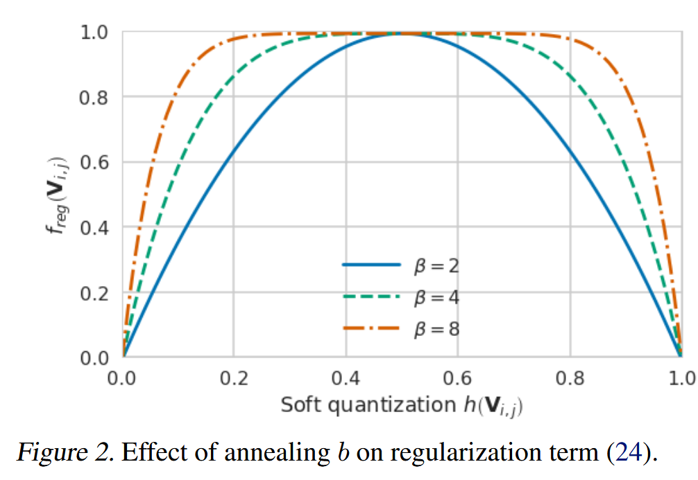
   </center>

5. 优化过程: 辅助函数使用退火策略,前期偏向于自由探索（高  $\beta$ 值下辅助函数比较平坦 ）,  后期让 $h(\mathbf{V}_{i,j})  $ 收敛到0和1    
6. 优化结果：
   <center class=img>
   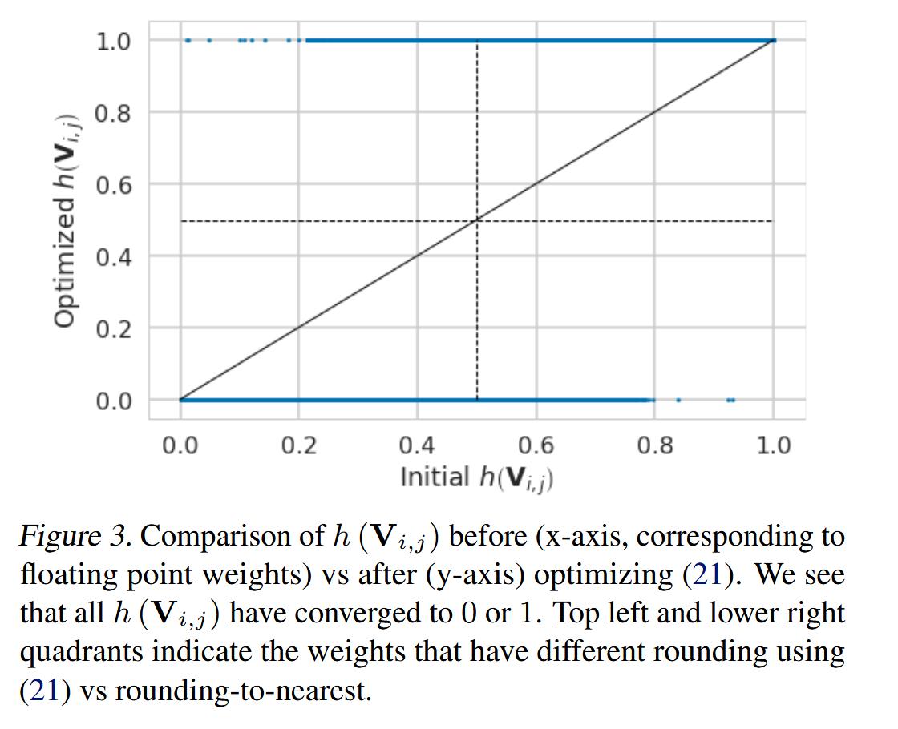
   </center>

实验结果

<div align="center">

### Comparison of Quantization Optimization Methods

</div>

| **Optimization** | **#bits W/A** | **ResNet18** | **ResNet50** | **InceptionV3** | **MobileNetV2** |
|------------------|---------------|---------------|---------------|------------------|------------------|
| Full precision | 32/32 | 69.68 | 76.07 | 77.40 | 71.72 |
| DFQ ([Nagel et al., 2019](#)) | 8/8 | 69.7 | – | – | 71.2 |
|---|---|---|---|---|---|
| Nearest | 4/32 | 23.99 | 35.60 | 1.67 | 8.09 |
| OMSE+opt ([Choukroun et al., 2019](#)) | 4/32 | 67.12 | 74.67 | 73.66 | – |
| OCS ([Zhao et al., 2019](#)) | 4/32 | – | 66.2 | 4.8 | – |
| AdaRound | 4/32 | <span style="color:green">68.71±0.06</span> | <span style="color:green">75.23±0.04</span> | <span style="color:green">75.76±0.09</span> | <span style="color:green">69.78±0.05</span> |
|---|---|---|---|---|---|
| DFQ (our impl.) | 4/8 | 38.98 | 52.84 | – | 46.57 |
| Bias corr ([Banner et al., 2019](#)) | 4/8 | 67.4 | 74.8 | 59.5 | – |
| AdaRound w/ act quant | 4/8 | <span style="color:green">68.55±0.01</span> | <span style="color:green">75.01±0.05</span> | <span style="color:green">75.72±0.09</span> | <span style="color:green">69.25±0.06</span> |

1. 这里的bias corr不是DFQ中的。是另一篇论文。

## zero quant
创新点：
1. 权重采用group wise quantization, 激活采用token wise quantization(适配LN, 可以fold)
2. layer-by-layer knowledge distillation. 低比特基本都需要蒸馏，LKD显著降低了显存需求。
3. 把量化/反量化折叠到前置和后置计算中，消除了量化/反量化带来的额外计算开销。

量化带来的指标下降原因分析
<center class=img>
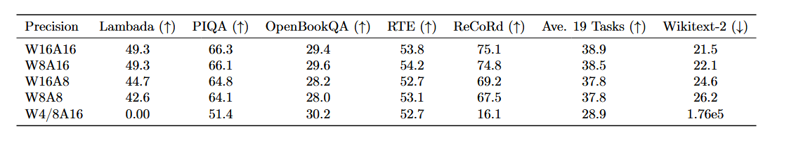
</center>

LKD的做法：当蒸馏第K层的时候，量化模型并非采用前K-1个量化后的层。而是只蒸馏第K层，额外的显存开销较小。
<center class=img>
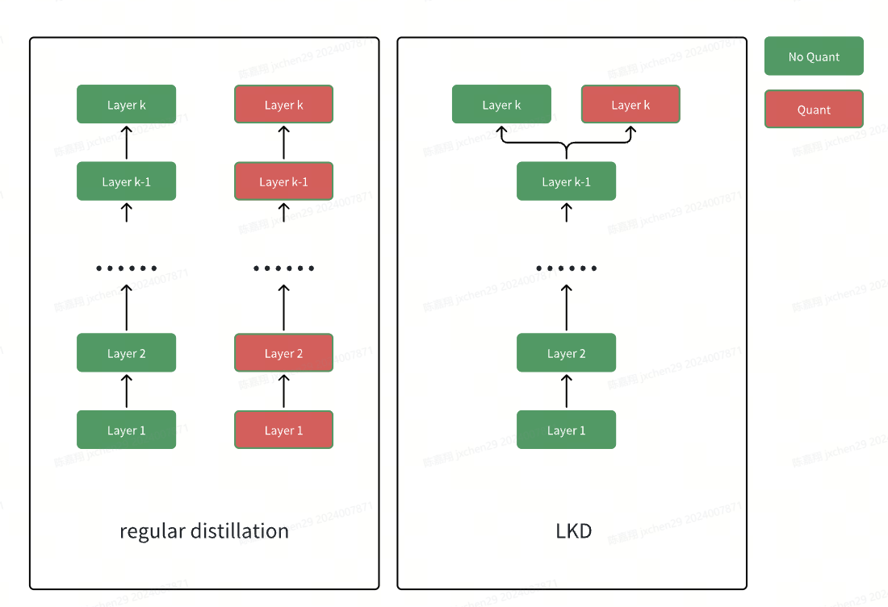
</center>

量化/反量化的fold消除
<center class=img>
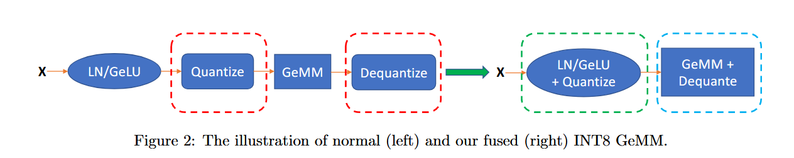
</center>

折叠的示例, [代码示例以及计算加速效果](https://triton-lang.org/main/getting-started/tutorials/02-fused-softmax.html#sphx-glr-getting-started-tutorials-02-fused-softmax-py)
<center class=img>
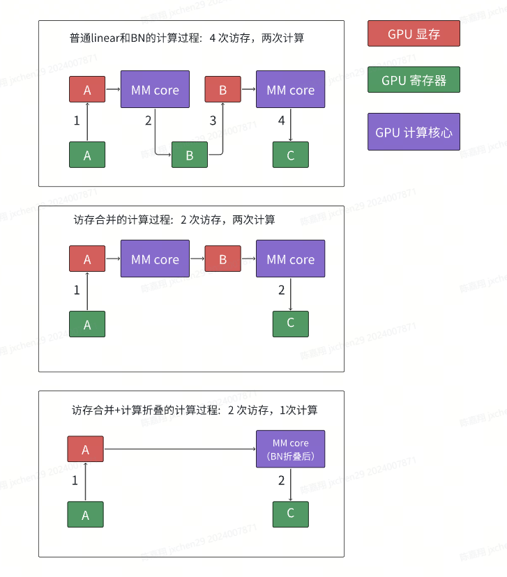
</center>

实验结果

<div align="center">

### Performance Comparison under Different Quantization Precisions

</div>

| **Precision (Method)** | **Lambada (↑)** | **PIQA (↑)** | **OpenBookQA (↑)** | **RTE (↑)** | **ReCoRd (↑)** | **Ave. 19 Tasks (↑)** | **Wikitext-2 (↓)** | **Time Cost** |
|-------------------------|-----------------|---------------|---------------------|--------------|----------------|-----------------------|---------------------|----------------|
| **W16A16** | 61.3 | 71.4 | 33.6 | 53.1 | 82.6 | 42.4 | 15.3 | N/A |
| **W8A8 (PTQ)** | 54.8 | 67.7 | 16.6 | 54.5 | 75.7 | 40.5 | 18.9 | 13 mins |
| **W8A8 (ZeroQuant)** | 62.6 | 70.7 | 33.4 | 52.7 | 80.9 | 42.3 | 15.7 | 0 |
|---|---|---|---|---|---|---|---|---|
| **W4/8A16 (PTQ)** | 0.00 | 50.4 | 27.0 | 50.9 | 15.8 | 29.0 | 1.35e5 | 13 mins |
| **W4/8A16 (ZeroQuant)** | 43.9 | 66.5 | 30.0 | 52.7 | 77.3 | 39.38 | 21.9 | 0 |
| **W4/8A16 (ZeroQuant-LKD)** | 59.4 | 69.5 | 31.6 | 52.7 | 79.7 | 41.5 | 17.6 | 3 hours |
|---|---|---|---|---|---|---|---|---|
| **W4/8A8 (ZeroQuant)** | 46.8 | 66.4 | 28.8 | 52.7 | 76.2 | 39.24 | 24.1 | 0 |
| **W4/8A8 (ZeroQuant-LKD)** | 48.7 | 68.1 | 29.0 | 52.0 | 77.4 | 39.90 | 18.2 | 3 hours |

<a id="qat-ste-code">QAT梯度直通示例</a>  

```python
# 核心模块示例, 如何自定义一个数学上不可微分操作的反向传播函数
import torch
from torch.autograd import Function

class FakeQuantizeSTE(Function):
    @staticmethod
    def forward(ctx, input, scale):
        return torch.round(input / scale) * scale

    @staticmethod
    def backward(ctx, grad_output):
        return grad_output, None

x = torch.randn(3, requires_grad=True)
scale = torch.tensor(0.1)
y = FakeQuantizeSTE.apply(x, scale)
y.sum().backward()
print(x.grad)
```

```python
# ste_fake_quant_demo.py
import math
import torch
import torch.nn as nn
import torch.nn.functional as F

# -------- Fake Quant with STE (autograd.Function) --------
class FakeQuantizeFunction(torch.autograd.Function):
    @staticmethod
    def forward(ctx, x, num_bits, symmetric, per_channel, ch_axis, eps):
        # 计算 scale/zero_point（简单版：逐次前向用min/max估计）
        if per_channel:
            # 按通道统计 min/max
            reduce_dims = [d for d in range(x.dim()) if d != ch_axis]
            x_min = x.amin(dim=reduce_dims, keepdim=True)
            x_max = x.amax(dim=reduce_dims, keepdim=True)
        else:
            x_min = x.min()
            x_max = x.max()

        if symmetric:
            # 对称量化：零点为0
            qmax = 2 ** (num_bits - 1) - 1
            m = torch.maximum(x_max.abs(), x_min.abs())
            scale = torch.maximum(m / qmax, torch.tensor(eps, device=x.device, dtype=x.dtype))
            zero_point = 0.0
            x_clamp_min = -qmax * scale
            x_clamp_max =  qmax * scale
        else:
            # 非对称：映射到 [0, 2^b-1]
            qmin, qmax = 0, 2 ** num_bits - 1
            scale = torch.maximum((x_max - x_min) / max(qmax - qmin, 1), torch.tensor(eps, device=x.device, dtype=x.dtype))
            zero_point = torch.clamp(torch.round(qmin - x_min / scale), qmin, qmax)
            x_clamp_min = (0.0 - zero_point) * scale
            x_clamp_max = (qmax - zero_point) * scale

        # 保存范围用于反向时做简单截断（可选）
        ctx.save_for_backward(x, x_clamp_min, x_clamp_max)
        ctx.num_bits = num_bits
        ctx.symmetric = symmetric
        ctx.per_channel = per_channel
        ctx.ch_axis = ch_axis
        ctx.eps = eps

        # 量化 -> 反量化
        if symmetric:
            q = torch.round(x / scale)
            q = torch.clamp(q, -(2**(num_bits-1)), 2**(num_bits-1)-1)
            x_hat = q * scale
        else:
            q = torch.round(x / scale + zero_point)
            q = torch.clamp(q, 0, 2**num_bits - 1)
            x_hat = (q - zero_point) * scale

        return x_hat

    @staticmethod
    def backward(ctx, grad_output):
        # STE：忽略round的梯度，近似 d/dx (x) = 1
        x, x_clamp_min, x_clamp_max = ctx.saved_tensors
        # 在可表示范围内直通，范围外可选择截断为0（常见简化）
        pass_through = (x >= x_clamp_min) & (x <= x_clamp_max)
        grad_input = grad_output * pass_through.to(grad_output.dtype)
        # 非张量参数的梯度为 None
        return grad_input, None, None, None, None, None

# -------- 便捷模块封装 --------
class FakeQuantize(nn.Module):
    def __init__(self, num_bits=8, symmetric=True, per_channel=False, ch_axis=1, eps=1e-8):
        super().__init__()
        self.num_bits = num_bits
        self.symmetric = symmetric
        self.per_channel = per_channel
        self.ch_axis = ch_axis
        self.eps = eps

    def forward(self, x):
        return FakeQuantizeFunction.apply(
            x, self.num_bits, self.symmetric, self.per_channel, self.ch_axis, self.eps
        )

# 将权重也做伪量化（常见做法：前向时对权重做伪量化）
class QuantLinear(nn.Linear):
    def __init__(self, in_features, out_features, bias=True,
                 w_num_bits=8, a_num_bits=8, symmetric=True):
        super().__init__(in_features, out_features, bias=bias)
        self.w_fake = FakeQuantize(num_bits=w_num_bits, symmetric=symmetric, per_channel=True, ch_axis=0)
        self.a_fake = FakeQuantize(num_bits=a_num_bits, symmetric=symmetric, per_channel=False)

    def forward(self, x):
        # 激活伪量化（前一层输出）
        x_q = self.a_fake(x)
        # 权重伪量化（对 weight 做 per-channel，对应 out_features 维度）
        w_q = self.w_fake(self.weight)
        b = self.bias
        return F.linear(x_q, w_q, b)

# -------- 一个极简可跑的训练 demo --------
def synthetic_regression(n=1024, in_dim=16, out_dim=1, noise=0.1, seed=0, device="cpu"):
    g = torch.Generator().manual_seed(seed)
    X = torch.randn(n, in_dim, generator=g)
    w_true = torch.randn(in_dim, out_dim, generator=g)
    y = X @ w_true + noise * torch.randn(n, out_dim, generator=g)
    return X.to(device), y.to(device)

class TinyQATNet(nn.Module):
    def __init__(self, in_dim=16, hidden=32, out_dim=1):
        super().__init__()
        self.fc1 = QuantLinear(in_dim, hidden, w_num_bits=8, a_num_bits=8, symmetric=True)
        self.act = nn.ReLU()
        self.fc2 = QuantLinear(hidden, out_dim, w_num_bits=8, a_num_bits=8, symmetric=True)

    def forward(self, x):
        x = self.fc1(x)
        x = self.act(x)
        x = self.fc2(x)
        return x

def main():
    device = "cuda" if torch.cuda.is_available() else "cpu"
    torch.manual_seed(42)

    X, y = synthetic_regression(n=2048, in_dim=16, out_dim=1, noise=0.1, seed=123, device=device)
    model = TinyQATNet(in_dim=16, hidden=32, out_dim=1).to(device)

    opt = torch.optim.Adam(model.parameters(), lr=1e-3)
    loss_fn = nn.MSELoss()

    model.train()
    for step in range(1, 301):
        # 小批量
        idx = torch.randint(0, X.size(0), (128,), device=device)
        xb, yb = X[idx], y[idx]

        pred = model(xb)
        loss = loss_fn(pred, yb)

        opt.zero_grad()
        loss.backward()
        opt.step()

        if step % 50 == 0:
            with torch.no_grad():
                mse_all = loss_fn(model(X), y).item()
            print(f"step {step:4d} | batch_loss={loss.item():.4f} | full_MSE={mse_all:.4f}")

    # 简单对比：关闭伪量化看一下（推理阶段常用做法）
    model.eval()
    print("\nDisable fake-quant (eval) and re-evaluate:")
    def disable_fake(m):
        if isinstance(m, FakeQuantize):
            # 用恒等映射替换（最简单方式：注册一个不做事的forward）
            m.forward = lambda x: x
    model.apply(disable_fake)
    with torch.no_grad():
        mse_no_fake = loss_fn(model(X), y).item()
    print(f"Full-data MSE without fake-quant: {mse_no_fake:.4f}")

# if __name__ == "__main__":
#     main()
main()
```

<a id="gemm-acclerate">计算加速效果示意</a>

```python
# TODO tensor core 计算加速示例
import time
import statistics as stats
import torch

try:
    import bitsandbytes as bnb
except ImportError as e:
    raise SystemExit("请先安装 bitsandbytes：pip install -U bitsandbytes") from e

def gflops(M, N, K, seconds):
    # GEMM 计算量近似 2*M*N*K
    return (2.0 * M * N * K) / 1e9 / seconds

@torch.inference_mode()
def cuda_timer(fn, warmup=10, iters=50):
    start = torch.cuda.Event(enable_timing=True)
    end = torch.cuda.Event(enable_timing=True)

    # 预热
    for _ in range(warmup):
        fn()
    torch.cuda.synchronize()

    times = []
    for _ in range(iters):
        start.record()
        fn()
        end.record()
        torch.cuda.synchronize()
        times.append(start.elapsed_time(end))  # ms
    avg_ms = sum(times) / len(times)
    std_ms = stats.pstdev(times)
    return avg_ms, std_ms

def bench_case(M, K, N, warmup=10, iters=30):
    if not torch.cuda.is_available():
        raise SystemExit("需要 CUDA/ROCm GPU。")

    device = "cuda"
    # 生成 FP32 输入；bnb.matmul 内部执行 INT8 matmul（未设置 threshold => 纯 INT8 路径）
    A32 = torch.randn(M, K, device=device, dtype=torch.float32)
    B32 = torch.randn(K, N, device=device, dtype=torch.float32)

    print(f"\n== Shape: [{M}x{K}] @ [{K}x{N}] ==")

    # 1) FP32 baseline
    def fp32_mm():
        return torch.mm(A32, B32)

    t_ms, s_ms = cuda_timer(fp32_mm, warmup, iters)
    t_s = t_ms / 1e3
    print(f"[FP32 torch.mm]     avg {t_ms:.3f} ms  std {s_ms:.3f} ms  "
          f"{gflops(M,N,K,t_s):.2f} GFLOPs")

    # 2) 纯 INT8（无 threshold）—— 不做 LLM.int8 的 outlier 拆分
    # 注意：不要传 threshold，保持默认关闭
    def int8_mm_pure():
        return bnb.matmul(A32, B32)  # threshold 未设置 => 纯 INT8 GEMM

    t_ms, s_ms = cuda_timer(int8_mm_pure, warmup, iters)
    t_s = t_ms / 1e3
    print(f"[INT8 bnb.matmul]   avg {t_ms:.3f} ms  std {s_ms:.3f} ms  "
          f"{gflops(M,N,K,t_s):.2f} GFLOPs")

if __name__ == "__main__":
    print("PyTorch:", torch.__version__)
    if torch.cuda.is_available():
        print("GPU:", torch.cuda.get_device_name(0))
    try:
        import bitsandbytes as bnb
        print("bitsandbytes:", bnb.__version__)
    except Exception:
        pass

    # 选择几组推理常见尺寸（可按显存调大/调小）
    shapes = [
        (1024, 1024, 1024),
        (2048, 2048, 2048),
        (4096, 4096, 4096),
        (2048, 1920, 1920),    # 常见 MHA/FFN 近似
        (8192, 4096, 14336),   # 近似大 FFN 展开
    ]
    for (M, K, N) in shapes:
        bench_case(M, K, N, warmup=10, iters=30)
```

运行结果：
<center class=img>
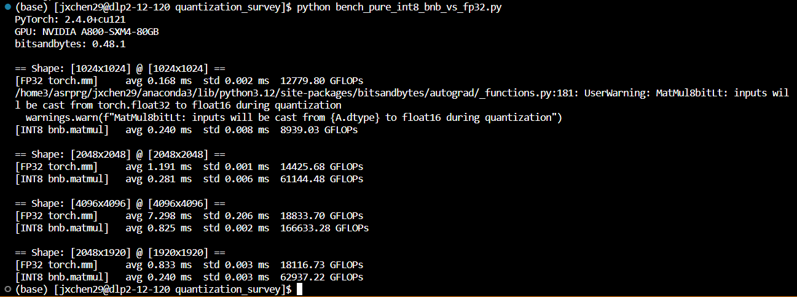
</center>

反向传播的理解示例代码

```python
import torch
from torch import nn
from torch.autograd import Function

# ---------------------------
# 工具：打印计算图（从某个 grad_fn 出发，追溯 next_functions）
# ---------------------------
def print_graph(fn, indent=0, seen=None):
    if fn is None:
        print(" " * indent + "None")
        return
    if seen is None:
        seen = set()
    if fn in seen:
        print(" " * indent + f"[{type(fn).__name__}] (visited)")
        return
    seen.add(fn)

    name = type(fn).__name__
    print(" " * indent + f"[{name}]")
    # next_functions: list of (Function or None, index)
    for i, (next_fn, _) in enumerate(fn.next_functions):
        prefix = " " * (indent + 2) + f"--> edge[{i}] "
        if next_fn is None:
            print(prefix + "None")
        else:
            print(prefix + f"{type(next_fn).__name__}")
            print_graph(next_fn, indent + 6, seen)

# ---------------------------
# 自定义一个 Function，用来在 forward/backward 打印细节
# 同时演示 save_for_backward（前向如何为反向保存中间量）
# ---------------------------
class DemoLinear(Function):
    @staticmethod
    def forward(ctx, x, W, b):
        # 保存给 backward 用的中间量
        ctx.save_for_backward(x, W)
        y = x @ W.t() + b  # 简单线性层
        print("\n[Forward] DemoLinear.forward")
        print(f"  x.requires_grad={x.requires_grad}, W.requires_grad={W.requires_grad}, b.requires_grad={b.requires_grad}")
        print(f"  y.shape={y.shape}")
        return y

    @staticmethod
    def backward(ctx, grad_out):
        x, W = ctx.saved_tensors
        # 线性层的标准梯度
        grad_x = grad_out @ W
        grad_W = grad_out.t() @ x
        grad_b = grad_out.sum(0)

        print("\n[Backward] DemoLinear.backward (executed)")
        print(f"  grad_out.shape={grad_out.shape}")
        print(f"  produces: grad_x({grad_x.shape}), grad_W({grad_W.shape}), grad_b({grad_b.shape})")
        return grad_x, grad_W, grad_b

# 便捷包装（像 nn.Linear 一样使用）
def demo_linear(x, W, b):
    return DemoLinear.apply(x, W, b)

# ---------------------------
# 小模型：Linear -> ReLU -> Mean
# 我们在关键张量上注册 backward hook，打印反向执行顺序
# ---------------------------
def main():
    torch.manual_seed(0)
    device = "cuda" if torch.cuda.is_available() else "cpu"
    print(f"Using device: {device}")

    B, In, Out = 4, 3, 2
    # 叶子张量（需要梯度）：x, W, b
    x = torch.randn(B, In, device=device, requires_grad=True)
    W = torch.randn(Out, In, device=device, requires_grad=True)
    b = torch.randn(Out, device=device, requires_grad=True)

    # 前向
    y_lin = demo_linear(x, W, b)            # 有 grad_fn: DemoLinearBackward
    y_relu = torch.relu(y_lin)              # 有 grad_fn: ReluBackward*
    z = y_relu.mean()                       # 有 grad_fn: MeanBackward*

    # -------- 前向：打印各张量 grad_fn 和 next_functions 结构 --------
    def show_tensor_info(name, t):
        print(f"{name}: shape={tuple(t.shape)} | requires_grad={t.requires_grad}")
        if t.grad_fn is not None:
            print(f"  grad_fn: {type(t.grad_fn).__name__}")
        else:
            print("  grad_fn: None (leaf tensor)")
        # 对叶子张量（x/W/b）会挂 AccumulateGrad；对中间张量挂具体 *Backward 节点

    print("\n=== Forward graph & grad_fn ===")
    show_tensor_info("x (leaf)", x)
    show_tensor_info("W (leaf)", W)
    show_tensor_info("b (leaf)", b)
    show_tensor_info("y_lin", y_lin)
    show_tensor_info("y_relu", y_relu)
    show_tensor_info("z (loss)", z)

    print("\n=== Traverse backward graph from z.grad_fn ===")
    print_graph(z.grad_fn)

    # -------- 反向：注册 hook 以观察执行顺序 --------
    # 对中间张量和叶子张量都注册 hook，打印梯度何时被计算到
    def make_hook(name):
        def _hook(grad):
            # 这里的打印顺序基本就是反向传播中，这个张量的梯度被“就绪并回传”的时刻
            print(f"[Hook] grad for {name}: shape={tuple(grad.shape)}, norm={grad.norm().item():.6f}")
        return _hook

    # 对中间结果注册 hook
    y_lin.register_hook(make_hook("y_lin"))
    y_relu.register_hook(make_hook("y_relu"))
    # 对叶子也注册：x、W、b 的梯度在 AccumulateGrad 节点处被写入
    x.register_hook(make_hook("x (leaf)"))
    W.register_hook(make_hook("W (leaf)"))
    b.register_hook(make_hook("b (leaf)"))

    print("\n=== Backward start ===")
    z.backward()  # 触发反向：MeanBackward -> ReluBackward -> DemoLinearBackward -> AccumulateGrad

    print("\n=== Gradients accumulated on leaves ===")
    print(f"x.grad.shape={tuple(x.grad.shape)}, norm={x.grad.norm().item():.6f}")
    print(f"W.grad.shape={tuple(W.grad.shape)}, norm={W.grad.norm().item():.6f}")
    print(f"b.grad.shape={tuple(b.grad.shape)}, norm={b.grad.norm().item():.6f}")

if __name__ == "__main__":
    main()
```

hook  

| 类型                                     | 注册方式      | 作用范围         | 触发时机                 |
| -------------------------------------- | --------- | ------------ | -------------------- |
| `tensor.register_hook()`               | 针对单个张量    | 在该张量的梯度被计算出时 | autograd 引擎执行节点时触发   |
| `module.register_forward_hook()`       | 针对 Module | 前向传播完成时      | module 的 forward 结束后 |
| `module.register_backward_hook()`（已弃用） | 针对 Module | 模块反向传播时      | 旧版机制，可能不稳定           |
| `torch.autograd.grad_hook()`（内部）       | 针对梯度流     | 自动调用         | 引擎调度内部               |


```python
import torch
import torch.nn as nn

# 定义一个简单线性层
layer = nn.Linear(3, 2, bias=False)

# ---------- 前向前 hook：劫持输入 ----------
def pre_hook(module, inputs):
    print(f"[Forward pre-hook] 原始输入: {inputs[0]}")
    new_input = torch.zeros_like(inputs[0])
    print(f"[Forward pre-hook] 修改后输入: {new_input}")
    # 必须返回 tuple
    return (new_input,)

layer.register_forward_pre_hook(pre_hook)

# ---------- 反向 hook：打印梯度 ----------
def backward_hook(module, grad_input, grad_output):
    print(f"[Backward hook] grad_input: {grad_input}")
    print(f"[Backward hook] grad_output: {grad_output}")

layer.register_full_backward_hook(backward_hook)

# ---------- 前向 + 反向 ----------
x = torch.randn(1, 3, requires_grad=True)
y = layer(x)
loss = y.sum()
loss.backward()
```