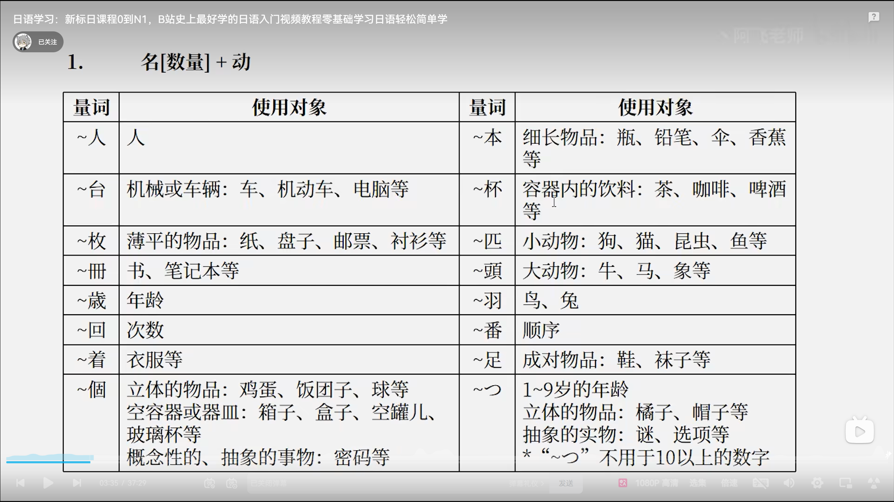

名[数量] + 动词  
数量词用在动词前面，量词因所修饰的事物种类不同而不同。

|例子|量词|
|-|-|
|卵を　一個　食べます                        　　　|いっこ|  
|本を　二冊　買いました　　　　　　　　　　　　　　　|にさつ|  
|緑茶を　三杯　飲みました                          |さんばい|  
|教室に　学生が　四人　います                      |よにん|
|ガレージに　車が　五台　あります                　 |ごだい|  
|引き出しに　鉛筆が　十本　あります                 |じゅっぽん|  
|切手を　何枚　かいましたか  

 

|-|～つ|～にん|～台|~個|～本|～杯|  
|-|-|-|-|-|-|-|
|1|ひとつ|ひとり|いちだい|いっこ|いっぽん|いっぱい|
|2|ふたつ|ふたり|にだい|にこ|にほん|にはい|
|3|みっつ|さんにん|さんだい|さんこ|さんぼん|さんばい|
|4|よっつ|よにん|よんだい|よんこ|よんほん|よんはい|
|5|いつつ|ごにん|ごだい|ごこ|ごほん|ごはい|
|6|むっつ|ろくにん|ろくだい|ろっこ|ろっぽん|ろっぱい|
|7|ななつ|ななにん|ななだい|ななこ|ななほん|ななはい|
|8|やっつ|はちにん|はちだい|はっこ|はっぽん|はっぱい|
|9|ここのつ|きゅうにん|きゅうだい|きゅうこ|きゅうほん|きゅうはい|
|10|とお|じゅうにん|じゅうだい|きゅっこ|じゅっぽん|じゅっぱい|
|何|いくつ|なんにん|なんだい|なんこ|なんぼん|なんばい|

---
询问数量时，在何后加量词。如：何個、何本、何冊等。这里的何必须读作なん  
指动物时，大动物用 頭，小动物用 匹  
例句：  
この　動物園には　象が　２頭　います  
友達の　猫を　１匹　もらいました  

---
名词[时间] + 动词  
表示时间数量的词语和动词一起使用时，说明动作，状态持续的时间。这是表示时间数量的词语后面不能加に。  
例句：  
李さんは　毎日　７時間　働きます  
昼　　　　　　　１時間　休みます  
森さんは　　　　９時間　寝ます  

---
名词[时间] に　名词[次数] + 动词
表示在一定时间内进行若干次动作时，使用这个句型
例句：  
李さんは　１週間に　２回　プールへ　いきます  
この　花は　２年でに　１度　咲きます  
王さんは　一週間に　５日　働きます  
王さんは　毎日　ゲームを　２時間　遊びます

---
动词的ます型
动词的ます型 去掉　ます　的形式会经常用到。 + たい　(表示想做)
|ます形|去掉ます|＋たい|
|-|-|-|
|働きます|働き|働きたい|
|休みます|休み|休みたい|
|起きます|起き|起きたい|
|寝ます|ね|寝たい|

---
名词[场所]へ  动词に　行きます・来ます  
表示移动行为的目的时使用。动词的ます形去掉ます的形式，表示移动行为的目的  
|原形|ます形|去掉ます|例句|
|-|-|-|-|
|出す|出します|出し|　荷物を　出しに　いきます|  
|泳ぐ|泳ぎます|泳ぎ|　泳ぎに　行きます|  
|遊ぶ|遊びます|遊び|  遊びに　来ました|  

例句：  
午後　郵便局へ　荷物を　出しに　行きます  
小野さんは　プールへ　泳ぎに　行きまし   
李さんは　わたしの　家へ　遊びに　来ました  

---
名词[数量]　＋　で  
用于不称重而以数个的方式售物。当数量是1个时，不加で  
例句：  
この　ケーキは　３個で　５００円です  
この　ケーキは　１個　　２００円です  

