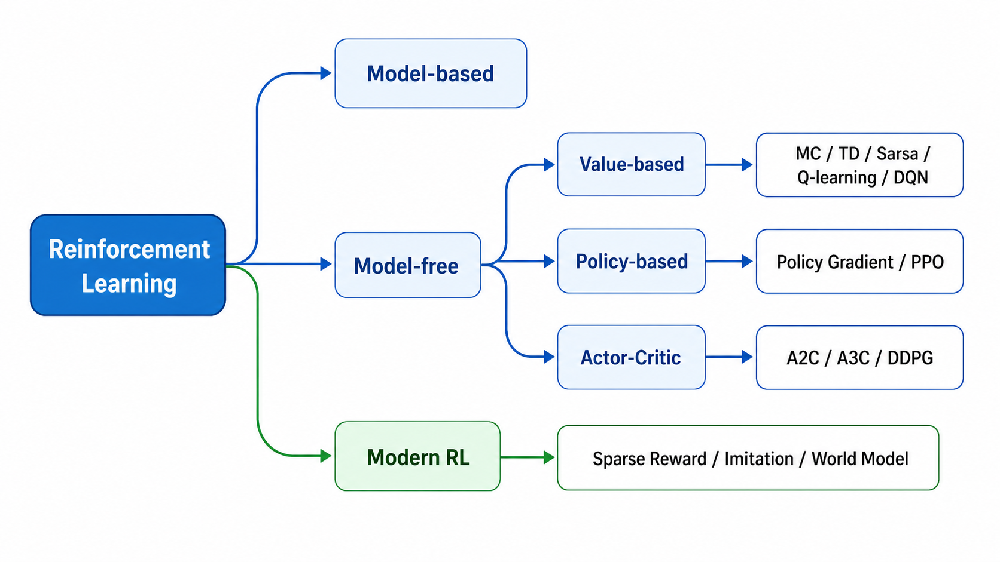
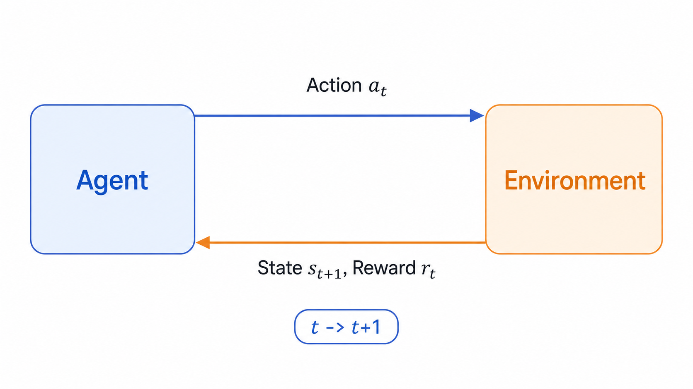

# 强化学习综述：从试错到可泛化的决策系统

强化学习（Reinforcement Learning, RL）研究的是一个智能体如何通过和环境交互来学习决策。它不像监督学习那样直接给出“正确标签”，而是只给出奖励信号：某个动作执行之后，环境会返回新的状态和奖励，智能体要从这些反馈中推断“什么行为长期来看更好”。

## 基本问题

强化学习问题可以压缩成一个闭环：

在时刻 $t$，智能体看到状态 $s_t$，选择动作 $a_t$，环境返回奖励 $r_t$ 和下一个状态 $s_{t+1}$。学习目标不是让某一步奖励最大，而是让长期回报最大：

$$
G_t=r_t+\gamma r_{t+1}+\gamma^2r_{t+2}+\cdots
$$

其中 $\gamma \in [0, 1]$ 是折扣因子。$\gamma$ 越大，智能体越在意远期收益；$\gamma$ 越小，智能体越短视。

强化学习难在三件事：

1. 当前动作会改变未来能看到的数据，所以训练数据不是独立同分布。
2. 奖励往往延迟出现，动作和结果之间存在信用分配问题。
3. 智能体既要探索未知动作，也要利用已知高收益动作。

## 算法谱系

从是否知道环境模型看，强化学习可以分为有模型和免模型。

有模型方法假设我们知道状态转移概率和奖励函数，可以用动态规划做策略迭代或价值迭代。免模型方法不知道环境规则，只能通过采样轨迹学习。现实任务里，环境通常太复杂，因此常用的是免模型方法。

从学习对象看，又可以分为三类。

价值型方法学习 $V(s)$ 或 $Q(s,a)$。它先回答“这个状态/动作有多好”，再根据价值选择动作。表格型 MC、TD、Sarsa、Q-learning 和深度版本 DQN 都属于这条线。

策略型方法直接学习策略 $\pi_\theta(a|s)$。它不显式枚举所有动作的价值，而是直接优化动作分布。Policy Gradient 和 PPO 是典型代表。

Actor-Critic 同时学习策略和价值函数。Actor 负责行动，Critic 负责评价，策略更新时用 Critic 降低方差。A2C、A3C、DDPG 都属于这个家族。

## 学习路线

推荐按下面顺序理解：

1. 先掌握 MDP、回报、价值函数和 Bellman 方程。
2. 再看动态规划，理解“用未来价值反推当前价值”。
3. 然后看 MC/TD，理解采样估计和自举更新。
4. 接着看 Sarsa/Q-learning，理解 on-policy 与 off-policy。
5. 进入深度强化学习后，先看 DQN，再看 Policy Gradient/PPO。
6. 最后用 Actor-Critic 和 DDPG 串起离散动作、连续动作和现代系统。

本系列文章主要参考 Datawhale EasyRL，并按博客阅读习惯重新组织。后续每篇会围绕一个算法家族讲清楚：它解决什么问题、核心更新公式是什么、为什么有效、有什么局限。

