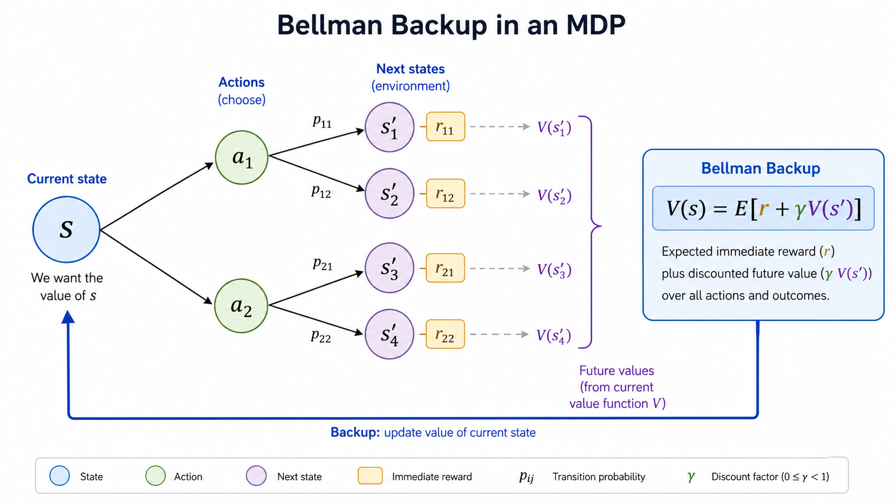

# 强化学习基础与 MDP

强化学习的数学语言是马尔可夫决策过程（Markov Decision Process, MDP）。MDP 把“智能体与环境交互”抽象成状态、动作、转移概率和奖励。

## MDP 五元组

一个 MDP 通常写成：

$$
(\mathcal{S}, \mathcal{A}, P, R, \gamma)
$$

其中 $\mathcal{S}$ 是状态空间，$\mathcal{A}$ 是动作空间，$P(s'|s,a)$ 是在状态 $s$ 执行动作 $a$ 后转移到 $s'$ 的概率，$R(s,a)$ 是奖励函数，$\gamma$ 是折扣因子。

“马尔可夫”指下一步只依赖当前状态和动作：

$$
P(s_{t+1}|s_t,a_t,s_{t-1},a_{t-1},\cdots)=P(s_{t+1}|s_t,a_t)
$$

这个假设非常关键。它让我们不必记住完整历史，只需要当前状态就能描述未来分布。如果真实任务不满足这个条件，常见做法是把历史观测、速度、隐藏状态或 RNN 表征并入状态。

## 策略与回报

策略 $\pi(a|s)$ 描述智能体在状态 $s$ 下选择动作 $a$ 的概率。确定性策略直接输出动作 $a=\pi(s)$；随机策略输出动作分布。

回报是从当前时刻开始的折扣奖励和：

$$
G_t=r_t+\gamma r_{t+1}+\gamma^2r_{t+2}+\cdots
$$

强化学习的目标就是找到策略 $\pi$，让期望回报最大：

$$
\max_\pi \mathbb{E}_\pi[G_t]
$$

## 价值函数

状态价值函数衡量“从状态 $s$ 开始，按照策略 $\pi$ 继续行动，长期回报有多大”：

$$
V_\pi(s)=\mathbb{E}_\pi[G_t|s_t=s]
$$

动作价值函数衡量“在状态 $s$ 先执行动作 $a$，之后再按照策略 $\pi$ 行动，长期回报有多大”：

$$
Q_\pi(s,a)=\mathbb{E}_\pi[G_t|s_t=s,a_t=a]
$$

两者的关系是：

$$
V_\pi(s)=\sum_a \pi(a|s)Q_\pi(s,a)
$$

如果策略是确定性的，那么 $V_\pi(s)=Q_\pi(s,\pi(s))$。

## Bellman 方程

Bellman 方程把长期回报拆成当前奖励和下一状态价值：

$$
V_\pi(s)=\sum_a \pi(a|s)\sum_{s'}P(s'|s,a)\left[R(s,a)+\gamma V_\pi(s')\right]
$$

它的直觉是：一个状态的价值，不需要等到完整轨迹结束才能定义；只要知道下一步奖励和下一状态价值，就能递推回来。

最优价值函数满足：

$$
V_*(s)=\max_a \sum_{s'}P(s'|s,a)\left[R(s,a)+\gamma V_*(s')\right]
$$

这个式子也是后面价值迭代、Q-learning 和 DQN 的核心。不同算法的差异，很多时候只是“Bellman backup 里的期望、最大值、采样估计和函数近似怎么实现”。

