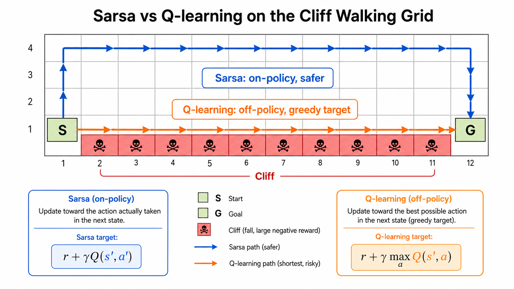

# Sarsa 与 Q-learning

Sarsa 和 Q-learning 都是表格型控制算法。它们学习动作价值函数 $Q(s,a)$，再通过 $Q$ 值选择动作。两者更新式非常接近，但行为差异很大。

## 动作价值更新

动作价值函数定义为：

$$
Q_\pi(s,a)=\mathbb{E}_\pi[G_t|s_t=s,a_t=a]
$$

如果我们知道每个状态下每个动作的长期价值，就可以选取 $Q$ 值最大的动作。问题是 $Q$ 不知道，需要通过交互逐步估计。

## Sarsa

Sarsa 的名字来自一次更新使用的五元组：

$$
(s_t,a_t,r_t,s_{t+1},a_{t+1})
$$

它的更新式是：

$$
Q(s_t,a_t)\leftarrow Q(s_t,a_t)+\alpha\left[r_t+\gamma Q(s_{t+1},a_{t+1})-Q(s_t,a_t)\right]
$$

注意目标里使用的是实际策略在下一状态采样到的动作 $a_{t+1}$。如果策略是 $\epsilon$-greedy，那么 Sarsa 会把探索动作带来的风险也纳入学习。

这使 Sarsa 是 on-policy 算法：用什么策略采样，就学习这个策略的价值。

## Q-learning

Q-learning 的更新式是：

$$
Q(s_t,a_t)\leftarrow Q(s_t,a_t)+\alpha\left[r_t+\gamma \max_a Q(s_{t+1},a)-Q(s_t,a_t)\right]
$$

它没有使用真实采样到的 $a_{t+1}$，而是假设下一步会选择当前估计下最优的动作。也就是说，行为策略可以带探索，但学习目标是贪心策略。

这使 Q-learning 是 off-policy 算法：采样策略和学习目标策略可以不同。

## Cliff Walking 直觉

在悬崖寻路问题里，起点和终点之间有一排悬崖。最短路径贴着悬崖走，但一旦探索动作出错就会掉下去。

Sarsa 会考虑 $\epsilon$-greedy 探索带来的风险，因此倾向于学到远离悬崖的保守路径。

Q-learning 的目标使用 $\max_a Q(s',a)$，相当于假设下一步一定贪心最优，不把探索误差计入目标，因此更容易学到贴近悬崖的最短路径。

这不是谁绝对更好，而是目标不同：Sarsa 学的是实际执行策略，Q-learning 学的是理想贪心策略。

## 小结

Sarsa 更稳健，适合需要把探索风险计入策略表现的场景。Q-learning 更直接地逼近最优动作价值，是 DQN 的直接基础。理解两者差异，是理解 on-policy/off-policy 的关键入口。

