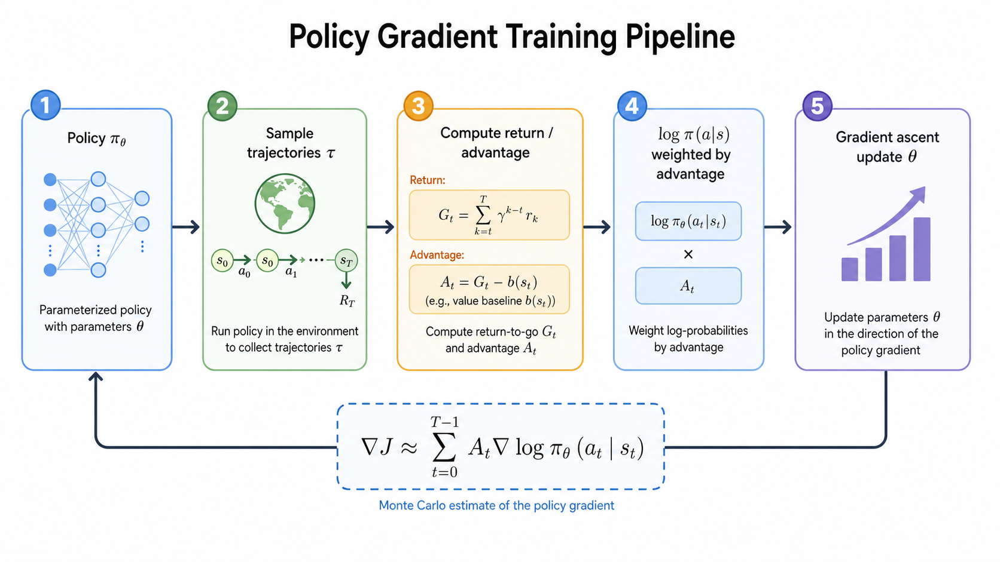

# 策略梯度

价值型方法先学习 $Q(s,a)$，再通过 $\arg\max_a Q(s,a)$ 选择动作。策略梯度（Policy Gradient, PG）换了一个角度：直接学习策略 $\pi_\theta(a|s)$，让高回报轨迹出现的概率变大。

## 目标函数

策略参数为 $\theta$，轨迹为：

$$
\tau=(s_0,a_0,s_1,a_1,\cdots)
$$

轨迹概率可以写成：

$$
p_\theta(\tau)=p(s_0)\prod_t \pi_\theta(a_t|s_t)P(s_{t+1}|s_t,a_t)
$$

我们要最大化期望回报：

$$
J(\theta)=\mathbb{E}_{\tau\sim p_\theta(\tau)}[R(\tau)]
$$

其中 $R(\tau)$ 是整条轨迹的回报。

## Log-derivative trick

直接对 $J(\theta)$ 求梯度：

$$
\nabla_\theta J(\theta)=\sum_\tau R(\tau)\nabla_\theta p_\theta(\tau)
$$

利用恒等式：

$$
\nabla p_\theta(\tau)=p_\theta(\tau)\nabla \log p_\theta(\tau)
$$

得到：

$$
\nabla_\theta J(\theta)=\mathbb{E}_{\tau\sim p_\theta(\tau)}\left[R(\tau)\nabla_\theta \log p_\theta(\tau)\right]
$$

由于环境转移 $P(s_{t+1}|s_t,a_t)$ 与 $\theta$ 无关，真正需要求梯度的是策略：

$$
\nabla_\theta \log p_\theta(\tau)=\sum_t \nabla_\theta \log \pi_\theta(a_t|s_t)
$$

于是采样估计为：

$$
\nabla_\theta J(\theta)\approx \sum_t R(\tau)\nabla_\theta \log \pi_\theta(a_t|s_t)
$$

直觉很简单：如果一条轨迹回报高，就提高轨迹中动作的概率；如果回报低，就降低这些动作的概率。

## Baseline 与 Advantage

直接用 $R(\tau)$ 加权会有很大方差。常见改进是减去 baseline：

$$
\nabla_\theta J(\theta)\approx \sum_t (R_t-b(s_t))\nabla_\theta \log \pi_\theta(a_t|s_t)
$$

baseline 不改变梯度期望，但能降低方差。最常用的 baseline 是状态价值函数 $V(s_t)$，于是得到优势函数：

$$
A(s_t,a_t)=Q(s_t,a_t)-V(s_t)
$$

优势函数衡量的是“这个动作比该状态下的平均表现好多少”。如果 $A>0$，提高动作概率；如果 $A<0$，降低动作概率。

## 局限

策略梯度可以自然处理连续动作，也能学习随机策略，但它通常样本效率低。每次策略变了，旧数据分布就不再严格匹配当前策略，因此原始 PG 往往需要不断重新采样。PPO 正是为了解决“能否更稳定、更高效地复用近端旧策略数据”而出现。

