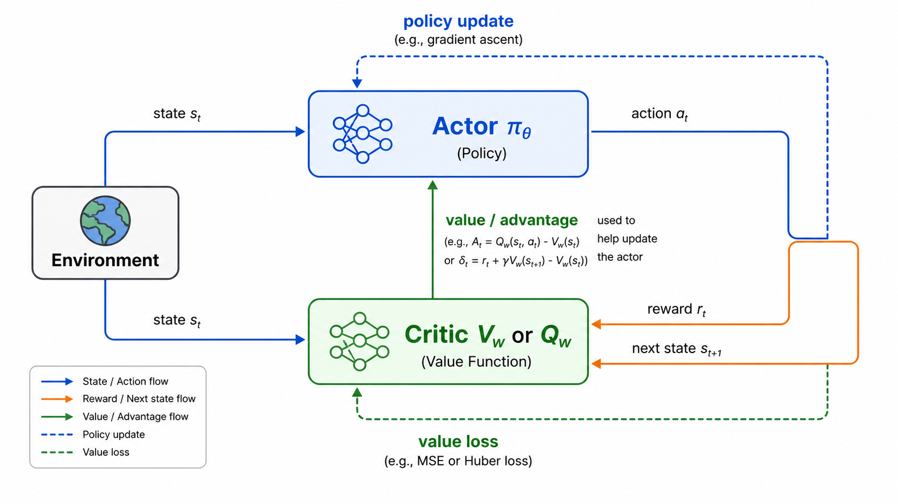

# Actor-Critic：让策略和价值函数互相配合

Actor-Critic 把策略型方法和价值型方法结合起来。Actor 负责选择动作，Critic 负责评价动作或状态。策略更新时不再只依赖高方差的完整回报，而是使用 Critic 给出的价值估计。

## Actor 与 Critic

Actor 是策略：

$$
\pi_\theta(a|s)
$$

它接收状态，输出动作分布或动作。

Critic 是价值函数：

$$
V_w(s) \quad \text{or} \quad Q_w(s,a)
$$

它评估当前状态或动作的长期价值。

在策略梯度中，如果直接用回报 $G_t$ 做权重，方差很大。Actor-Critic 用优势函数替代：

$$
A_t=Q(s_t,a_t)-V(s_t)
$$

实际中常用 TD error 近似 advantage：

$$
\delta_t=r_t+\gamma V_w(s_{t+1})-V_w(s_t)
$$

Actor 更新为：

$$
\nabla_\theta J(\theta)\approx \delta_t\nabla_\theta\log\pi_\theta(a_t|s_t)
$$

Critic 则通过 TD 目标训练：

$$
\mathcal{L}(w)=\left(r_t+\gamma V_w(s_{t+1})-V_w(s_t)\right)^2
$$

## 为什么有效

Actor 直接优化策略，适合连续动作和随机策略。Critic 提供低方差评价，避免每次都等完整 episode 结束。

这也是一个分工：Actor 解决“怎么行动”，Critic 解决“这个行动好不好”。如果 Critic 准，Actor 更新更稳定；如果 Critic 很差，Actor 会被错误信号带偏。

## A2C 与 A3C

A2C（Advantage Actor-Critic）是同步版本。多个环境并行收集数据，然后同步计算梯度并更新共享模型。

A3C（Asynchronous Advantage Actor-Critic）是异步版本。多个 worker 各自与环境交互，异步更新全局参数。异步采样能增加数据多样性，减少样本相关性。

两者的核心思想一致：用 advantage 作为策略梯度权重，用价值函数做 baseline。

## 与 PPO、DDPG 的关系

PPO 通常也采用 actor-critic 架构：Actor 用 PPO clip objective 更新，Critic 负责拟合状态价值，进而计算 advantage。

DDPG 则是连续动作下的 actor-critic：Actor 输出确定性连续动作，Critic 学习 $Q(s,a)$，Actor 通过最大化 Critic 评分来更新。

因此 Actor-Critic 更像一个框架，而不是单一算法。理解这个框架之后，很多现代强化学习算法都能放进同一张图里。

