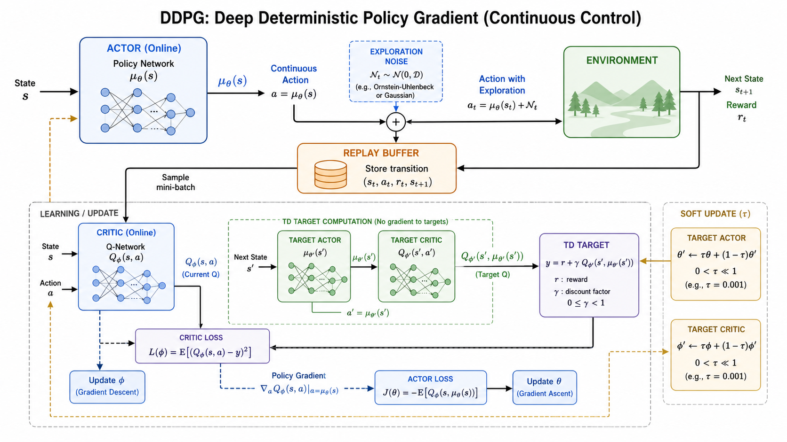

# DDPG：连续动作空间中的确定性 Actor-Critic

DQN 适合离散动作，因为它可以枚举所有动作并取最大 Q 值。连续动作空间不能这么做，例如机器人关节力矩、自动驾驶方向盘角度、控制器输出都是连续的。DDPG（Deep Deterministic Policy Gradient）就是为连续动作设计的。

## 确定性策略

DDPG 的 Actor 不是输出动作分布，而是直接输出一个动作：

$$
a=\mu_\theta(s)
$$

Critic 估计动作价值：

$$
Q_\phi(s,a)
$$

Actor 的目标是让 Critic 给自己的动作打更高分：

$$
J(\theta)=\mathbb{E}_{s\sim D}[Q_\phi(s,\mu_\theta(s))]
$$

用链式法则更新 Actor：

$$
\nabla_\theta J\approx
\mathbb{E}\left[
\nabla_a Q_\phi(s,a)|_{a=\mu_\theta(s)}
\nabla_\theta \mu_\theta(s)
\right]
$$

直觉是：Critic 告诉 Actor “动作往哪个方向改能让 Q 更大”，Actor 就沿这个方向调整。

## Critic 更新

DDPG 的 Critic 和 DQN 类似，用 TD 目标训练：

$$
y=r+\gamma Q_{\phi^-}(s',\mu_{\theta^-}(s'))
$$

损失为：

$$
\mathcal{L}(\phi)=\left(Q_\phi(s,a)-y\right)^2
$$

其中 $\theta^-$ 和 $\phi^-$ 是目标 Actor 和目标 Critic。

## 经验回放与目标网络

DDPG 是 off-policy 算法，使用 replay buffer 存储经验。训练时从 buffer 采样 transition，所以可以重复利用旧数据。

目标网络用软更新：

$$
\theta^- \leftarrow \tau\theta+(1-\tau)\theta^-
$$

$$
\phi^- \leftarrow \tau\phi+(1-\tau)\phi^-
$$

$\tau$ 通常很小，让目标网络缓慢跟随在线网络，减少震荡。

## 探索噪声

确定性策略如果只输出固定动作，就缺少探索。DDPG 在执行动作时添加噪声：

$$
a_t=\mu_\theta(s_t)+\mathcal{N}_t
$$

噪声可以是高斯噪声，也可以是 Ornstein-Uhlenbeck 噪声。训练时 Critic 看到的是带探索的数据，Actor 更新时则使用无噪声动作。

## 局限

DDPG 对超参数、奖励尺度和 Critic 估计误差比较敏感。如果 Critic 过估计，Actor 会被引向错误动作。后续 TD3 通过双 Critic、延迟策略更新和目标动作平滑来缓解这些问题；SAC 则进一步引入最大熵目标，提高探索和稳定性。

