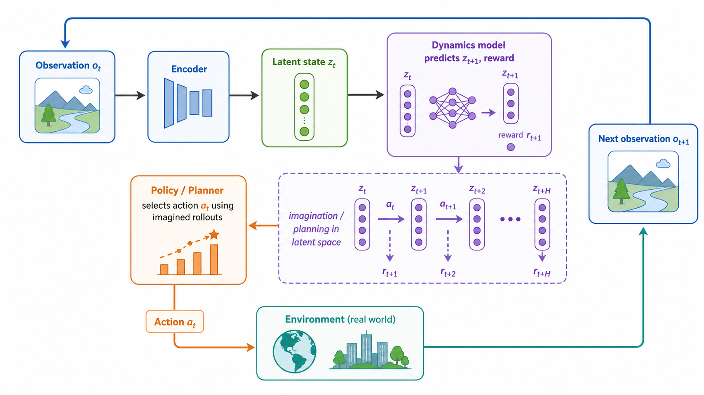

# 世界模型与现代强化学习系统

前面的算法大多直接从真实环境采样，再更新策略或价值函数。世界模型（World Model）换了一个思路：先学习环境在潜在空间里的动态，再在模型里想象未来，用想象结果帮助决策。

## 世界模型的核心

世界模型通常包含三部分：

1. Encoder：把高维观测 $o_t$ 压缩成潜在状态 $z_t$。
2. Dynamics：预测潜在状态如何随动作演化。
3. Reward/Value：预测奖励或价值。

形式上可以写成：

$$
z_t=f_\theta(o_t)
$$

$$
p_\theta(z_{t+1},r_t|z_t,a_t)
$$

有了动态模型后，智能体可以不完全依赖真实环境，而是在潜在空间里 rollout，比较不同动作序列的后果。

## 为什么重要

真实环境采样可能很贵。机器人会磨损，真实驾驶有风险，大型游戏或仿真也可能成本高。世界模型把一部分学习转移到“想象”中，提高样本效率。

世界模型还帮助处理视觉强化学习。原始像素太高维，直接学策略很难；如果能先把图像压缩成包含任务信息的 latent state，后续控制会更容易。

## 与 AlphaStar、视觉 RL 的关系

AlphaStar 这类系统不只是一个单算法，而是把强化学习、模仿学习、自博弈、层级策略、海量工程系统组合起来。它说明现代 RL 往往是系统工程，而不是单个更新公式。

视觉 RL 关注从图像观测中学习决策。难点是表征学习和控制目标耦合：图像特征如果只服务重建，不一定服务决策；如果只靠奖励学习，又可能样本效率太低。

MineCraft 等开放环境进一步放大了问题：状态空间大、任务长、奖励稀疏、语言和视觉都可能参与决策。因此现代方法常结合预训练模型、世界模型、技能发现和模仿学习。

## 从算法到系统

经典算法回答的是“怎样更新价值函数或策略”。现代 RL 系统还要回答：

1. 状态如何表示。
2. 奖励如何设计或学习。
3. 经验如何高效复用。
4. 探索如何覆盖长任务。
5. 模型如何从仿真迁移到现实。

世界模型的意义在于，它把环境规律显式放进学习对象。智能体不只是记住“这个状态下动作哪个好”，而是学习“世界会如何变化”。这也是从表格型 RL 走向通用决策系统的重要方向。

