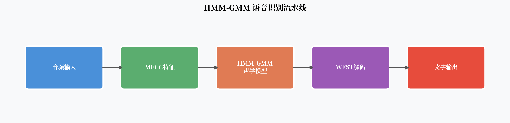
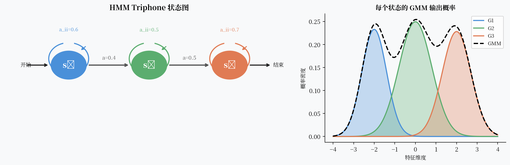

# HMM-GMM：语音识别的统计学基石

语音是什么？它是一段随时间连续变化的声波，每个音素只持续几十毫秒，说快说慢因人而异，同一个字在不同语境下听起来可能截然不同。用任何确定性规则去描述它，都会撞墙。1970 年代的研究者们想明白了一件事：**语音识别本质上是一个概率推断问题**。

HMM-GMM 的组合，就是他们给出的答案。这套框架统治了语音识别长达三十年，直到 2011 年才被深度学习撼动。理解它，是理解整个 ASR 发展史的起点。

---

## 核心观点

HMM-GMM 之所以能统治语音识别三十年，是因为它用概率图模型精准拆解了语音信号的两个核心难题：**时序动态性**（同一个音素持续时长不固定）和**声学多样性**（不同人发同一个音听起来不一样）。前者交给 HMM，后者交给 GMM。

---

## 为什么语音需要统计建模

想象一下"你好"这两个字。一个说话很快的人可能只用 0.3 秒，一个说话慢的人可能用 0.8 秒。中间的"好"字，在上扬语调和下降语调里，频率走势完全不同。如果再加上麦克风差异、背景噪声、口音……

这些变化不是噪声，**它们是语言信号的内在属性**。任何基于模板匹配的方法都会在这里碰壁。

统计建模的思路是：不去找一个"标准"的声音模板，而是建立一个概率模型，问："给定这段音频，最可能对应的文字序列是什么？"

用贝叶斯公式写出来就是：

$$
\hat{W} = \arg\max_W P(W | X) = \arg\max_W P(X | W) \cdot P(W)
$$

其中 $X$ 是声学特征序列，$W$ 是候选文字序列。$P(X|W)$ 是**声学模型**的任务，$P(W)$ 是**语言模型**的任务。HMM-GMM 负责前者。

---

## HMM：对付时序动态性

隐马尔可夫模型（Hidden Markov Model）是解决时序问题的经典工具。

在语音识别里，每个音素（如 /b/、/ei/）被建模为一个有 3 个状态的 HMM。这 3 个状态对应音素的起始、中间和结尾三个阶段。

HMM 做了两个核心假设：

**1. 马尔可夫假设**：当前状态只依赖上一个状态，与更早的历史无关。

$$P(s_t | s_{t-1}, s_{t-2}, \ldots) = P(s_t | s_{t-1})$$

**2. 观测独立假设**：当前帧的声学特征只依赖当前状态，与其他帧无关。

$$P(x_t | s_1, \ldots, s_T, x_1, \ldots, x_T) = P(x_t | s_t)$$

这两个假设让模型变得可计算，但也埋下了后来被深度学习击败的伏笔——真实语音中，帧之间的依赖关系远比马尔可夫假设复杂。

### 三音素（Triphone）

单音素 HMM 太粗糙了。"d" 在 "do" 里和在 "ad" 里发音明显不同。实践中通常使用**三音素**建模：每个状态不仅表示当前音素，还记录左右上下文。

例如 /d/ 在 "bad day" 里可能被建模为 `æ-d+d`（左邻音素 æ，右邻音素 d）。

三音素状态数量爆炸——理论上有 $50^3 = 125000$ 种，实际通过**状态捆绑**（状态聚类）压缩到几千个共享状态。这是 HMM-GMM 系统最考验工程能力的部分之一。

---

## GMM：对付声学多样性

HMM 告诉我们每个状态之间如何转移，但没有说清楚：**一个状态长什么样？**

这就是 GMM（高斯混合模型）的工作。对于每个 HMM 状态 $s$，GMM 建模该状态的声学观测概率：

$$P(x_t | s) = \sum_{k=1}^{K} w_k \cdot \mathcal{N}(x_t; \mu_k, \Sigma_k)$$

其中 $w_k$ 是混合权重，$\mu_k$ 是均值，$\Sigma_k$ 是协方差矩阵。

为什么需要混合高斯而不是单个高斯？

同一个音素状态，男声和女声的声学特征分布可以相差很远。单个高斯无法捕捉这种多峰分布，而多个高斯的叠加可以近似任意复杂的概率密度。

实践中，每个状态的 GMM 通常有 8~64 个混合分量。

!!! note "特征：MFCC"
    HMM-GMM 的输入不是原始波形，而是经过预处理的声学特征。最常用的是 **MFCC**（梅尔频率倒谱系数）：对音频做短时傅里叶变换、映射到梅尔频率尺度、取对数、做倒谱变换，再加上一阶和二阶差分，得到约 39 维特征向量。
    
    梅尔尺度模拟人耳的感知特性——低频分辨率高，高频分辨率低。

---

## N-gram 语言模型

声学模型给出每个音素序列的概率，但光靠声学信息还不够。"我昨天去了超市" 和 "我昨天去了草地" 在声学上可能非常接近，但结合上下文语言模型，前者的概率会高得多。

语言模型负责建模 $P(W) = \prod_i P(w_i | w_{i-n+1}, \ldots, w_{i-1})$。

传统 ASR 使用 N-gram 语言模型，即假设当前词只依赖前 N-1 个词。Trigram（3-gram）是最常见的选择。

---

## WFST 解码

把声学模型和语言模型合并成一个统一的解码图，是工程上的大挑战。现代 HMM-GMM 系统用 **WFST（加权有限状态转换器）** 来解决这个问题。

WFST 把 HMM 转换器（H）、上下文依赖转换器（C）、词典转换器（L）、语言模型（G）合并为：

$$HCLG = H \circ C \circ L \circ G$$

这个合并后的自动机支持高效的 **Viterbi 束搜索**，在解码时只保留概率最高的若干条路径，大幅减少计算量。

Kaldi 工具包是 WFST-based HMM-GMM 的标准实现，至今仍被很多研究者用作基线系统。

---

## 为什么最终遇到了天花板

HMM-GMM 的几个根本性局限：

**1. GMM 是生成式模型，不是判别式模型。**  
GMM 建模的是 $P(x|s)$，即"给定状态，声学特征是什么"。但识别任务真正需要的是 $P(s|x)$，即"给定声学特征，最可能的状态是什么"。生成式建模做了很多我们不关心的事。

**2. HMM 的条件独立假设过于简单。**  
真实语音中，协同发音（coarticulation）导致相邻帧之间存在强依赖。HMM 的马尔可夫假设忽略了长程依赖。

**3. MFCC 特征的信息损失。**  
MFCC 的手工设计虽然有效，但不可避免地丢失了部分有用信息。能不能让模型自己学特征？

**4. GMM 的参数效率低。**  
用高斯混合近似复杂的声学分布，需要大量参数。当训练数据增多时，模型容量成为瓶颈。

!!! warning "HMM-GMM 的边界"
    Wall Street Journal 基准测试上，最好的 HMM-GMM 系统词错率（WER）约为 18-20%（测试集 eval92）。2011 年微软用 DNN 替换 GMM 后，同样的任务 WER 降至 13% 左右，相对下降超过 30%。

---

## 遗产：框架的价值

尽管声学建模部分已被深度学习取代，HMM-GMM 的框架逻辑并没有完全消失：

- **HMM 框架**在 DNN-HMM、LSTM-HMM 中继续沿用了十年
- **WFST 解码**至今仍是工业界的主流解码方案之一  
- **三音素建模**的思想影响了后续端到端模型的输出单元设计  
- **Kaldi 工具包**的训练 recipe 至今是很多语音任务的数据处理基础

HMM-GMM 教会了我们怎么把语音识别分解成可以独立优化的子问题。这种分治思想，在深度学习时代依然有效。

---

## 一个开放问题

GMM 的根本局限是用手工设计的概率分布去拟合声学空间。如果换一个能自动学习任意复杂映射的模型……这就是下一篇要讲的故事。

**DNN-HMM：深度学习改写语音识别的第一枪。**
