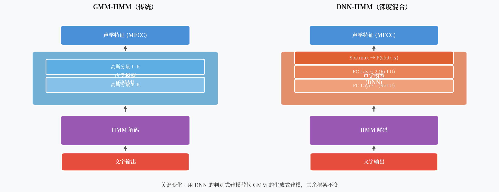

# DNN-HMM：深度学习改写语音识别的第一枪

2011 年，微软研究院在 Switchboard 电话语音识别基准上，用一个深度神经网络替换了 GMM，词错率从 27.4% 降到了 18.5%——相对下降超过 32%。这是一个里程碑事件，但也是一次不彻底的革命。

为什么说不彻底？因为 HMM 框架一点没动。DNN 只是做了一件事：**把 GMM 换掉，扮演一个更好的"打分器"**。

---

## 核心观点

2011 年这次革命的本质是**把生成式建模换成了判别式建模**。GMM 问的是"给定状态，声学特征长什么样"；DNN 直接问"给定声学特征，是哪个状态的概率最大"。这个方向的改变，才是 WER 大幅下降的根本原因。

---

## GMM 到底错在哪里

回顾 GMM 的工作方式：它建模 $P(x_t | s)$，即每个 HMM 状态的观测概率。

这是一个**生成式模型**。它试图描述"状态 s 会产生什么样的声学特征"。但识别任务真正需要的是**判别式**信息：给定这帧声学特征，哪个状态的概率最大？

$$\text{GMM}: P(x|s) \rightarrow \text{需要贝叶斯转换} \rightarrow P(s|x)$$

这个"贝叶斯转换"需要知道先验概率 $P(s)$，它引入了额外的近似误差。

更大的问题是：**GMM 对特征空间的建模能力有限**。

MFCC 特征是 39 维的。GMM 假设每个状态的特征服从高斯混合分布。但真实的声学特征空间是高维、非线性、高度复杂的。用有限个高斯去拟合，怎么够用？

---

## DNN 做了什么

DNN-HMM 的核心思路很简单：**直接训练一个神经网络，把声学特征映射到 HMM 状态的后验概率**。

$$\text{DNN}: x_t \rightarrow P(s | x_t)$$

网络的最后一层是 Softmax，输出维度等于 HMM 状态数（通常是几千个三音素状态）。

!!! note "为什么叫 Hybrid？"
    DNN 输出的是状态后验概率 $P(s|x)$，而 HMM 的 Viterbi 解码需要似然度 $P(x|s)$。通过贝叶斯公式：
    
    $$P(x|s) \propto \frac{P(s|x)}{P(s)}$$
    
    用 DNN 的 Softmax 输出除以先验概率 $P(s)$，就得到了"缩放的似然度"（scaled likelihood）。这个设计让 DNN 可以直接插入原有的 HMM 解码框架，不改动解码器一行代码。

DNN 比 GMM 强在哪里？

- **判别式建模**：直接优化分类目标，不浪费容量建模不需要的分布
- **非线性表达能力强**：多层非线性变换可以拟合任意复杂的决策边界
- **输入可以是多帧拼接**：DNN 一次看 11-31 帧的上下文（左右各若干帧拼接），而 GMM 每帧独立处理

---

## 训练细节：从 GMM 到 DNN 需要几步

DNN-HMM 的训练并不是从零开始。它有一个**依赖 GMM 的 Bootstrap 过程**：

1. 先用常规方法训练一个 GMM-HMM 系统
2. 用 GMM-HMM 对训练数据做强制对齐（forced alignment），得到每一帧对应的 HMM 状态标注
3. 用这些帧级标注训练 DNN，目标是预测正确的 HMM 状态

这意味着 DNN-HMM 系统**必须先有一个 GMM-HMM 系统**，才能得到训练标签。这个依赖关系既是工程负担，也是后来端到端方法要解决的核心问题之一。

训练好 DNN 后，可以用 DNN 重新对训练数据做强制对齐（效果比 GMM 更准），然后再训练一轮 DNN——这叫 **re-alignment** 迭代，通常能带来额外 1-2% 的 WER 提升。

---

## CNN-HMM 和 LSTM-HMM

DNN-HMM 的成功迅速启发了更多变体。

### CNN-HMM

卷积神经网络（CNN）在图像上的成功让研究者想到：MFCC 的时频谱图（spectrogram）不就是一张图像吗？

CNN 对频率局部性（frequency locality）建模能力更强——同一个音素在不同频率位置的模式相似，卷积的权值共享恰好能利用这一点。IBM 在 2014 年用 CNN-HMM 进一步提升了准确率。

### LSTM-HMM

长短期记忆网络（LSTM）能建模长程时序依赖，这正是前馈 DNN 的短板。LSTM-HMM 用双向 LSTM（BiLSTM）处理整段音频，同时看前向和后向上下文。

2015 年，Google 发表了基于 LSTM 的 CTC 系统（虽然不是 LSTM-HMM，而是端到端的 CTC，但同期的 LSTM-HMM 研究也取得了很好的结果）。

!!! tip "双向 vs 单向"
    双向 LSTM 精度更高，但无法流式推理（需要看完整段音频才能处理第一帧）。单向 LSTM 精度稍低，但可以做流式识别。这个 trade-off 至今仍然存在。

---

## DNN-HMM 的局限

尽管 DNN-HMM 带来了显著提升，它依然有几个根本性的局限：

**1. 帧级独立假设**  
DNN 的训练目标是逐帧分类，每帧独立预测。但实际上，相邻帧之间存在强依赖（协同发音），逐帧独立假设会损失这些信息。LSTM 改善了这一点，但仍是近似。

**2. 训练标签依赖 GMM 对齐**  
如前所述，DNN 的训练标签来自 GMM-HMM 的强制对齐，这引入了初始 GMM 的误差上限。对齐质量决定了 DNN 训练的上限。

**3. HMM 框架的先天限制**  
HMM 的马尔可夫假设和帧级独立性在 DNN-HMM 中依然存在。更根本的问题是：需不需要 HMM？能不能直接从特征序列端到端地预测文字？

**4. 系统复杂度高**  
一个完整的 DNN-HMM 系统需要：MFCC 提取、GMM 系统初始化、强制对齐、DNN 训练、WFST 解码图构建……每一步都有很多超参数需要调整。

---

## 历史意义

DNN-HMM 是"深度学习进入语音识别"的标志。它证明了两件事：

1. 神经网络可以学到比手工特征（GMM）更好的声学表示
2. HMM 框架足够灵活，可以容纳新的声学模型

Hinton、Deng、Yu 等人 2012 年发表在 IEEE Signal Processing Magazine 的论文 "Deep Neural Networks for Acoustic Modeling in Speech Recognition" 成为这一时期最重要的综述，至今引用超过 10,000 次。

但这只是开始。下一步要问的问题是：**能不能把 HMM 也去掉？**

---

## 一个开放问题

DNN-HMM 的训练流程依赖帧级对齐标签，而这些标签来自 GMM。如果没有帧级对齐，只有"这段音频对应这句话"的序列级标注，还能训练模型吗？

**CTC（Connectionist Temporal Classification）给出了答案。**
