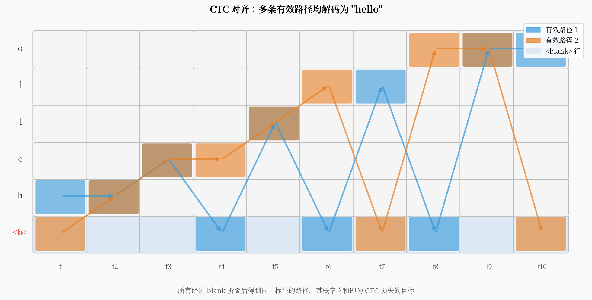

# CTC：用一个空白符号，解开了序列对齐的死结

假设你有一段音频和对应的文字"hello"，但你不知道每一帧音频对应哪个字母。DNN-HMM 的解法是：先训练一个 GMM 系统，用它做帧级对齐，再用这些对齐标签训练 DNN。

2006 年，Alex Graves 问了一个更直接的问题：**能不能跳过对齐这一步，直接从音频序列端到端地学到文字序列？**

CTC（Connectionist Temporal Classification）的答案是：可以——只要你引入一个特殊的"空白符号"。



---

## 核心观点

CTC 的本质不是一种网络结构，而是一种**损失函数设计**。它通过引入 `<blank>` 并对所有有效对齐路径的概率求和，让模型在不知道输入帧和输出字符精确对应关系的情况下也能端到端训练。这一设计彻底绕开了对帧级标注的依赖。

---

## 对齐问题：死结在哪里

给定一段 $T$ 帧的音频和 $L$ 个字符的标注，有多少种可能的对齐方式？

如果每帧只对应一个字符，且字符只能向前推进（不能后退），对齐方式的数量是组合数 $\binom{T}{L}$。当 $T=100$，$L=20$ 时，这是一个天文数字。

传统 DNN-HMM 的做法是强制确定一种对齐（通过 Viterbi 对齐），然后用这个单一对齐训练模型。但这种确定性对齐是有误差的，并且把误差固化进了训练标签里。

**CTC 的思路是：不去找唯一的对齐，而是对所有合法的对齐路径求和。**

---

## `<blank>` 符号的引入

CTC 在输出词汇表里增加了一个特殊 token：`<blank>`（简写为 `-`）。

CTC 模型的每一帧输出一个词汇表上的概率分布（包含 `<blank>`）。这样每一帧都会输出一个 token，得到一条长度为 $T$ 的路径 $\pi = (\pi_1, \pi_2, \ldots, \pi_T)$。

然后定义一个**折叠规则** $\mathcal{B}$：先合并连续重复的 token，再删除所有 `<blank>`。

举例：输入"hello"，$T=10$：

```
路径：h h e - l - l l o o
折叠：h e l l o  ✓
```

```
路径：- h e - - l l - o -
折叠：h e l o  ✗  (少了一个 l)
```

所有折叠后得到"hello"的路径，都是有效的 CTC 路径。

!!! note "重复字符的处理"
    如果输出序列中有相邻相同字符（如 "ll"），CTC 规定必须用 `<blank>` 隔开。路径 `l - l` 折叠为 `ll`，而路径 `l l` 折叠为 `l`（只有一个 l）。这是 `<blank>` 的第二个作用：区分相邻重复字符。

---

## CTC 损失：对所有有效路径求和

设网络在第 $t$ 帧输出 token $k$ 的概率为 $y_k^t$。则路径 $\pi$ 的概率为：

$$P(\pi | x) = \prod_{t=1}^{T} y_{\pi_t}^t$$

CTC 损失最大化所有有效路径的概率之和：

$$P(y | x) = \sum_{\pi \in \mathcal{B}^{-1}(y)} P(\pi | x)$$

这个求和在路径数量上是指数级的，但可以用**前向-后向算法（Forward-Backward）**在 $O(T \cdot L)$ 时间内精确计算：

定义前向变量 $\alpha(t, s)$ = 在时刻 $t$，已经成功输出了前 $s$ 个字符（以任意合法路径）的概率。

$$\alpha(t, s) = \sum_{\pi \in \text{有效前缀路径}} \prod_{t'=1}^{t} y_{\pi_{t'}}^{t'}$$

递推关系类似于 HMM 的前向算法，只是加入了 `<blank>` 状态的跳转规则。

---

## CTC 的条件独立假设

CTC 能高效计算的代价，是一个很强的假设：**每一帧的输出在给定输入的条件下是独立的**。

数学上，这意味着：

$$P(\pi | x) = \prod_{t=1}^{T} y_{\pi_t}^t$$

即路径概率是各帧输出概率的**乘积**，而不是一个条件序列概率。

这个假设在实践中有多大影响？

**明显的地方**：CTC 模型不能直接建模输出 token 之间的语言依赖。比如，模型不能利用"h-e-l"已经出现的信息来更好地预测下一个"l"。

**不那么明显的补救**：CTC 通常配合外部语言模型（N-gram 或神经 LM）做 beam search，在解码阶段引入语言约束。这在实践中能补偿大部分损失。

!!! warning "条件独立的实际影响"
    在低资源场景下，CTC 的条件独立假设影响明显——语言模型能提供的先验信息少，CTC 单独表现不好。RNN-T 通过引入预测网络来解决这个问题（见下一篇）。

---

## 解码：贪心 vs Beam Search

**贪心解码**：每帧取最高概率的 token，然后折叠。速度极快，但结果不是最优的。

**Beam Search**：维护 $B$ 条最高概率的路径，同时用语言模型打分。

$$\text{score} = \log P_{\text{CTC}}(y|x) + \lambda \log P_{\text{LM}}(y)$$

Beam Search 通常比贪心解码提升 10-20% WER。$\lambda$ 是权衡 CTC 和语言模型的超参数，需要在验证集上调优。

---

## CTC 的主要优势

**1. 真正的端到端训练**  
不需要帧级对齐，只需要"这段音频→这句话"的序列级标注。标注成本大幅降低。

**2. 推理速度快**  
贪心解码是 $O(T \cdot V)$（$V$ 是词汇表大小），比 WFST + Viterbi 快得多。

**3. 流式友好**  
CTC 可以做流式推理——处理完每帧就可以输出当前最可能的 token，不需要等待整段音频。（虽然贪心解码的 WER 会高一些。）

**4. 实现简单**  
PyTorch 和 TensorFlow 都有内置的 CTC Loss 实现，十几行代码就能上手。

---

## CTC 在工业界的位置

尽管 RNN-T 在流式识别中更受青睐，CTC 至今仍是很多系统的重要组件：

- **Conformer-CTC**：用 Conformer 做编码器 + CTC 损失，在离线识别中表现优秀
- **CTC 辅助损失**：很多端到端系统（如 ESPnet 的 Transformer-based 模型）同时使用 CTC 和注意力解码器，CTC 辅助训练编码器
- **SenseVoice**（阿里巴巴 2024）：非自回归 CTC 框架，推理速度比自回归模型快 10 倍

---

## 一个开放问题

CTC 解决了对齐问题，但代价是条件独立假设。有没有可能在保留 CTC 流式能力的同时，也让模型能建模输出 token 之间的依赖？

**RNN-T 的答案是：加一个"语言模型头"。**
