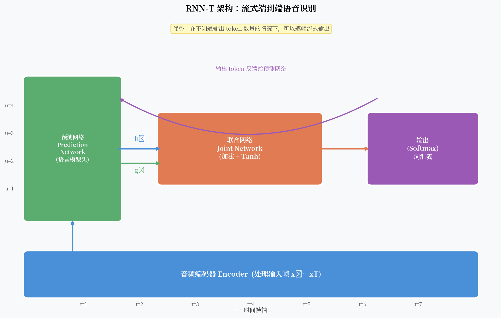

# RNN-T：真正流式端到端，Google 是怎么做到的

CTC 解决了对齐问题，但留下了一个遗憾：它假设每一帧的输出是条件独立的。这意味着模型不能直接利用"已经输出了什么"来预测"下一个输出是什么"。

2012 年，Alex Graves 在 CTC 的基础上提出了 RNN-T（Recurrent Neural Network Transducer）。核心思想只有一句话：**在 CTC 的解码框架里加一个 RNN，让它记住已经输出的 token 序列**。

就这一个改动，让模型有了内置的语言建模能力，同时保留了完全的流式能力。



---

## 核心观点

RNN-T 是目前工业界流式语音识别的首选——它在 CTC 的框架基础上加了一个"语言模型头"（预测网络），通过联合网络将声学信息和语言信息融合，**同时保留了不需要对齐标注、可以流式输出的优势**。

---

## CTC 的遗憾

CTC 的输出概率分解为：

$$P(\pi | x) = \prod_{t=1}^{T} y_{\pi_t}^t$$

每一帧的输出 $y_t$ 只依赖输入 $x$，与之前输出的 token 序列无关。

这带来一个显然的问题：模型无法学到语言规律。它不知道"q" 后面大概率跟 "u"，不知道"人工智" 后面很可能跟 "能"。

在实践中，CTC 系统必须配合外部语言模型来补偿这个缺陷。但外部语言模型的融合是浅层的（只在 beam search 的 rescoring 阶段），不如内置语言建模来得自然。

---

## RNN-T 的三个组件

RNN-T 由三部分组成：

### 1. 编码器（Encoder）

输入：声学特征序列 $x_1, \ldots, x_T$  
输出：高层声学表示 $h_1, \ldots, h_T$

编码器处理输入音频，提取时序声学特征。可以是 LSTM、Conformer 或任意序列模型。

**关键点**：编码器是**因果的**（causal），即 $h_t$ 只依赖 $x_1, \ldots, x_t$，不看未来帧。这保证了流式推理能力。

### 2. 预测网络（Prediction Network）

输入：已输出的 token 序列 $y_1, \ldots, y_{u-1}$  
输出：隐状态 $g_u$

预测网络本质上是一个语言模型。它把已输出的 token 序列编码成一个向量，表示"语言层面，下一个 token 是什么"的预期。

$$g_u = \text{RNN}(y_0, y_1, \ldots, y_{u-1})$$

其中 $y_0$ 是特殊的开始 token。

!!! note "预测网络作为隐式语言模型"
    预测网络没有看任何声学输入，它只看已输出的 token。从这个角度，它就是一个语言模型。但它是在端到端联合训练的——它学到的语言先验是针对当前 ASR 任务优化的，而不是通用文本语言模型。

### 3. 联合网络（Joint Network）

输入：声学表示 $h_t$ 和语言表示 $g_u$  
输出：词汇表上的概率分布

$$P(k | t, u) = \text{Softmax}(W \cdot \text{Tanh}(W_h h_t + W_g g_u))$$

联合网络把当前帧的声学信息和当前输出位置的语言信息融合，输出下一个 token 的概率。

---

## 二维格子：时间 × 输出

RNN-T 的解码可以想象成在一个二维格子上移动：

- X 轴：时间帧 $t = 1, \ldots, T$
- Y 轴：输出 token 位置 $u = 0, 1, \ldots$

在格子的每个位置 $(t, u)$，有两种可能：

1. **输出 `<blank>`**：沿 X 轴前进（消耗一帧音频），Y 轴不动
2. **输出实际 token**：沿 Y 轴前进（输出一个字符），X 轴不动

解码结束的条件：到达最后一帧，且输出 `<blank>` 离开格子。

这个过程天然是流式的——**每读一帧，就可以尝试输出零个或多个 token**，不需要等待整段音频。

---

## 训练目标

RNN-T 的损失和 CTC 类似，都是对所有合法路径的概率求和：

$$P(y | x) = \sum_{\pi \in \mathcal{B}^{-1}(y)} P(\pi | x)$$

不同的是，RNN-T 的路径概率不再是逐帧独立的乘积，而是在二维格子上的路径概率：

$$P(\pi | x) = \prod_{(t,u) \in \pi} P(\pi_{t,u} | h_t, g_u)$$

这个求和同样可以用前向-后向算法在 $O(T \times U \times V)$ 时间内精确计算，其中 $U$ 是输出序列长度，$V$ 是词汇表大小。

---

## 流式推理

流式推理时，编码器每接收一帧就更新 $h_t$，然后联合网络在当前帧循环输出 token，直到输出 `<blank>` 为止。

```
for t in 1..T:
    h_t = encoder.step(x_t)  # 逐帧处理
    while True:
        prob = joint(h_t, g_u)
        token = argmax(prob)
        if token == <blank>:
            break  # 跳到下一帧
        else:
            emit(token)
            g_u = prediction_network.step(token)  # 更新预测网络
            u += 1
```

这个简单的循环就实现了流式解码，延迟只有一帧（加上编码器的感受野）。

---

## Google 的生产实践

RNN-T 是 Google 在 Pixel 手机上语音输入的核心技术。

2019 年，Google 发表了 "Streaming End-to-End Speech Recognition for Mobile Devices"，在 Pixel 手机上实现了：

- **延迟 < 300ms**（感知层面接近实时）
- **模型大小 ~ 80MB**（可在手机端直接运行）
- **词错率**接近服务器端水平

关键技术点：
1. 用 LSTM 做编码器，限制 lookahead（向前看的帧数）控制延迟
2. 量化（INT8）减小模型体积和推理时间
3. 统计语言模型辅助 shallow fusion

2023 年之后，Google 把编码器换成了 Conformer（精度更高），Pixel 系列的语音识别继续以 RNN-T 为基础架构。

---

## RNN-T 的局限

**1. 训练复杂度高**  
前向-后向计算需要维护 $T \times U$ 的二维动态规划表，内存和计算量比 CTC 高很多。序列越长，开销越大。

**2. 推理速度依赖预测网络**  
每个输出 token 都需要运行一次预测网络，无法完全并行化。这在 CPU 上是明显瓶颈。

**3. 超参数多**  
编码器、预测网络、联合网络各自的深度和宽度需要仔细调整。Google 的最佳配置在不同任务上差异很大。

---

## 一个开放问题

RNN-T 的编码器原本是 LSTM，感受野是因果的（只看过去帧）。如果用注意力机制做编码器，能不能既看全局上下文，又保持流式能力？

**Conformer 给出了更好的编码器，但流式 Conformer 的设计本身也是一个有趣的工程问题。**
