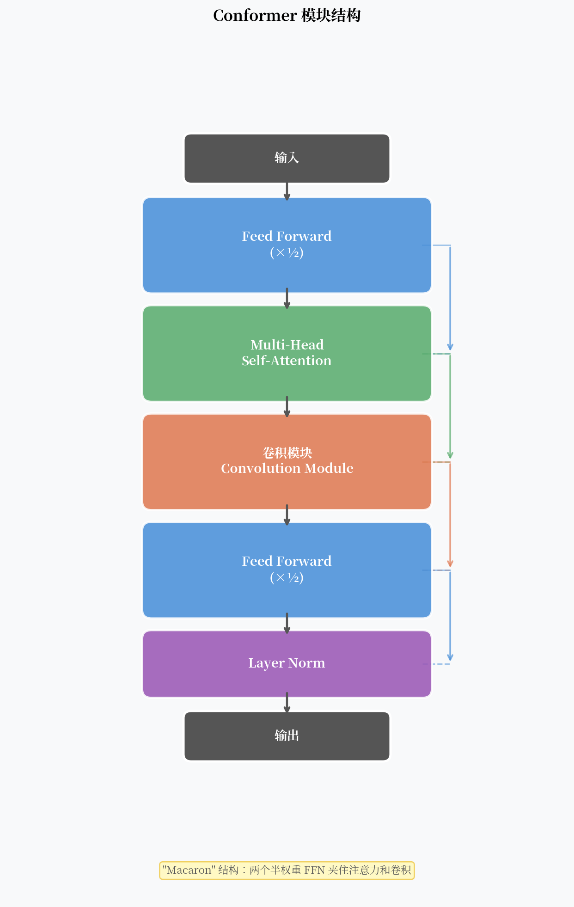

# Conformer：一个模块把局部卷积和全局注意力焊在一起

2017 年 Transformer 发布后，ASR 研究者很快就把它搬了过来。效果不错，但有个明显的问题：Transformer 擅长捕捉长程依赖，但对局部特征感知能力不足。

语音信号不一样。相邻几帧之间的协同发音（coarticulation）是 ASR 里最重要的局部模式之一。一个只看全局的模型，天然地对这类信息不敏感。

2020 年，Google 提出了 Conformer——**在 Transformer 的 Self-Attention 前后夹入一个深度可分离卷积模块**。这个设计让局部和全局信息都得到了充分建模，此后四年稳坐 ASR 骨干网络的位置。

---

## 核心观点

Transformer 在 ASR 上的主要短板是缺乏局部特征感知能力。Conformer 通过在 Self-Attention 前后夹一个深度可分离卷积模块，实现了局部与全局信息的互补建模，这个设计用了 4 年时间坐稳了 ASR 骨干网络的位置。

---

## Transformer 用于 ASR 的短板

用 Transformer 做 ASR 编码器，有两个主要问题：

**1. 缺乏局部特征建模**  
Self-Attention 是全局的——每个位置都可以 attend 到所有其他位置。这对句法依赖很有用，但对语音的局部模式（如辅音爆破、元音共振峰）的建模不够精细。

**2. 二次复杂度**  
Self-Attention 的计算复杂度是 $O(T^2 \cdot d)$，当输入序列很长时，计算量迅速膨胀。语音帧率通常 10ms 一帧，一段 10 秒音频就有 1000 帧，$1000^2 = 10^6$ 的注意力矩阵在推理时是明显瓶颈。

相比之下，CNN 的局部性假设正好补充了 Self-Attention 的短板：卷积核只看局部邻域，计算量是线性的。

---

## Conformer 模块的设计

一个完整的 Conformer 模块由四个子模块串联组成：

$$\text{output} = \text{LayerNorm}(x + \text{FF}_2(\text{Conv}(\text{MHSA}(\text{FF}_1(x)))))$$

（简化写法，省略了各处的残差连接。）

### "Macaron" 结构：两个半权重 FFN

Conformer 的最外层是两个前馈网络（Feed-Forward），但权重只有标准 FFN 的一半：

$$\tilde{x} = x + \frac{1}{2} \text{FFN}(x)$$

为什么是一半？这来自 Macaron Net 的设计哲学：把一个完整的 FFN 拆成两半，分别放在模块的头和尾，中间夹入注意力和卷积。这样每个子模块的输入都经过了相同量的非线性变换，参数分配更均匀。

实验显示，这个 "Macaron" 结构比普通的 Pre-LN Transformer 在 WER 上有 0.5-1% 的提升。

### Multi-Head Self-Attention with Relative Position Encoding

Conformer 的 Self-Attention 使用**相对位置编码**（Relative Position Encoding），而不是原版 Transformer 的绝对位置编码。

为什么？语音帧的绝对位置信息意义不大——重要的是"这一帧相对于另一帧有多远"。相对位置编码捕捉了这种相对关系。

具体实现使用 Transformer-XL 风格的相对位置编码：

$$\text{Attention}(Q, K, V) = \text{softmax}\left(\frac{QK^T + Q R^T}{\sqrt{d_k}}\right) V$$

其中 $R$ 是位置差的函数，而不是绝对位置。

### 卷积模块

这是 Conformer 的关键创新。卷积模块的结构：

1. **Pointwise Conv**（1×1 卷积）→ 通道扩展到 $2d$
2. **GLU**（门控线性单元）→ 通道恢复到 $d$，引入非线性
3. **Depthwise Conv**（深度可分离卷积，核宽度 $K$）→ 局部特征提取
4. **Batch Norm** → 训练稳定
5. **Swish 激活** → 平滑非线性
6. **Pointwise Conv**（恢复维度）

关键参数是 **核宽度 $K$**，通常取 31 或 15。它决定了卷积能看到的局部上下文大小：$K=31$ 对应左右各 15 帧，约 300ms。

!!! note "为什么用深度可分离卷积"
    标准卷积的参数量是 $K \times d \times d$，当 $d=512$ 时非常大。深度可分离卷积把它分成 Depthwise（$K \times d$）+ Pointwise（$d \times d$）两步，参数量减少约 $K$ 倍。Conformer 中 $K=31$，参数效率提升 30 倍以上。

---

## 为什么局部卷积在 Self-Attention 之后

Conformer 模块的顺序是 FF → MHSA → Conv → FF，不是 FF → Conv → MHSA → FF。为什么？

实验结果表明：先用注意力建立全局上下文，再用卷积在已有全局信息的基础上提炼局部特征，效果好于反过来的顺序。

直觉上：MHSA 先让每个位置"看到"了整个序列的信息，随后的卷积在这个更丰富的表示上做局部聚合，效果更好。

---

## 基准测试结果

Conformer 在 LibriSpeech 上的结果（2020 年发表时）：

| 模型 | test-clean WER | test-other WER |
|------|---------------|----------------|
| Transformer | 2.4% | 5.6% |
| ContextNet (CNN-based) | 2.1% | 5.1% |
| **Conformer (Medium)** | **2.1%** | **4.3%** |
| **Conformer (Large)** | **2.0%** | **4.3%** |

同年（2020），LibriSpeech test-clean 上 WER 2.0% 是 SOTA。此后四年，几乎所有的 ASR SOTA 系统都以 Conformer 作为编码器骨架，区别只在于训练方案（监督 vs 自监督）和解码方式（CTC vs attention vs RNN-T）。

---

## 流式 Conformer

标准 Conformer 的 Self-Attention 是全局的，无法流式推理。为了支持实时识别，需要修改：

**1. 因果 Conformer（Causal Conformer）**  
把 Self-Attention 改为**因果注意力**——每个位置只 attend 到自己和之前的位置。同时把 Depthwise Conv 改为因果卷积（只看左侧邻域）。代价是 WER 上升约 15-20%。

**2. Chunk-based Attention**  
把输入切成固定大小的 chunk，Attention 只在 chunk 内做。这是延迟和精度的折中。Google Streaming Conformer 用这种方式实现了低延迟流式识别。

**3. Emformer**  
Meta 提出的变体，通过 memory-enhanced 的方式传递 chunk 间的上下文。

---

## Conformer 的局限

**计算成本**：标准 Conformer 比同参数量的 Transformer 计算量大约 20-30%（因为多了卷积模块）。在移动端部署时需要专门的量化和裁剪。

**流式 WER 代价**：把全局注意力改为因果注意力，WER 通常上升 10-20%（相对值）。流式和离线之间存在明显 gap。

**不适合极长序列**：$O(T^2)$ 的注意力复杂度在超长语音（>30 秒）时成为瓶颈，需要改用局部注意力变体。

---

## 一个开放问题

Conformer 在有监督场景下效果很好，但它需要大量标注数据。对于标注数据稀缺的语言，有没有办法用无标注数据预训练一个好的声学编码器？

**这就是 wav2vec 2.0 和 HuBERT 要解决的问题。**
