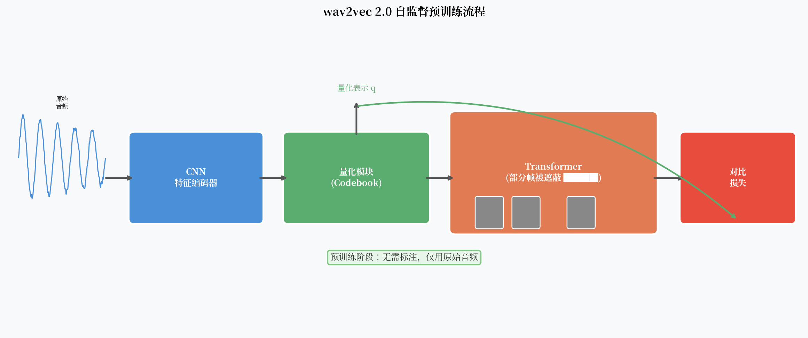

# wav2vec 2.0 和 HuBERT：用未标注数据学语音表示

标注一小时英语语音大概需要多少时间？

业界的经验是：每小时音频需要 4-10 小时的人工标注，包括转录、质检和校对。英语还算好办，因为有大量母语标注员。对于肯尼亚语、海地克里奥尔语或藏语，合格的标注员本身就稀缺，成本可能高出十倍。

这就是自监督预训练的动机：**世界上有数以亿计小时的无标注音频，能不能从中学到有用的语音表示？**

2020-2021 年，Facebook AI（现 Meta AI）连续发表了 wav2vec 2.0 和 HuBERT，证明了答案是肯定的。

---

## 核心观点

语音标注数据稀缺且昂贵。wav2vec 2.0 和 HuBERT 证明了自监督预训练可以从大量无标注音频中学到有用的语音表示——在低资源语言上，仅用 10 分钟标注数据加上自监督预训练，就能达到之前需要 100 小时标注数据的水平。

---

## 自监督学习的基本思路

BERT 对 NLP 的启示是：把文本中的部分词 mask 掉，让模型预测被 mask 的词。这个"掩码预测"目标迫使模型学习词的上下文语义。

语音版本的"BERT"需要解决一个额外问题：**NLP 的词是离散的，语音帧是连续的**。

"预测被 mask 的语音帧"是什么意思？预测一个连续向量？那模型很容易通过预测均值来 trivially 最小化损失，学不到有用的表示。

wav2vec 2.0 和 HuBERT 用两种不同的方式解决了这个问题。

---

## wav2vec 2.0：量化 + 对比学习

### 架构

wav2vec 2.0 的预训练由三部分组成：

**1. CNN 特征编码器**  
把原始波形编码为帧级特征序列 $z_1, \ldots, z_T$（约 20ms 一帧）。

**2. Transformer 上下文编码器**  
接收 mask 后的特征序列，输出上下文表示 $c_1, \ldots, c_T$。被 mask 的帧用一个可学习的 mask token 替换。

**3. 量化模块（Quantizer）**  
把 CNN 特征 $z_t$ 量化为离散 token $q_t$，来自一个大小为 $V$ 的 codebook（码本）。

这个量化步骤把连续的声学特征变成了离散的"伪 token"，类似于 NLP 里的词汇表。

### 对比损失

预训练目标：对于被 mask 的位置 $t$，让 Transformer 输出 $c_t$ 在量化表示 $q_t$ 和若干负样本 $q_{t_1'}, \ldots, q_{t_K'}$ 中，识别出正确的 $q_t$。

$$\mathcal{L}_{\text{ctc}} = -\log \frac{\exp(\text{sim}(c_t, q_t)/\kappa)}{\sum_{q' \in Q} \exp(\text{sim}(c_t, q')/\kappa)}$$

其中 $\text{sim}$ 是余弦相似度，$\kappa$ 是温度参数。

这个设计的精妙之处：**模型被迫学到与量化 codebook 对齐的连续表示**，既避免了预测连续均值的 trivial solution，又学到了有区分性的特征。

### 量化的实现

wav2vec 2.0 使用 Gumbel-Softmax 做可微分的向量量化：

$$q_t = G \cdot e_{\hat{g}}$$

其中 $G$ 是可学习的 codebook 矩阵，$\hat{g}$ 是通过 Gumbel-Softmax 选择的 codebook 索引。Gumbel-Softmax 在前向传播时输出离散的 one-hot 向量，在反向传播时用 softmax 近似梯度，保证了端到端可训练。

---

## HuBERT：离线 K-means + 掩码预测

HuBERT（Hidden-Unit BERT）的思路更直接，受 BERT 原版启发更深：

**直接预测被 mask 的离散 token**——只要能生成可靠的"伪标签"，就能做掩码预测了。

### 两阶段训练

**第一阶段：用 MFCC 做 K-means 聚类**  
对所有训练数据的 MFCC 特征做 K-means 聚类（通常 $K=100$），得到每帧的聚类标签。这些标签就是"伪音素"。

**用伪标签做掩码预测预训练**  
Transformer 对 mask 后的音频做掩码预测，目标是预测被 mask 帧对应的 K-means 聚类标签。

$$\mathcal{L}_{\text{HuBERT}} = -\sum_{t \in M} \log P(\hat{z}_t | \tilde{x}, t)$$

其中 $M$ 是被 mask 的位置集合，$\hat{z}_t$ 是伪标签，$\tilde{x}$ 是 mask 后的输入。

**第二阶段：用第一阶段的模型特征做更好的聚类**  
第一阶段预训练完后，用 Transformer 的中间层特征（而不是 MFCC）重新做 K-means 聚类，聚类中心数增加到 $K=500$。然后用新的聚类标签再训练一次。

这个迭代过程产生了质量更好的伪标签，进而训练出更好的模型。

!!! tip "为什么 HuBERT 用离线聚类？"
    对比 wav2vec 2.0 的在线量化，HuBERT 的离线 K-means 聚类不参与反向传播，计算更简单，也更稳定。代价是需要多次迭代，训练流程更长。但最终效果上 HuBERT 和 wav2vec 2.0 相近，在某些基准上更好。

---

## 低资源实验：震撼的结果

wav2vec 2.0 论文中最令人印象深刻的实验是**低资源语音识别**：

| 标注数据量 | 无预训练 WER | wav2vec 2.0 WER |
|-----------|-------------|-----------------|
| 10 分钟 | 无法收敛 | 8.9% (clean) |
| 1 小时 | ~73% | 6.0% (clean) |
| 100 小时 | ~26% | 3.8% (clean) |
| 960 小时 | ~2.4% | 1.9% (clean) |

用 960 小时无标注数据预训练 + **10 分钟**标注数据微调，WER 只有 8.9%——而从头训练用 100 小时标注数据的模型 WER 还有 26%。

这个结果改变了低资源 ASR 的游戏规则。

**现实意义**：对于一个有 500 万母语者的少数民族语言，收集 100 小时标注数据几乎不可能。但收集 1000 小时无标注音频（广播、对话等）要容易得多。自监督预训练让这种语言的 ASR 开发变得可行。

---

## 两者的比较

| | wav2vec 2.0 | HuBERT |
|--|-------------|--------|
| 离散化方式 | 在线 Gumbel-Softmax 量化 | 离线 K-means 聚类 |
| 训练目标 | 对比学习 | 掩码预测（交叉熵） |
| 训练稳定性 | 略敏感（需调整对比温度） | 更稳定 |
| 伪标签质量 | 随训练同步提升 | 需要迭代更新 |
| LibriSpeech 结果 | 基本相当 | 略好 |

---

## 局限性

**1. 预训练成本高**  
wav2vec 2.0 Large 在 960 小时 LibriSpeech 上预训练需要约 8 个 A100 GPU 运行 1-2 天。HuBERT 因为需要迭代聚类，总计算量更高。

**2. 预训练数据决定上限**  
如果目标语言的预训练音频来自单一场景（如广播），迁移到嘈杂对话场景效果会下降。预训练数据的多样性至关重要。

**3. 特征对下游任务的专用性**  
wav2vec 2.0 的预训练特征在 ASR 上表现很好，但不一定能直接迁移到情感识别或说话人识别任务——这些任务需要的信息可能被掩码预测目标"洗掉"了。

**4. 微调数据依然需要**  
自监督预训练解决了"没有标注数据"的问题，但仍然需要一些标注数据做微调（哪怕只有 10 分钟）。完全零资源的语音识别仍然是开放问题。

!!! warning "预训练和微调的域适配"
    如果预训练数据（如英语播客）和微调数据（如医疗对话）差距太大，效果会明显下降。预训练不是万能的，域适配依然重要。

---

## 一个开放问题

wav2vec 2.0 和 HuBERT 都需要专门的预训练阶段。有没有一种方式，通过简单地把海量弱监督数据扔进去训练，不做精心的自监督设计，也能得到一个在 99 种语言上都好用的模型？

**Whisper 的答案是：可以，但你需要 680,000 小时的数据。**
