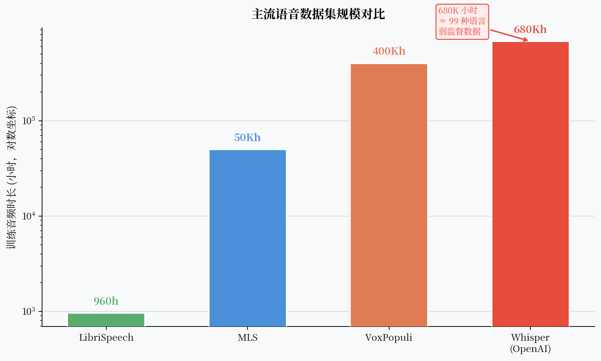

# Whisper：68 万小时弱监督，OpenAI 给语音识别的一个简单答案

2022 年，OpenAI 发布了 Whisper，并附上了一句简单的描述："Robust Speech Recognition via Large-Scale Weak Supervision"（通过大规模弱监督实现鲁棒语音识别）。

没有新颖的自监督设计，没有精巧的对比学习，没有量化码本——就是一个编解码 Transformer，加上从互联网上抓来的 680,000 小时（约 68 万小时）音频-文本对。

结果：在无需微调的情况下，Whisper 在 99 种语言上都能工作，在很多语言上超过了当时精心微调过的 SOTA 模型。

**数据量足够大的时候，很多技巧都可以不要。**



---

## 核心观点

Whisper 告诉我们：当数据足够多，很多精心设计的技巧都变得可以不要。但"弱监督≠无监督"，数据质量依然决定了 Whisper 的边界——它在某些口音、方言和专业领域上仍有明显局限。

---

## 什么是"弱监督"

标准的有监督 ASR 数据：人工精标，每个词时间戳准确，质量高，但成本极高。

自监督预训练（wav2vec/HuBERT）：完全无标注音频，精心设计的预训练目标。

Whisper 的"弱监督"处于中间：**从互联网上大规模抓取音频-文本对，不做精细标注，但对数据进行粗粒度质量过滤**。

数据来源包括：

- 播客（带字幕的）
- YouTube 视频（带自动生成字幕的）
- 有声书
- 多语言网站的音频内容

这些数据质量参差不齐——字幕可能由 YouTube 自动识别生成，本身就有错误；有些音频有背景音乐；有些字幕和音频时间不完全对齐。

**Whisper 的策略**：接受这些噪声，用数量弥补质量，让模型自己从大量噪声样本中学到鲁棒的表示。

---

## 数据规模带来了什么

680,000 小时 vs 之前最大的公开语音数据集：

- **LibriSpeech**：960 小时英语有声书（高质量）
- **MLS**（Multilingual LibriSpeech）：约 50,000 小时多语言有声书
- **VoxPopuli**：约 400,000 小时欧洲议会多语言演讲

Whisper 的 680,000 小时中，英语约 438,000 小时，另外 96 种语言分享剩余 242,000 小时。

规模带来的核心优势：

**1. 多语言覆盖**  
训练数据覆盖 99 种语言，包括很多低资源语言。模型学到了跨语言的声学-文字映射。

**2. 域鲁棒性**  
多样化的数据来源（播客、YouTube、有声书）让模型在不同录音条件下都表现稳定。

**3. 噪声鲁棒性**  
互联网音频的噪声多样，模型被迫学到了忽略背景噪声的能力。

---

## 多任务 Token 设计

Whisper 的编解码 Transformer 架构本身没有特别新颖。真正有意思的是它的**多任务设计**：

解码器的输入不只是 BOS token，而是一个特殊的 token 序列，指定当前任务：

```
<|startoftranscript|> <|zh|> <|transcribe|> <|notimestamps|>
```

- `<|zh|>`：指定语言（中文）
- `<|transcribe|>`：任务是 ASR 转录（vs `<|translate|>` 翻译成英文）
- `<|notimestamps|>`：不输出时间戳（vs 输出词级时间戳）

这些 special token 是可学习的，模型在训练时学会根据这些指令切换行为。

效果：**一个模型，支持 99 种语言的 ASR 和翻译，以及时间戳输出**——不需要为每个任务训练独立的模型。

!!! note "Whisper 的翻译能力"
    `<|translate|>` token 让 Whisper 可以直接把外语语音翻译成英语文本（Speech Translation）。这是因为 68 万小时训练数据中包含了大量"外语音频→英语字幕"的样本，模型从中学到了端到端的语音翻译能力。

---

## 模型尺寸系列

Whisper 发布了从 39M 到 1.55B 参数的 6 个尺寸：

| 模型 | 参数量 | Encoder Layers | Decoder Layers |
|------|--------|----------------|----------------|
| tiny | 39M | 4 | 4 |
| base | 74M | 6 | 6 |
| small | 244M | 12 | 12 |
| medium | 769M | 24 | 24 |
| large | 1.55B | 32 | 32 |
| large-v2 | 1.55B | 32 | 32 |

在多数公开基准上，large-v2 比之前的 SOTA 更好；small 模型在笔记本 CPU 上的推理速度也可以接受。

---

## Whisper 的边界：它在哪里失败

**1. 实时性差**  
Whisper 的解码器是自回归的，每生成一个 token 都需要运行一次解码器。对于长音频，延迟很高。官方实现不支持流式输出。

**2. 口音和方言**  
Whisper 的训练数据虽然多样，但主要是"书面语"风格的音频（播客、有声书）。方言、口音重的语音、口语化表达上，Whisper 的表现明显下降。

**3. 专业领域词汇**  
医学术语、法律文书、专业缩写——训练数据里这类内容比例低，Whisper 常常识别错。

**4. 某些语言的实际效果**  
训练数据里某些语言只有几百小时，效果远不如英语。

**5. 幻觉问题**  
当音频很安静或噪声很大时，Whisper 有时会"幻觉"出不存在的词语。这是弱监督训练数据的副作用——模型见过很多"音频+随机文字"的噪声样本。

!!! warning "Whisper 的幻觉"
    长静音片段最容易触发幻觉。Whisper 会把静音识别为重复的词或奇怪的句子。在生产系统中使用 Whisper 时，需要做静音检测（VAD）和后处理过滤。

---

## 对 ASR 领域的影响

Whisper 的发布改变了语音识别的比较基准。

在 Whisper 之前，各语言的 ASR 研究都在比较"有多少标注数据"的条件下达到最低 WER。

在 Whisper 之后，讨论变成了："在完全不微调的情况下，Whisper Large 的 WER 是多少？能不能做 Whisper 的高效微调（LoRA 等）来达到更好效果？"

这个"零样本基线突然变得很强"的变化，让一部分依赖少量标注数据的系统失去了意义，也推动了更多关注数据高效微调的研究。

---

## 一个开放问题

Whisper 很强，但它只做 ASR 和翻译。语音是一种感知输入——如果把 Whisper 的音频编码器接到一个大语言模型上，让 LLM 来理解语音，会发生什么？

**Qwen-Audio 代表了这个方向的一次探索。**
