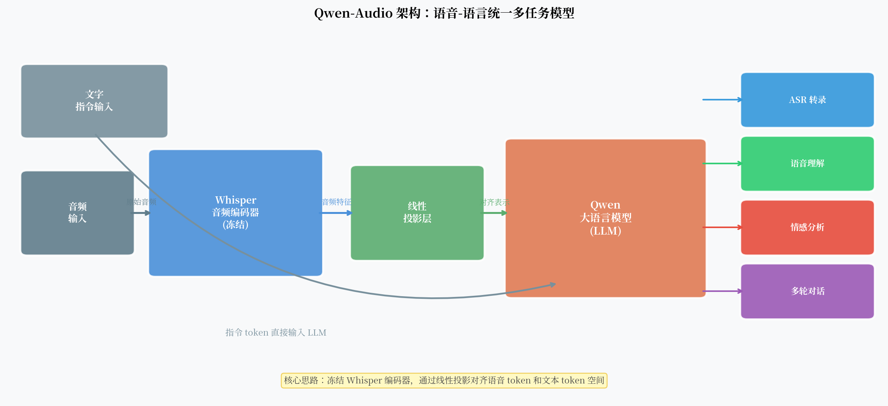

# Qwen-Audio：当语音识别遇上大语言模型

传统 ASR 系统做一件事：把语音变成文字。输入是音频，输出是转录文本，仅此而已。

但如果你对它说："这段音频里说话人的情绪怎么样？"或者"他说的这个医学术语是什么意思？"——传统 ASR 没有这个能力。这些问题需要语言理解，而 ASR 在文字输出之后就结束了。

2023 年，阿里巴巴发布了 Qwen-Audio：把 Whisper 的音频编码器和通义大语言模型（Qwen LLM）连接起来，用一个线性投影层作为桥梁。

这个组合重新定义了语音 AI 能做的事。

---

## 核心观点

Qwen-Audio 代表了 ASR 的一个范式转变——语音不再只是"转成文字"的输入，而是大模型理解世界的一个感知通道。通过把经过充分预训练的音频编码器和语言模型对齐，一个模型可以同时处理转录、理解、分析和多轮对话。

---

## 架构：三个组件

Qwen-Audio 的架构可以分为三部分：

### 1. Whisper 音频编码器（冻结）

Qwen-Audio 直接复用了 Whisper Large v2 的音频编码器，**不更新其参数**。

为什么选择 Whisper？

- Whisper 编码器经过 680K 小时多语言音频训练，已经是目前最强的通用音频特征提取器之一
- 冻结编码器减少了训练参数量，降低了遗忘风险
- 中英文语音都能良好处理

编码器把 30 秒以内的音频转为固定长度的帧级特征序列（约 1500 个向量，每个 1280 维）。

### 2. 线性投影层（训练的关键）

这是连接音频编码器和语言模型的"翻译器"：

$$h_{\text{audio}} = W \cdot f_{\text{Whisper}}(x_{\text{audio}}) + b$$

一个简单的线性变换，把 Whisper 的 1280 维特征投影到 Qwen LLM 的 embedding 维度（通常 4096 维）。

**为什么线性投影就足够了？**

直觉上，Whisper 编码器的特征已经包含了丰富的语音信息，LLM 需要的是理解这些信息，而不是重新编码它。线性投影的任务只是做维度对齐，让两个模态的表示空间"对齐"。

这个设计和 LLaVA（视觉语言模型）非常相似，区别只在于视觉编码器换成了音频编码器。

!!! note "为什么不用更复杂的 Adapter？"
    有研究尝试用多层 MLP 或 cross-attention 做模态对齐，在某些任务上有提升，但提升幅度有限。线性投影简单高效，是目前工程实践中的主流选择。

### 3. Qwen LLM

Qwen 是阿里巴巴的大语言模型，基于 Transformer decoder-only 架构，在大量中英文文本上预训练。

在 Qwen-Audio 中，LLM 接收两类输入：
- **音频 token**：来自线性投影后的音频特征（约 1500 个 token）
- **文字 token**：用户的文字指令

这两类 token 拼接后输入 LLM，LLM 统一处理并生成文字回复。

---

## 多任务指令微调

Qwen-Audio 的核心训练策略是**多任务指令微调**（Multi-task Instruction Tuning）。

训练数据包括多种任务类型：

| 任务 | 示例 |
|------|------|
| ASR 转录 | "请转录这段音频" → "北京今天天气晴朗…" |
| 语音翻译 | "把这段英语翻译成中文" → "…" |
| 情感分析 | "说话人的情绪是什么？" → "语气平静，略带喜悦" |
| 音频理解 | "这段音频是什么场景？" → "户外，有鸟叫声和风声" |
| 多轮对话 | 多轮问答，支持上下文理解 |

通过这种多任务微调，模型学会了根据指令灵活切换行为——同一段音频，不同的指令会得到不同的输出。

---

## 超越 ASR：新能力

这个架构带来了传统 ASR 没有的能力：

**1. 指令驱动的灵活性**  
用户可以用自然语言指定任务，不需要预先选择功能入口。"帮我概括一下这段会议录音的主要内容"——这句话既要 ASR 也要摘要，传统 ASR 系统做不到。

**2. 多轮对话能力**  
LLM 的 context window 支持多轮对话。"你刚才说的第三点能展开说说吗？"——模型知道"第三点"指的是什么。

**3. 语言层面的理解**  
因为 LLM 有丰富的世界知识，它能理解语音内容的语义，而不仅仅是把音素映射到文字。

**4. 跨模态任务**  
文字指令可以引导模型处理音频中的特定信息。"这段音频中提到了哪些具体的时间节点？"——LLM 会从转录内容中抽取结构化信息。

---

## 局限性与风险

**1. ASR 精度不一定是最优的**  
Qwen-Audio 是通用模型，在特定场景下的 ASR 精度可能不如专门优化的 Conformer-CTC 系统。如果你只需要最准的转录，专用 ASR 系统可能更合适。

**2. 延迟高**  
LLM 的自回归解码速度慢。对于需要实时识别的场景，Qwen-Audio 不适合。

**3. 幻觉风险增加**  
LLM 本身的幻觉问题 + 语音理解的不确定性 = 双重风险。模型可能在没有充分声学证据的情况下"猜"出内容。

**4. 隐私问题**  
音频数据通常包含大量个人信息（声纹、对话内容）。把音频发到云端 API 处理，隐私风险需要认真评估。

**5. 音频长度限制**  
Whisper 编码器只能处理 30 秒以内的音频。更长的音频需要分段处理，上下文连贯性依赖额外的工程设计。

!!! warning "对 ASR 精度的期望管理"
    Qwen-Audio 的设计目标是"理解"，不是"极致精度的转录"。在噪声环境、方言、专业术语等场景下，它的 WER 可能高于专用 ASR 系统。选择工具时需要明确目标。

---

## 范式转变的意义

Qwen-Audio 代表了一种更大的趋势：**感知模块 + 语言模型的多模态融合**。

相似的架构正在视觉（LLaVA、GPT-4V）、视频（Video-LLaMA）、乃至传感器数据领域涌现。

共同的设计模式是：

1. 使用强大的预训练编码器（CLIP、Whisper、VideoMAE 等）
2. 用轻量的投影层（线性或 MLP）对齐到 LLM embedding 空间
3. 用多任务指令微调赋予模型灵活的任务处理能力

这种"预训练编码器 + LLM + 指令微调"的范式，正在成为多模态 AI 的标准套路。

语音 AI 的终点可能不是"最准的 ASR"，而是**能听、能懂、能说的多模态智能体**。

---

## 一个开放问题

Qwen-Audio 用了冻结的 Whisper 编码器 + 线性投影。但 Whisper 编码器是为 ASR/翻译设计的，它的特征对情感分析或音频理解来说真的是最优的吗？

未来的方向可能是：**端到端联合训练音频编码器和 LLM**，或者使用**更通用的音频基础模型**（如在多种音频任务上预训练的编码器）作为感知层。

语音 + 大模型的研究刚刚开始。
