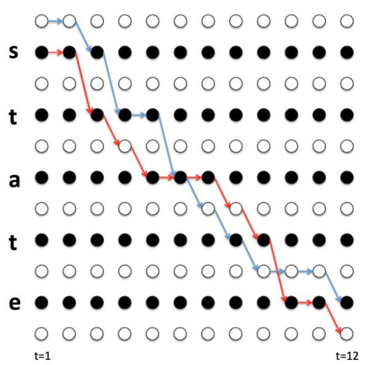

# CTC
## CTC算法产生的原因
CTC全称Connectionist Temporal Classification。  
在语音识别领域，我们对音频的处理一般是带有偏移地分窗后做特征提取，形成一帧的特征，而模型学习的目标是phone或者character，但是语音实际上每个phone或character对应的帧的数量会不一致，而且还有静音帧（不对应phone或character）。这样就存在对齐的问题：每帧的监督信号怎么确定？实际上，语音本身的音素边界就是不清楚的，人工标注一方面太贵，一方面很难标注准确。CTC就是为了解决这个对齐问题而提出的。在下文，为表述方便，我们假设标签结果都是phone。  
### CTC的想法
逐步来解析CTC的想法：
1. 首先因为语音有静音帧，所以在标签体系上应该存在静音帧对应的标签，因此增加一个blank标签（记为$\xi$）
2. 因为每个phone可能会对应多帧。所以应该允许phone有重复，并且可以融合成一个phone
3. 在2的基础上，因为需要对相同的相邻phone做区分，例如apple中的p。所以在区分相同相邻phone时，通过添加一个blank来实现。  
基于上面3个想法，很同意推导出从CTC序列到真实序列的压缩规则：
1. 先合并相同phone
2. 去除blank  
举例：
$aap \xi ppp \xi le$ -> $ap \xi p \xi le $-> $apple$ 

### CTC loss的计算
基于上述的压缩规则，可以有多个CTC序列对应压缩后的序列。对模型的训练来说，所有的压缩后于ground truth序列相同的序列都应该是合法序列。  
但是所有的合法序列要显式都找出来计算量太大，是$O(N^T)$的指数复杂度，是不可接受的。所以借鉴HMM的前后向过程，用动态规划来求解。  
这里需要注意，我们不再关注每个时刻的监督信号，因为本身就不存在，不同合法序列在每个时刻对应的phone可能都是不同的。我们只求所有合法序列的概率和。  

  

定义辅助变量：
前向变量 $\alpha(t, s)$：在时刻 $t$ 已经产生了前缀 $\mathbf{l}'[1:s]$ 的所有合法路径的概率之和
后向变量 $\beta(t, s)$：从时刻 $t$ 的位置 $s$ 出发，完成剩余序列的概率之和。  
前向转移公式如下：
1. 初始条件如下：
    $$\alpha(1, 1) = p(\varepsilon \mid \mathbf{x}, t=1)$$
    $$\alpha(1, 2) = p(y_1 \mid \mathbf{x}, t=1)$$
    $$\alpha(1, s) = 0, \quad s > 2$$
2. 当$\mathbf{l}'_{s} = \xi $或$\mathbf{l}'_{s} = \mathbf{l}'_{s-2}$ , 此时不能跳过 $s-1$（否则两个相同标签会被合并），只允许：$$ \alpha(t, s) = \left[\alpha(t-1, s) + \alpha(t-1, s-1)\right] \cdot p(\mathbf{l}'_s \mid t) $$
2. 当$\mathbf{l}'_{s} \neq \xi $并且$\mathbf{l}'_{s} \neq \mathbf{l}'_{s-2}$, 允许从 $s−2$ 直接跳（跳过中间的 blank）:
3$\alpha(t, s) = \left[\alpha(t-1, s) + \alpha(t-1, s-1) + \alpha(t-1, s-2)\right] \cdot p(\mathbf{l}'_s \mid t) $$
4. 中止条件：$P(\mathbf{y} \mid \mathbf{x}) = \alpha(T, 2U+1) + \alpha(T, 2U)$
反向转移公式类似。

### CTC模型的解码
在上文使用动态规划计算CTC的loss的时候，很重要的一个信息是基于ground truth扩展后的序列。但是在解码过程中，没有这个信息，这代表无法像HMM一样，解码参考学习的前向过程，CTC的解码会稍微麻烦一些。  
回顾CTC的最主要的想法：不需要对齐，这导致多个CTC序列对应同一个压缩后序列。学习的过程中也是这样学习的，任何压缩后可以对应到ground truth的CTC序列都算是合法的，这也代表在解码过程中，只找一条概率最大的CTC序列是不太符合直觉的，应该是找到一条压缩后的序列对应的所有CTC序列，然后对这些CTC序列的概率求和，将和作为解码序列对应的概率。但是直接暴力计算的话复杂度太高。基本上要穷举所有的CTC解码路径状态，复杂度是$O(N^T)$，是指数级的。  
所以寻求动态规划算法来降低复杂度。先规定递推变量：
$p^+(\mathbf{l}, t)$ 表示在时刻$t$，以非blank结尾的，映射到前缀$\mathbf{l}$的所有路径概率之和。
$p^-(\mathbf{l}, t)$ 表示在时刻$t$，以blank结尾的，映射到前缀$\mathbf{l}$的所有路径概率之和。  
做两个解释：
1. 做以上区分是因为blank确实会影响状态聚合，这个在后面的递推中会很显然。
2. 这里的前缀指的是进行CTC压缩后的序列。  
由于序列尾部的blank不影响压缩后的序列，因此将两个动态规划变量求和可以得到时刻$t$的一个前缀的所有路径的概率和：
$$p(\mathbf{l}, t) = p^+(\mathbf{l}, t) + p^-(\mathbf{l}, t)$$
1. 初始化
$t = 0$时，$p^-(\emptyset, 0) = 1, \quad p^+(\emptyset, 0) = 0$  
2. $t$时刻的递推  
输出是blank时，前缀不变，但是强制切换到以blank结尾：$p^-(\mathbf{l}, t) = p(\varepsilon \mid t) \cdot \left[p^+(\mathbf{l}, t-1) + p^-(\mathbf{l}, t-1)\right]$  
输出 $c=last(\mathbf{l})$，但是前缀不变：$p^+(\mathbf{l}, t) \mathrel{+}= p(c \mid t) \cdot p^+(\mathbf{l}, t-1)$  
输出$c$，追加到前缀。这个情况可以分成两类子情况。
- $c \neq last(\mathbf{l})$，即新字符与前缀的末字符不同：$p^+(\mathbf{l} \oplus c, t) \mathrel{+}= p(c \mid t) \cdot \left[p^+(\mathbf{l}, t-1) + p^-(\mathbf{l}, t-1)\right]$  
- $c = last(\mathbf{l})$， 新字符与前缀的末字符相同，这时只能从以blank结尾的状态扩展，如果从非blank结尾的状态扩展，按照CTC的压缩规则，会发生合并，无法追加：$p^+(\mathbf{l} \oplus c, t) \mathrel{+}= p(c \mid t) \cdot p^-(\mathbf{l}, t-1)$
3. 终止与输出  
当到达时刻$T$时，特定前缀的所有满足条件的概率和为：$p(\mathbf{l}, T) = p^+(\mathbf{l}, T) + p^-(\mathbf{l}, T)$。这时就可以比较不同压缩后的序列的所有路径概率和的大小了。选取最大的即可，对应的序列就是解码序列。

!!! 额外补充的两个点"
1. 上面介绍的解码流程是全空间检索的，可以对比HMM的beam search算法，在这个解码流程中也使用beam search。使用方式很直观，不再解释。
2. 在解码的递推过程中，一直在发生概率乘，实际上很容易发生数值下溢。所以一般取$log$来把乘法转换成加法，来避免数值下溢。但是因为在解码的递推中，还有概率的加法，所以需要正确处理$log$内部的求和问题：$\log(a+b) = m + \log\left(e^{\log a - m} + e^{\log b - m}\right), \quad m = \max(\log a, \log b)$，做m的提取是为了$log$内部的数值较为稳定，因为取的是$max$，所以$log$内部的值一个是1，一个是0-1之间。这样保证$log$内部的数值是1-2之间。这个问题其实是CTC prefix search的工程难点，刚才表述的方案是对这个问题的解决。实际上HMM里的Baum-Welch算法和解码也需要这样处理。
---