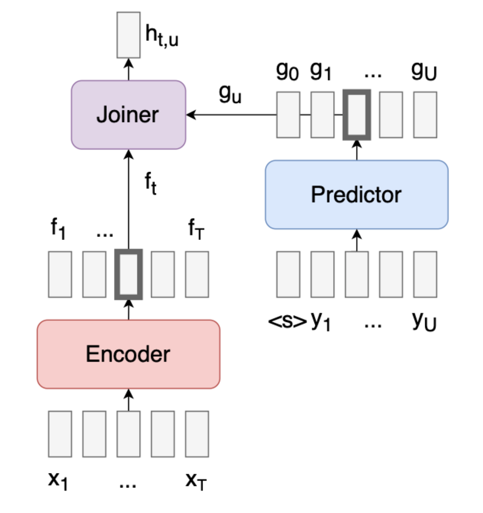
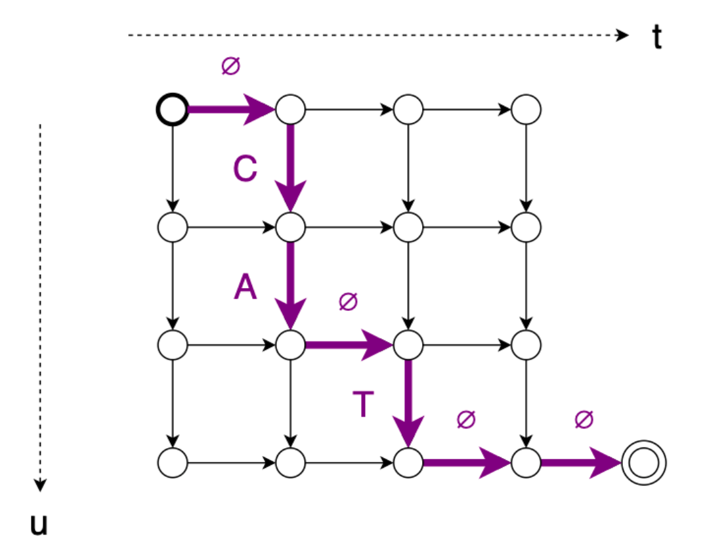

# Transducer
Transducer又叫RNN-T，T就是Transducer的意思。先来回顾下CTC的问题：
1. CTC的每个时间步的输出是独立的，可以视作缺少语言模型，可能转写出来的序列不符合上下文连贯的表达。
2. CTC因为每帧要对应至少一个标签，所以只适合输入序列长于输出序列的情况，这种情况会限制下采样的倍数。因为下采样倍数太多，帧数会较少，导致输入比输出短，这种情况下无法使用CTC。
而Transducer可以解决这两个问题:
1. Transducer允许一个input对应多个output
2. 通过一个predictor网络实现LM  

Transducer的核心计算过程如图：  
    
因为$y_{u}$和$x_{i}$的时刻不同步了，需要制定$y$和$x$各自时间步的推进规则：  
首先明确transducer的输出规则，可以插入blank，但是字符本身不能像CTC一样重复：$z = \varnothing, C, A, \varnothing, T, \varnothing, \varnothing$  
1. 当$h_{t,u}$对应 $\varnothing$ 时，$x$的时间步推进一步：$t = t+1$  
2. 当$h_{t,u}$对应非$\varnothing$时，$y$的时间步推进一步：$u = u+1$  
3. $t = T+1$，计算完成。

training的计算规则。把$z = \varnothing, C, A, \varnothing, T, \varnothing, \varnothing$对应的转移图画出来。  

   
其实类似于CTC，可以从左上角走到右下角的所有路径都是合法的，但是transducer的转移规则更简单， 一个节点只能来自于左边节点或者上边节点。然后类比CTC的计算方式，就可以得到所有合法的路径的概率和。这样就可以完成训练。

推理的规则：transducer的greedy的解码相当简单，因为已经有了LM，直接按照两个维度的时间步推进，消耗完x的时间步即可，得到的结果也是比较符合LM的上下文依赖的。