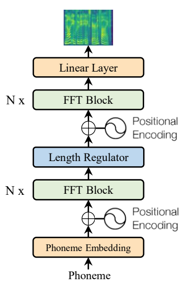
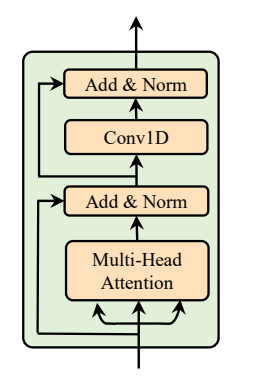
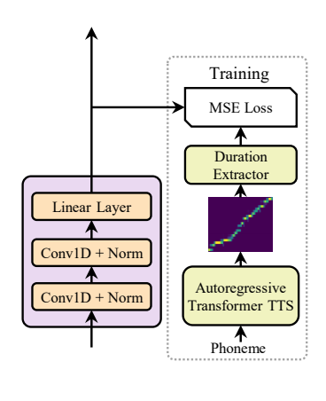

# FastSpeech [paper](https://arxiv.org/pdf/1905.09263)

## 背景
TTS的合成目前一般通过两个步骤生成：1. text(phoneme)转换成梅尔谱 2. 使用vocoder把梅尔谱转换成语音 [Griffin-Lim](http://hil.t.u-tokyo.ac.jp/~kameoka/SAP/papers/Griffin1984__Signal_Estimation_from_Modified_Short-Time_Fourier_Transform.pdf), [WaveNet](https://arxiv.org/pdf/1609.03499), [Parallel WaveNet](https://arxiv.org/pdf/1711.10433), [WaveGlow](https://arxiv.org/pdf/1811.00002), [WORLD](https://github.com/mmorise/World), [ClariNet](https://openreview.net/pdf?id=HklY120cYm)
已有方法的问题：
1. 梅尔谱是自回归的，所以推理很慢
2. 生成的语音不够鲁棒（经由梅尔谱的级联，并且梅尔谱质量不够高，也会导致语音遗漏和重复）
3. 生成的语音控制性较差。  

论文希望缓解以上三个问题，主要的贡献点：
1. 并行化生成梅尔谱
2. phoneme duration predictor实现phoneme和梅尔谱的对齐。对齐缓解了遗漏和重复问题
3. length predictor可以通过控制phoneme duration来实现韵律的控制

## 模型
### 解决思路
1. TTS中遗漏与重复的原因是phoneme和梅尔谱对齐得较差，那就解决对齐问题：使用predictor来预测每个phoneme frame对应多少个梅尔谱frame。预测出之后对phoneme的hidden state根据预测结果做整数倍的复制。以上模块称为length regulator模块。
2. Transformer结构中的全连接层与梅尔谱生成任务不是很匹配，因为梅尔谱生成更加依赖局部信息，因此提出FFT（Feed-Forward Transformer）,把全连接模块变成1D Conv模块。
3. 对齐信息以及梅尔谱的来源：训练了一个自回归TTS作为teacher进行蒸馏。（其中对齐部分比较麻烦, 后面会详解介绍, 但是在fastspeech2中其实去除了这个teacher, 直接使用MFA工具对真实语音提取需要的对齐信息以及梅尔谱）
4. 用自回归模型蒸馏非自回归模型实现并行加速
### 扩展
当有了length regulator模块后，可以通过调整对齐的结果，比如
1. 对对齐的倍数乘以系数实现生成速度的控制
2. 修改space的倍数实现韵律的控制

## 图示
### 整体结构
   
还对自回归TTS的sequence-level knowledge进行蒸馏。（蒸馏的目标是梅尔谱），其实没太理解这里的梅尔谱和直接抽取的有什么区别？对应的[论文](https://arxiv.org/abs/1606.07947)

### FFT block

### length regulator
<video controls width="1080">
    <source src="https://pub-0041adf75d3e4d7d9a5dce556e21001c.r2.dev/audio-token-video/Length_regulator.mp4" type="video/mp4">
    MP4 video is not supported by the web browser.
</video>

### duration predictor
   
先训练一个TTS的自回归模型，使用transfromer模型(multihead attention). 然后在各个attention矩阵上衡量与对角阵（非方阵）的相似度（叫对角度更合适）。选择对角度最大的attention，进行变形argmax后得到duration predictor的监督信息。

## 实验结果
评测维度设置为语音质量，推理速度，鲁棒性（对重复和遗漏的解决），可控性。
### 1. 语音质量
| Method                       | MOS          |
|------------------------------|--------------|
| GT                           | 4.41 ± 0.08  |
| GT (Mel + WaveGlow)          | 4.00 ± 0.09  |
| Tacotron 2 [22] (Mel + WaveGlow) | 3.86 ± 0.09  |
| Merlin [28] (WORLD)          | 2.40 ± 0.13  |
| Transformer TTS [14] (Mel + WaveGlow) | 3.88 ± 0.09  |
| FastSpeech (Mel + WaveGlow)  | 3.84 ± 0.08  |

结论
- Transformer TTS效果最好，但是是自回归生成的
- FastSpeech是非自回归方法，效果只降了一点点

### 2. 推理速度
| Method                                 | Latency (s)    | Speedup    |
|---------------------------------------|----------------|------------|
| Transformer TTS [14] (Mel)            | 6.735 ± 3.969  | /          |
| FastSpeech (Mel)                      | 0.025 ± 0.005  | 269.40×    |
| Transformer TTS [14] (Mel + WaveGlow) | 6.895 ± 3.969  | /          |
| FastSpeech (Mel + WaveGlow)           | 0.180 ± 0.078  | 38.30×     |

结论
- 无论是否加vocoder，推理速度都加快了很多

### 3. 鲁棒性
| Method            | Repeats | Skips | Error Sentences | Error Rate |
|-------------------|---------|-------|-----------------|------------|
| Tacotron 2        | 4       | 11    | 12              | 24%        |
| Transformer TTS   | 7       | 15    | 17              | 34%        |
| FastSpeech        | 0       | 0     | 0               | 0%         |

结论
- 对遗漏和重复的问题解决非常好

### 4. 长度控制（不做详细介绍, 做法在模型中已经介绍过）

## 补充
消融实验

| System                                      | CMOS    |
|--------------------------------------------|---------|
| FastSpeech                                  | 0       |
| FastSpeech without 1D convolution in FFT block | -0.113  |
| FastSpeech without sequence-level knowledge distillation | -0.325  |

结论
- 主要关注下1D Conv的提升，证明了在梅尔谱生成任务上，局部性确实更加适合用卷积来建模，相比于全连接
