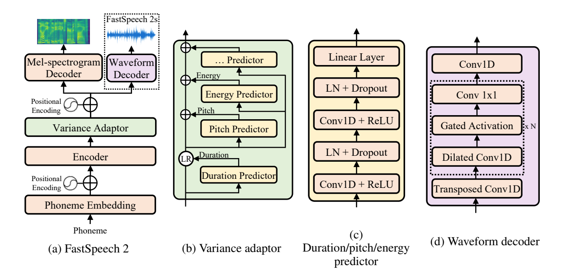

# FastSpeech2 [paper](https://arxiv.org/abs/2006.04558)

## 背景
与[fastspeech](./fastspeech.md)的背景大前提相同。额外提出了一个核心问题：文本和语音存在一对多问题，例如同样的文本可能对应音色，音量等不同的语音。如果不给模型准确的信息，最终合成的语音可能表现力一般且属性不可控。（通过）
fastspeech还存在的问题：
1. 蒸馏方式复杂且耗时
2. 可修改的信息较少，只有duration。并且duration的信息是用attention矩阵抽取的，可能不准确。
fastspeech2提出的解决方案：
1. duration信息不再依赖蒸馏，直接用GT训
2. 注入更多信息作为条件（pitch，energy，更加准确的duration）
探索性质的实验：提出了fastspeech2s，去除了vocoder，不适用显式梅尔谱，end2end生成wav。

## 模型
### 解决思路
1. 在生成过程注入更丰富的信息，使生成的语音可控属性更多
2. 注入信息怎么获取：a. infer时使用predictor从GT语音中预测 b. 训练时来自于GT

### 图示

### 处理流程
1. encoder把phoneme embedding序列转换成hidden state序列
2. adaptor对序列信息进行调整。包括length regulator的调整，其他信息的注入等
3. 梅尔谱decoder把调整后的hidden state转换成梅尔谱（*并行的）

3个predictor
1. duration predictor
    训练时使用 [Montreal forced alignment](https://montreal-forced-aligner.readthedocs.io/en/latest/) 来从语音中获取。
    predictor的预测方式，输入是文本转换的phoneme序列的hidden state, 输出是每个phoneme对应的梅尔谱的数量。对hiddens state的作用方式和fastspeech一致。
2. pitch predictor
    训练和推理都做的事情：对pitch F0进行256值的量化，然后对256值做embedding，然后把embedding加到expanded hidden state上。
    predictor的预测方式，输入是文本，输出是pitch contour做完CWT（continuous wavelet transform）的谱, 做CWT的原因是pitch contour变动太大，做训练目标不合适。在infer时，把预测结果做iCWT，得到pitch contour，在通过上面步骤把embedding加进去。
3. energy predcitor
    训练和推理时的做法：把每帧的STFT的amplitude的L2-norm作为energy，也是通过256值量化后变换成embedding后加入expanded hidden state

fastspeech2的后续做法：并行解码出梅尔谱，送给vocoder转换成语音
fastspeech2s的后续做法，不解码梅尔谱，直接用waveform decoder解码出wav

问题：其实这里也会过拟合到训练集，如果要操控属性，是否可以通过对量化后的值扰动的方式进行？

## 实验和结果
### 评估
语音质量，训练速度，属性控制，duration控制 几个维度
#### 语音质量
| Method                        | MOS          |
|-------------------------------|--------------|
| GT                            | 4.30 ± 0.07  |
| GT (Mel + PWG)                | 3.92 ± 0.08  |
| Tacotron 2 (Shen et al., 2018) (Mel + PWG) | 3.70 ± 0.08  |
| Transformer TTS (Li et al., 2019) (Mel + PWG) | 3.72 ± 0.07  |
| FastSpeech (Ren et al., 2019) (Mel + PWG) | 3.68 ± 0.09  |
| FastSpeech 2 (Mel + PWG)      | 3.83 ± 0.08|
| FastSpeech 2s                 | 3.71 ± 0.09  |

结论(PWG指的是Parallel WaveGAN)：
1. fastspeech2的效果不错
2. fastspeech2s与一代的自回归模型效果基本持平（Transformer TTS） 

#### 训练速度
| Method                       | Training Time (h) | Inference Speed (RTF) | Inference Speedup |
|------------------------------|-------------------|-----------------------|-------------------|
| Transformer TTS (Li et al., 2019) | 38.64            | 9.32 × 10⁻¹           | /                 |
| FastSpeech (Ren et al., 2019)    | 53.12            | 1.92 × 10⁻²           | 48.5×             |
| FastSpeech 2                    | 17.02            | 1.95 × 10⁻²           | 47.8×             |
| FastSpeech 2s                   | 92.18            | 1.80 × 10⁻²           | 51.8×             |

结论：
1. fastspeech2的训练不需要teacher model，所以快了很多
2. fastspeech2s的训练慢是因为没有用vocoder，相当于包含了新训一个vocoder的时间，所以不参与比较

#### 属性控制

| Method             | σ    | γ     | K      | DTW   |
|--------------------|------|-------|--------|-------|
| GT                 | 54.4 | 0.836 | 0.977  | /     |
| Tacotron 2         | 44.1 | 1.28  | 1.311  | 26.32 |
| TransformerTTS     | 40.8 | 0.703 | 1.419  | 24.40 |
| FastSpeech         | 50.8 | 0.724 | -0.041 | 24.89 |
| FastSpeech 2       | 54.1 | 0.881 | 0.996 | 24.39 |
| FastSpeech 2 - CWT | 42.3 | 0.771 | 1.115  | 25.13 |
| FastSpeech 2s      | 53.9 | 0.872 | 0.998  | 24.37 |

结论：
1. fastspeech2和fastspeech2s的语音更加接近于GT
2. fastspeech2s因为训练了waveform decoder，所以在某些维度上更加适配本任务
3. CWT指的是（continuous wavelet transform）, 该图表中没有显示出优势，但是论文补充了额外的MOS比较，在2和2s上，加了CWT后，MOS评分分别有0.185和0.201的上升。说明对听感是有提升的。

#### duration控制
| Method                     | Δ (ms)  |
|----------------------------|---------|
| Duration from teacher model | 19.68   |
| Duration from MFA           | 12.47   |

结论：MFA更准

| Setting                              | CMOS    |
|--------------------------------------|---------|
| FastSpeech + Duration from teacher   | 0       |
| FastSpeech + Duration from MFA       | +0.195  |

结论：MFA得到的duration训练出来的语音质量也更好

### 消融实验

| Setting                         | CMOS    |
|---------------------------------|---------|
| FastSpeech 2                    | 0       |
| FastSpeech 2 - energy           | -0.040  |
| FastSpeech 2 - pitch            | -0.245  |
| FastSpeech 2 - pitch - energy   | -0.370  |

| Setting                         | CMOS    |
|---------------------------------|---------|
| FastSpeech 2s                   | 0       |
| FastSpeech 2s - energy          | -0.160  |
| FastSpeech 2s - pitch           | -1.130  |
| FastSpeech 2s - pitch - energy  | -1.355  |

结论：还得加pitch和energy