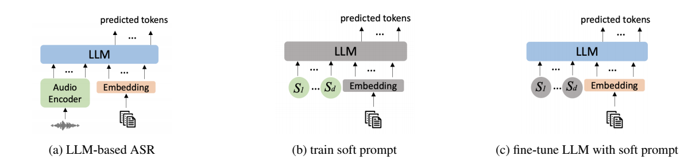

# effective text adaptation for llm-based asr through soft prompt fine-tuning [paper](https://arxiv.org/abs/2412.06967)
## 背景
1. 目前有部分ASR的工作是基于LLM的，但是在一些特定领域的识别却不好，希望能在这些领域提升识别效果，但是如果从ASR的数据角度出发，paired data获取的成本很高，但是无监督的文本数据获取难度比较低。如何高效使用这些数据是论文希望回答的问题。
2. 比较直接的使用方法，直接使用这些in domain数据finetune LLM，然后在LLM上在调优。如果ASR的训练量较大，那么调优成本会比较高。
3. 一些in domain数据的必要性：在部分entity很重要的特定领域，一般的ASR比较不容易理解这种领域的数据。（表现上应该是较高的WER和EER[Entity error rate]）。但是这种领域的纯文本数据相对于文本语音pair数据较好获取，因此有必要探讨如何高效利用这种数据。（有点像热词？）
4. TTS的方法用来构造paired 数据效果是不错的。就是计算资源要求太大。所以现在文本辅助的方式是对这种方案的一种改进。

论文针对以上背景和问题提出的解决思路，使用in domain文本数据调优模型，但是希望在一定程度上避免与ASR任务的不一致性：
1. 固定text embedding和LLM，使用text训练一个speech prompt。
2. 固定speech prompt，使用text调优text embedding和LLM。

## 模型

### 方法图示

### 数据与训练过程说明
1. 数据说明
- paired data: $C = \{ (\mathbf{a}_s, \mathbf{x}_s) \}$, 其中x是文本数据，a是对应的语音数据
- in domain text data: $Q = \{ \mathbf{x}_t \}$, 这里的x和paired data的x分布不同。上面算是通用文本数据，这里是in domain数据。   
2. finetune
结合使用C和Q，通过Pre fine-tune和Post fine-tune训练ASR的过程：  
- Pre fine-tune: 先用Q来ft LLM, 然后使用C基于LLM来训练ASR。论文观点是ft阶段其实注入了一些in domain信息，但是ASR训练只使用了C，可能会对Q的信息遗忘。（我们的ASR训练方式中有夹杂对文本的训练）
- Post fine-tune: 第一步完成后，在Q上再调优ASR的decoder。并且在调优的时候针对speech prompt有两种选择，a. 不提供prompt b. 提供空的prompt。论文观点是这种调优方式和ASR的训练方式有一些差别，可能导致Q的信息无法有效注入或者注入效率较低。

3. soft prompt
伪speech embedding来弥补这个gap（这个策略称为soft prompt）。
- 固定text embedding和LLM。选定一个pesudo audio embedding的长度，然后在Q上训练出这个pesudo audio embedding
- 基于这个embedding，在Q上ft decoder。（这里的表述和图示有些区别，图示是ft了text embeddding和LLM，除非理解成这两个模块共同组成decoder）
- infer时去掉pesudo audio embedding。
因为不同的文本数据的长度不同，所以soft prompt的长度设置成可变的是更合理的。论文中把这个长度作为超参，在不同的领域上采用不同的配置。（是不是可以更加细化，不同长度的文本对应不同长度的soft prompt，整个数据集用一个粒度感觉还是太大了）

## 实验结果
数据：video其实指的是paired data，只有语音和文本。music和chatbot是只有文本。
模型设置：
- baseline： 基于LLaMA训练的ASR模型。
- ft策略：a. 只使用Pre fine-tune b. 也使用Post fine-tune
- prompt策略： a. empty prompt （用[INST]在文本前填充） b. upsample 和 mask（对token做一些1或2倍的复制，然后随机mask掉50%） c. 论文中提出的soft prompt
- external LM：还用了外部LM介入的方式，用in-domain text训一个LM，然后在解码器的部分和外部LM的score进行插值修正解码结果。external LM的结构是6层LSTM，参数量是50M

1. ft策略对比
| Text adaptation  | music 1 (WER / EER) | music 2 (WER / EER) | music 3 (WER / EER) |
|------------------|---------------------|---------------------|---------------------|
| N/A              | 19.34 / 38.88      | 13.62 / 29.82      | 18.92 / 33.70      |
| pre fine-tune    | 18.99 / 36.89      | 13.26 / 28.92      | 18.40 / 32.25      |
| post fine-tune   | **18.51 / 36.28**  | **12.90 / 27.80**  | **18.08 / 32.03**  |
结论：post fine-tune的策略更好

2. prompt策略对比
| Domain                 | Music 1 (WER/EER) | Music 2 (WER/EER) | Music 3 (WER/EER) | Chatbot (org. WER/EER) | Chatbot (tech. WER/EER) | Chatbot (food WER/EER) |
|------------------------|-------------------|-------------------|-------------------|-------------------------|--------------------------|-------------------------|
| N/A (base)            | 19.34 / 38.88    | 13.42 / 29.62    | 18.92 / 33.70    | 5.54 / 21.80           | 4.82 / 6.69             | 2.23 / 4.98            |
| no prompt             | 18.51 / 36.28    | 12.90 / 28.10    | 18.08 / 32.03    | 5.52 / 20.87           | 4.67 / 5.93             | 2.15 / 4.36            |
| empty prompt          | 18.72 / 36.43    | 13.02 / 28.14    | 18.02 / 31.86    | 5.55 / 21.03           | 4.70 / 6.23             | 2.19 / 4.67            |
| upsample and mask     | 18.86 / 36.60    | 13.16 / 28.42    | 17.98 / 31.86    | 5.48 / 20.87           | 4.72 / 5.93             | 2.16 / 4.82            |
| soft prompt (d=30)    | **18.27 / 35.90**| 12.65 / 27.60    | **17.69 / 30.92**| 5.42 / 20.38           | 4.60 / **5.63**         | 2.06 / 4.20            |
| soft prompt (d=50)    | 18.39 / 36.28    | **12.34 / 27.03**| 17.88 / 31.62    | **5.34 / 20.22**       | **4.56 / 5.63**         | **2.04 / 4.05**        |
结论：
- soft prompt的效果最好
- soft prompt的合适长度根据不同的任务有变化，但是整体看来50略微好于30。论文说做了更多的长度实验，更长的长度没有再带来更多收益。

3. external LM
| Domain              | Music 1 (WER/EER)    | Music 2 (WER/EER)    | Music 3 (WER/EER)    | Chatbot (org. WER/EER) | Chatbot (tech. WER/EER) | Chatbot (food WER/EER) |
|---------------------|----------------------|----------------------|----------------------|-------------------------|--------------------------|-------------------------|
| N/A (base)         | 19.34 / 38.88       | 13.42 / 29.62       | 18.92 / 33.70       | 5.54 / 21.80           | 4.82 / 6.69             | 2.23 / 4.98            |
| base + LM          | 17.99 / 35.76       | 12.32 / 27.46       | 17.66 / 30.62       | 5.45 / 20.22           | 4.77 / 5.93             | 2.12 / 4.36            |
| soft prompt        | 18.27 / 35.90       | 12.65 / 27.60       | 17.69 / 30.92       | **5.34** / 20.22       | 4.56 / 5.63             | **2.04 / 4.05**        |
| soft prompt + LM   | **17.58 / 35.52**   | **12.10 / 26.80**   | **17.36 / 30.49**   | 5.36 / **20.16**       | **4.49 / 5.34**         | 2.08 / 4.05            |
结论：external LM能在论文的方法上进一步带来一些提升
