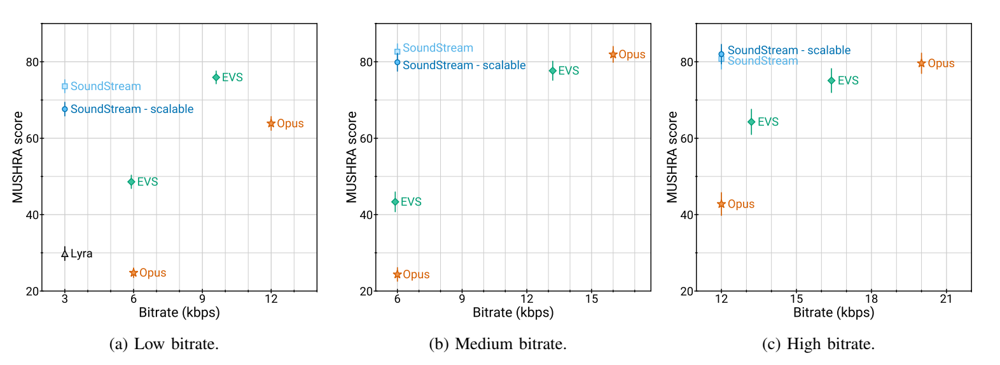

# SoundStream: An End-to-End Neural Audio Codec [paper](https://ar5iv.labs.arxiv.org/html/2107.03312?_immersive_translate_auto_translate=1)

## 目标：
1. 低码率传输
2. 根据通信情况码率可变
3. 实现去噪功能

codec形态：

| 模态     | 目标                    | 常见操作过程                        | 优势| 劣势|
|----------|------------------------|------------------------------------|-----|-----|
|waveform  |对波形进行尽可能的重建保真| 时域信号变频域,变换系数进行量化和编码,变换系数进行量化和编码|对语音信号无需做任何假设，可以处理一般信号|中高码率的恢复信号质量好，低码率容易产生伪影|
|parametric|尽可能保持变解码前后信号的听感一致|   -                        |低码率传输时听感保持较好|对信号做了分布的强假设，真实信号偏离假设分布可能较远|

使用ML的方式（可学习的量化模型），实现中低码率下codec过程中保持更好的听感。

## contribution:
1. 提出了RVQ
2. quantizer dropout, 使一个模型可以处理不同的码率
3. 相对于基于梅尔谱特征的方法，压缩的效率较高
4. 模型支持流式推理

论文中的中低码率范围是 3Kbps~18Kbps， 原始音频码率是24KHz

## 模型
输入：单声道的语音信号
步骤：
1. encoder把输入语音信号转换成embedding
2. RVQ使用多层codebook对embedding进行编码，编码结果是不同层的codebook的索引
3. decoder重建语音信号

训练方式：
1. end-to-end训练
2. 使用discriminator进行adversrial训练，结合重构loss
3. 使用一个condition siginal来控制是否进行去噪

RVQ dropout：随机选取前N个RVQ模块对embedding进行处理。（是一种结构化dropout）

所有的convolution都是因果的
使用了ELU激活单元，没有使用任何normalization
基于第一个batch的数据，使用K-means来初始化codebook

### 模型整体
<video controls width="1080">
    <source src="https://pub-0041adf75d3e4d7d9a5dce556e21001c.r2.dev/audio-token-video/SoundStream.mp4" type="video/mp4">
    MP4 video is not supported by the web browser.
</video>

### 编码过程
<video controls width="1080">
    <source src="https://pub-0041adf75d3e4d7d9a5dce556e21001c.r2.dev/audio-token-video/codebook_VQ.mp4" type="video/mp4">
    MP4 video is not supported by the web browser.
</video>

1. RVQ dropout是在示例过程中只取前N个RVQ, 有点类似于消除高频分量。

去噪（增强）的实现方式。（见第一个视频的最后部分），因为FiLM的[论文](https://ar5iv.labs.arxiv.org/html/1709.07871?_immersive_translate_auto_translate=1)还没细读，所以去噪部分暂时略过。

## 数据
训练数据有三种, 均为24KHz
1. 干净语音: LibriTTS dataset
2. 带噪语音: LibriTTS的干净语音和Freesound的噪声进行混合(peak normalization, 3s, -30dB~0dB)
3. 音乐: MagnaTagATune dataset  

测试数据, 以下四种数据中各抽取2~4s的数据50个clip, 共计200个clip
1. 从以上三种数据中构建测试集(算3种)
2. 带背景噪声的近场和远场语音

## 实验结果
评测指标
主观指标：[MUSHRA](https://www.itu.int/dms_pubrec/itu-r/rec/bs/R-REC-BS.1534-3-201510-I!!PDF-E.pdf)
客观指标：[PESQ](https://www.recursosvoip.com/docs/english/pap465.pdf) [POLQA](https://publications.tno.nl/publication/100912/RjNDE2/beerends-2013-perceptualII.pdf) [ViSQOL](https://static.googleusercontent.com/media/research.google.com/en//pubs/archive/39979.pdf)  

压缩率比较实验

RVQ超参选取实验(相同码率下)

| | | | |
|-|-|-|-|
|Number of quantizers|8|16|80|
|Codebook size N|1024|32|2|
|ViSQOL:arrow_up:|4.01 ± 0.03|3.98 ± 0.03|3.92 ± 0.03|

去噪实验, 指标为ViSQOL(没怎么看懂这个实验的说明)

|Input SNR|soundstream|soundstream->SEANet|SEANet->soundstream|
|-|-|-|-|
|0dB|2.93 ± 0.02| 3.02 ± 0.03| 3.05 ± 0.02|
|5dB|3.18 ± 0.02| 3.30 ± 0.02| 3.31 ± 0.02|
|10dB|3.42 ± 0.02| 3.51 ± 0.02| 3.50 ± 0.02|
|15dB|3.58 ± 0.02| 3.64 ± 0.02| 3.63 ± 0.02|

## 讨论
1. 论文中的带噪数据都是使用干净语音和噪声进行混合的，与真实带噪语音分布可能不太一样。可以尝试蒸馏高性能去噪模型：使用真实的带噪语音作为输入，该语音经过高性能去噪模型的输出作为重建的监督语音
2. batch不大时，RVQ的codebook初始化的值不太好，基于梯度直通[1](https://spaces.ac.cn/archives/6760/comment-page-6)[2](https://kexue.fm/archives/10489)的方式，训练应该很慢。  
    a. 是否可以考虑基于所有数据先训练一个encoder和残差K-means。（不一定有效，因为encoder没有训练好）
    b. 去除RVQ，直接训练codec；固定encoder，训练K-means，然后继续训练codec（希望缓解RVQ的训练缓慢的问题）
