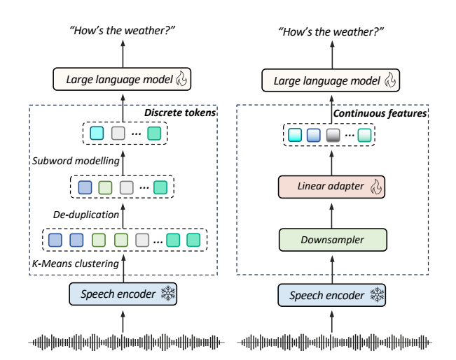
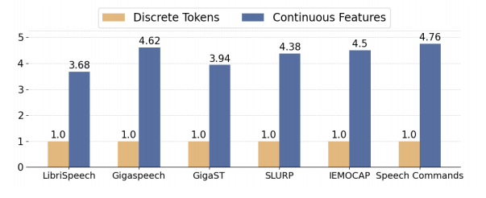
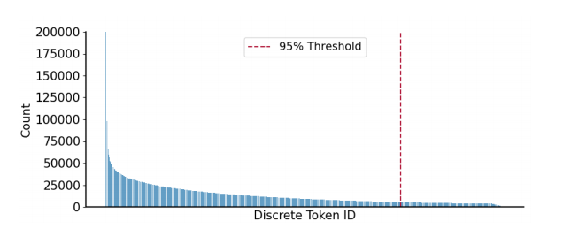
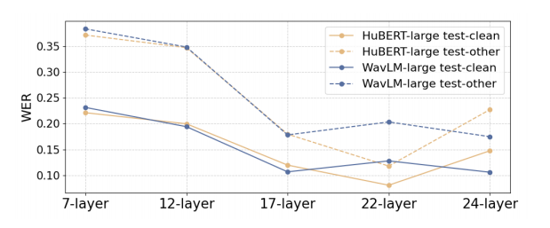

# A Comparative Study of Discrete Speech Tokens for Semantic-Related Tasks with Large Language Models [paper](https://arxiv.org/html/2411.08742?_immersive_translate_auto_translate=1)

## 目标
比较在SLM任务中, 使用离散token和连续token的优劣势

## 离散和连续在论文中的定义

1. 由feature extractor输出的token经过线性变化后直接使用的方式称为连续
2. 经过VQ和RVQ处理后再送入后续模型的token处理方式称为离散。（离散是token取值空间变得离散, 只能取有限个数的值。 离散值数量上界： $V_{upper\_bound} = \prod_i code\_num\_of\_layer_i$）

## 具体配置
1. 特征提取的模型: [Hubert](https://ar5iv.labs.arxiv.org/html/2106.07447?_immersive_translate_auto_translate=1)和[WavLM](https://ar5iv.labs.arxiv.org/html/2110.13900?_immersive_translate_auto_translate=1)
2. LLM基座: Qwen1.5-0.5B(全参数调优)和LLaMa3.1-8B(LORA调优)

## contribution 
1. 首个在一些语义相关任务上对比连续和离散token表征的论文
- Automatic Speech Recognition (ASR)
- Phoneme Recognition (PR)
- Keyword Spotting (KS)
- Spoken Intent Classification (IC) 
- Speech Translation (ST)
- Emotion Recognition (ER)
2. 对比维度中包含训练效率和数据规模。为其他任务的模型选择提供了较好的insight
3. 深入分析揭示了导致连续和离散表征的任务的性能差异的原因。(分析感觉不太够)

## 去重怎么做？
两篇参考blog [1](https://exactly-once.github.io/posts/token-based-deduplication/) [2](https://aquibjkhan.medium.com/deduplication-near-duplicate-a-short-guide-b7ecbf348f97)  
claude:
> 1. 特征表示去重  
> - 对语音特征向量进行聚类和去重
> - 使用余弦相似度或欧氏距离计算特征向量间的相似度
> - 设置相似度阈值，将高度相似的语音token合并或删除
> 2. 语音片段去重
> - 基于声学特征的相似性分析
> - 使用动态时间规整算法(DTW)计算语音片段间的相似度
> - 对连续或高度相似的语音片段进行合并或删除
> 3. token级别去重策略
> - 对连续重复的语音token进行压缩
> - 例如，连续5个相同的语音token可以压缩为1个
> - 保留基本语义的同时减少冗余信息
> 4. 统计学方法
> - 计算每个语音token的出现频率
> - 根据频率设置去重阈值
> - 移除低频或高频的冗余token
> 5. 上下文相关去重
> - 考虑语音token的上下文语境
> - 仅在上下文不重要时进行去重操作
> - 避免删除对语义至关重要的重复信息

## 数据与训练
|表征|音频采样率|centroids|BPE vocabulary size|downsampling rate|
|-|-|-|-|-|
|离散|16KHz|2000|6000|-|
|连续|16KHz|-|-|2|

## 实验结果与结论
1. 离散表征中K-menas centriods数量和BPE词表大小对ASR任务的识别结果的影响

| SSL model     | Manipulation |Manipulation|WER:arrow_down:|WER:arrow_down:|
|---------------|--------------|------------|---------------|---------------|
|               | K-Means      | BPE size   | test-clean | test-other |
| Hubert-Large  | k=1000       | -          | 7.48       | 12.82      |
|               | k=2000       | -          | 5.02       | 10.55      |
|               | k=3000       | -          | 5.01       | 10.51      |
|               | k=2000       | 4000       | 4.99       | 10.78      |
|               | k=2000       | 6000       | 4.56       | 9.79       |
|               | k=2000       | 8000       | 5.04       | 11.20      |
| WavLM-large   | k=1000       | -          | 5.33       | 10.54      |
|               | k=2000       | -          | 5.04       | 10.11      |
|               | k=3000       | -          | 5.03       | 10.34      |
|               | k=2000       | 4000       | 4.88       | 10.62      |
|               | k=2000       | 6000       | 4.72       | 10.45      |
|               | k=2000       | 8000       | 4.62       | 10.82      |

结论：
1. 离散表征的码本大小增加会提升性能。  

讨论：
为什么要做离散化？（这个问题需要调研更多关于VQ的论文来回答）
但是离散化后的学习空间一定是变小了。
- 学习空间变小，易于学习（和模型的拟合能力会相关）
- 离散表征相对于连续表征有量化损失，没有连续表征的能力强。
- 增大codebook实际上是让离散表征更加靠近连续表征。
- 模型能力是否会被离散化约束。（LLM选择离散化是因为文本这种符号化信息本身是离散的，并不代表transformer结构在处理更善于处理离散化信息相对于连续信息）
- 当语音训练数据够多时，借助LLM时是否还需要进行离散化？

不同任务上两种特征提取模型的结果对比

| SSL model | Token type | ASR (WER:arrow_down:) Librispeech|ASR (WER:arrow_down:) Gigaspeech | PR (PER:arrow_down:) | ST (BLEU:arrow_up:) | KS (ACC:arrow_up:) | IC (ACC:arrow_up:) | ER (ACC:arrow_up:) |
|----------|------------|------------|-----------|------------|-----------|-----------|-----------|-----------|
| HuBERT-Large | Discrete | 4.56 / 9.79 | 19.40 | 9.69 | 22.75 / 20.14 | 93.70 / 93.85 | 57.04 | 38.65 |
| WavLM-Large | Discrete | 4.72 / 10.45 | 16.34 | 9.64 | 24.62 / 21.22 | 92.87 / 92.45 | 59.96 | 37.98 |
| HuBERT-Large | Continuous | 4.91 / 6.43 | 17.45 | 12.84 | 26.63 / 25.42 | 95.38 / 95.70 | 76.84 | 56.72 |
| WavLM-Large | Continuous | 2.92 / 4.61 | 13.96 | 12.62 |  29.44 / 28.12 |97.76 / 97.36 |81.35 | 59.45 |

1. 小模型上，大多下游任务连续表征都好于离散表征。（Phoneme Recognition除外）
2. 连续表征上WavLM优于Hubert
3. WavLM-Large和continous结合的方式在在大多数任务上效果都是最优

收敛速度对比

1. 离散token相对于连续token收敛快很多。  
讨论：
- 离散token训练收敛快是合理的
- 增加连续token的收敛速度的策略：先用离散的训收敛, 然后去除VQ模块, 继续用连续token训练。

token利用不平衡性分析

1. 论文指出离散后的token有严重的数据不平衡问题(长尾效应严重)
2. 但是提出的针对这种问题的缓解办法是使用连续表征(听起来不合理)

讨论：
- 离散是连续的一种近似。离散在单个token上的不平衡性应该会对应在连续token表征的空间区域上的不平衡性。可能BPE这种方式能够对长尾效应有一定的缓解。

不同层级特征对应的WER

1. 不同层捕获的信息重点可能不同, 导致适配不同的任务  

讨论：

- 逐层分析（有点道理，可能不同的层在关注不同的信息，而特定的信息可能是适配于特定任务的）。那更合理的额方式应该是尝试对多层进行加权和，对权重采用grid search的方式来探索合适的权重配比（可能需要训练不同层特征的adaptor）
