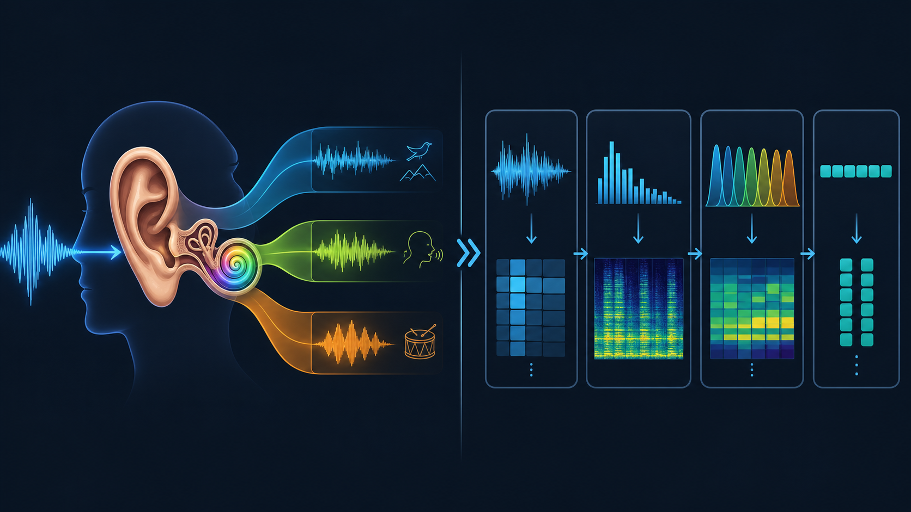
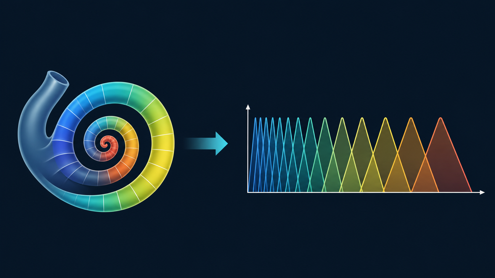
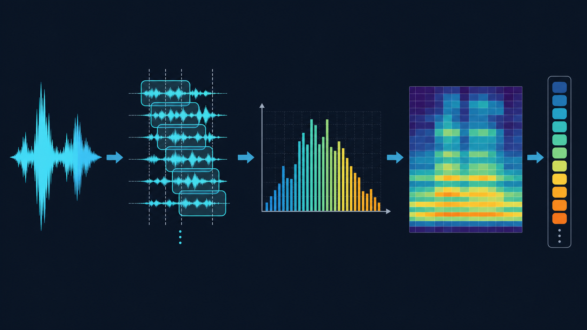

# 从人耳听语音到机器提取特征：为什么 Mel 谱和 MFCC 会有效

语音特征提取最容易被理解成一串工程步骤：

`分帧 -> 加窗 -> FFT -> Mel filter bank -> log -> DCT`

但如果只记流程，很容易不知道每一步到底在“保留什么信息”。更好的理解方式是把它和人耳听语音的过程放在一起看。

人耳并不是逐点读取空气压力波形。我们真正感受到的是声音里不同频率成分的强弱、这些成分随时间如何变化，以及声道共振带来的整体频谱形状。语音识别里的特征提取也在做类似的事：它不直接把原始波形丢给模型，而是把声音整理成更接近听觉感知、也更适合建模的表示。

这篇文章的重点不是说机器“完全模拟”了人耳，而是用人耳作为参照，理解为什么 `Mel spectrogram`、`filter bank` 和 `MFCC` 这些特征在语音任务里长期有效。

## 1. 人耳不是在看波形，而是在分析频率

麦克风采到的语音是一条随时间起伏的波形。它包含了很多信息，但对识别来说并不直观。

例如同一句话，换一个说话人、换一个麦克风、音量稍微变大或变小，波形采样点都会明显变化。可是人耳仍然能听出它是同一句话。说明我们听语音时，并不是依赖每个采样点的精确数值。

更关键的信息通常在频率结构里：

- 哪些频率能量强，哪些频率能量弱
- 这些频率能量在短时间内如何变化
- 元音的共振峰大致落在哪里
- 清辅音、擦音、爆破音是否带来高频或瞬态变化

所以语音特征提取的第一层思想就是：不要只看波形本身，要把声音拆成频率成分来看。

这对应到机器处理，就是 `FFT` 或 `STFT`。

## 2. 为什么要分帧：人耳也是连续地看短时间变化

语音不是静止信号。一个音节内部会变化，一个词和下一个词之间也会变化。如果对整段语音只做一次频谱分析，时间上的变化会被混在一起。

但在很短的时间内，比如 `20ms ~ 30ms`，语音可以近似看成稳定的。于是工程上会把音频切成短帧：

- 常见帧长：`25ms`
- 常见帧移：`10ms`
- 每帧乘窗函数，降低边界截断带来的频谱泄漏

这一步和听觉直觉很一致：我们不是等一句话结束后才一次性理解声音，而是在连续接收一个个短时间片段，并把这些片段串起来形成语音感知。

已有文章中的这张图展示了波形如何被切成短帧并加窗。

分帧之后，每一帧都可以做频谱分析。把很多帧的频谱按时间排列起来，就得到频谱图。

## 3. 耳蜗像一组滤波器，filter bank 也是一组滤波器

人耳里最重要的结构之一是耳蜗。可以粗略理解为：耳蜗的不同位置对不同频率更敏感。低频和高频不会被完全等价地处理，而是会在听觉系统中形成一种频率分解。

这和 `filter bank` 的思想很像。

`filter bank` 是一组带通滤波器。每个滤波器负责统计一个频率范围内的能量：

$$
E_m = \sum_k P[k] H_m[k]
$$

其中 $P[k]$ 是功率谱，第 $m$ 个滤波器是 $H_m[k]$，输出 $E_m$ 就是这一段频带的能量。

这一步做了两件事：

1. 把 FFT 中很细的频率点汇总成更稳定的频带能量。
2. 让特征更关注“频带整体强弱”，而不是每一根细小谐波的位置。

这对语音很重要。因为同一个元音由不同人说出来，基频和谐波位置会变，但声道形成的谱包络相对更稳定。filter bank 汇总频带能量后，能更好地保留这种稳定结构。

## 4. 为什么是 Mel 尺度：人耳对频率的感知不是线性的

如果频率从 `300Hz` 增加到 `600Hz`，人耳会觉得变化很明显。但如果从 `5300Hz` 增加到 `5600Hz`，虽然同样增加了 `300Hz`，主观感受并不一样。

这说明人耳对频率的分辨率不是线性的。低频区域通常分得更细，高频区域相对更粗。

Mel 尺度就是为了近似这种听觉特性。常见公式是：

$$
\text{mel}(f) = 2595 \log_{10}\left(1 + \frac{f}{700}\right)
$$

它带来的结果是：

- 低频滤波器更密
- 高频滤波器更疏
- 特征的频率轴更接近听觉感知

因此，`Mel filter bank` 不是随便设计的一组滤波器。它背后的直觉是：既然人耳不是线性地感知频率，机器也没有必要在线性 Hz 轴上平均地分配注意力。

## 5. 为什么要取 log：响度感知也不是线性的

人耳对响度的感知同样不是线性的。声音能量翻倍，不等于主观上“听起来也翻倍”。

所以在 Mel filter bank 得到每个频带的能量之后，通常会取对数：

`Mel energy -> log-Mel`

取 log 有三个好处：

- 压缩动态范围，避免大能量频带完全主导特征
- 更接近人耳对响度的非线性感知
- 把一些乘性影响转成加性影响，后续建模更方便

把每一帧的 `log-Mel` 沿时间拼起来，就是常说的 `Mel spectrogram`。

已有技术图里可以看到，从线性 STFT 到 Mel 谱，再到 MFCC，信息表示在逐步抽象。

## 6. MFCC：把听觉频带能量进一步压缩成谱包络

MFCC 比 `log-Mel` 多做了一步 `DCT`：

$$
\text{MFCC} = \text{DCT}(\log\text{-Mel})
$$

如果说 `log-Mel` 是“按听觉尺度整理后的频带能量”，那么 MFCC 更像是在这个基础上继续提炼出整体形状。

低阶 MFCC 通常对应变化较慢的部分，也就是频谱包络；高阶 MFCC 更容易包含快速起伏的细节，比如谐波造成的局部波动。传统语音系统常保留前 `12` 或 `13` 维 MFCC，就是因为很多语音识别所需的稳定信息集中在低阶部分。

这张图展示了只保留不同数量的低阶 MFCC 后，重建出来的 log-Mel 形状。保留维度越少，越像是在抓平滑的整体外形。

从听觉类比看，MFCC 做的不是“听得更细”，而是把对识别更稳定的谱包络压缩出来。

## 7. 一张对照表：人耳做了什么，算法做了什么

| 人耳/听觉系统关注点 | 特征提取中的对应步骤 | 作用 |
| --- | --- | --- |
| 连续感知短时间变化 | 分帧、帧移 | 把非平稳语音拆成短时近似稳定片段 |
| 对频率成分敏感 | FFT / STFT | 从波形转到频率表示 |
| 耳蜗不同位置响应不同频率 | filter bank | 汇总不同频带的能量 |
| 低频分辨率更细，高频更粗 | Mel 尺度 | 让频率轴更接近听觉感知 |
| 响度感知非线性 | log 压缩 | 压缩动态范围，突出相对变化 |
| 更关注稳定的音色和共振结构 | MFCC 低阶系数 | 提炼谱包络，弱化部分细碎波动 |

这张表可以帮助记住整个流程：

`波形 -> 短时频谱 -> Mel 频带能量 -> log-Mel -> MFCC`

它不是一串孤立步骤，而是在逐步把声音变成更接近“听觉上有意义”的表示。

## 8. 但机器并不等于人耳

用人耳做类比很有帮助，但也要避免过度理解。

`Mel spectrogram` 和 `MFCC` 只是借鉴了听觉系统的一些规律，例如频率非线性和响度非线性。它们并没有完整模拟耳蜗、听神经、大脑皮层，也不会自动理解音素、词义或上下文。

现代端到端 ASR 里，模型也经常直接使用 `log-Mel` 或 `fbank`，让神经网络自己学习后续变换，而不一定再手工做 DCT 得到 MFCC。即便如此，Mel 频带和 log 压缩仍然很常见，因为它们提供了一个稳定、紧凑、符合听觉直觉的输入表示。

所以更准确的说法是：

> 语音特征提取不是复制人耳，而是把人耳有效利用的信息，用工程上稳定可计算的方式表达出来。

## 9. 总结

如果只看原始波形，语音是一串高速变化的采样点；如果从听觉角度看，语音更像是一组随时间变化的频率能量结构。

这正是音频特征提取的核心：

1. `分帧`：跟踪短时间变化。
2. `FFT/STFT`：把波形拆成频率成分。
3. `Mel filter bank`：像耳蜗一样按频带汇总能量。
4. `log`：模拟响度感知并压缩动态范围。
5. `MFCC`：进一步提炼稳定的谱包络。

如果只记一句话：

`Mel 谱是在听觉尺度上整理频谱，MFCC 是在 Mel 谱上进一步压缩出谱包络。`

理解了这层对比，`STFT -> Mel -> MFCC` 就不再是一串公式，而是一套把声音变成可识别信息的过程。

## 10. 参考

本文的写作角度受到 Jonathan Hui 的文章 [Speech Recognition: Phonetics](https://jonathan-hui.medium.com/speech-recognition-phonetics-d761ea1710c0) 启发，重点提炼其中“听觉感知与语音特征提取之间的关系”，并结合当前笔记中的 MFCC、Mel spectrogram 和 filter bank 内容重新组织。
