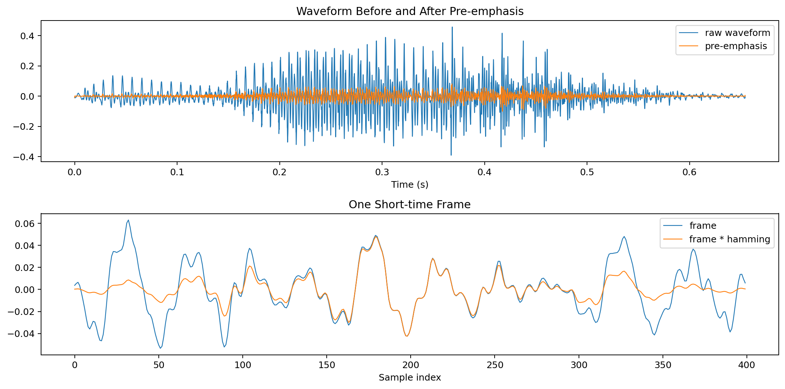
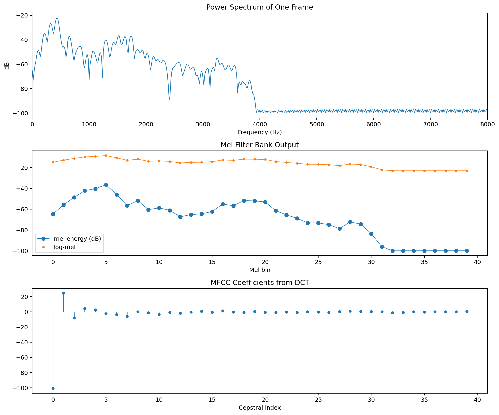
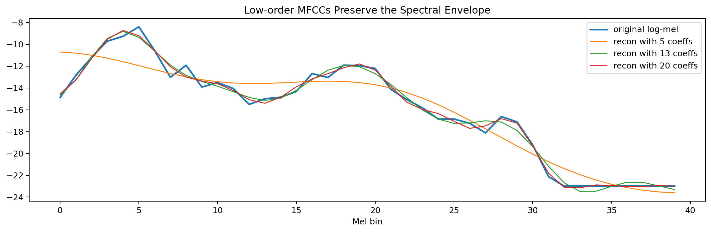
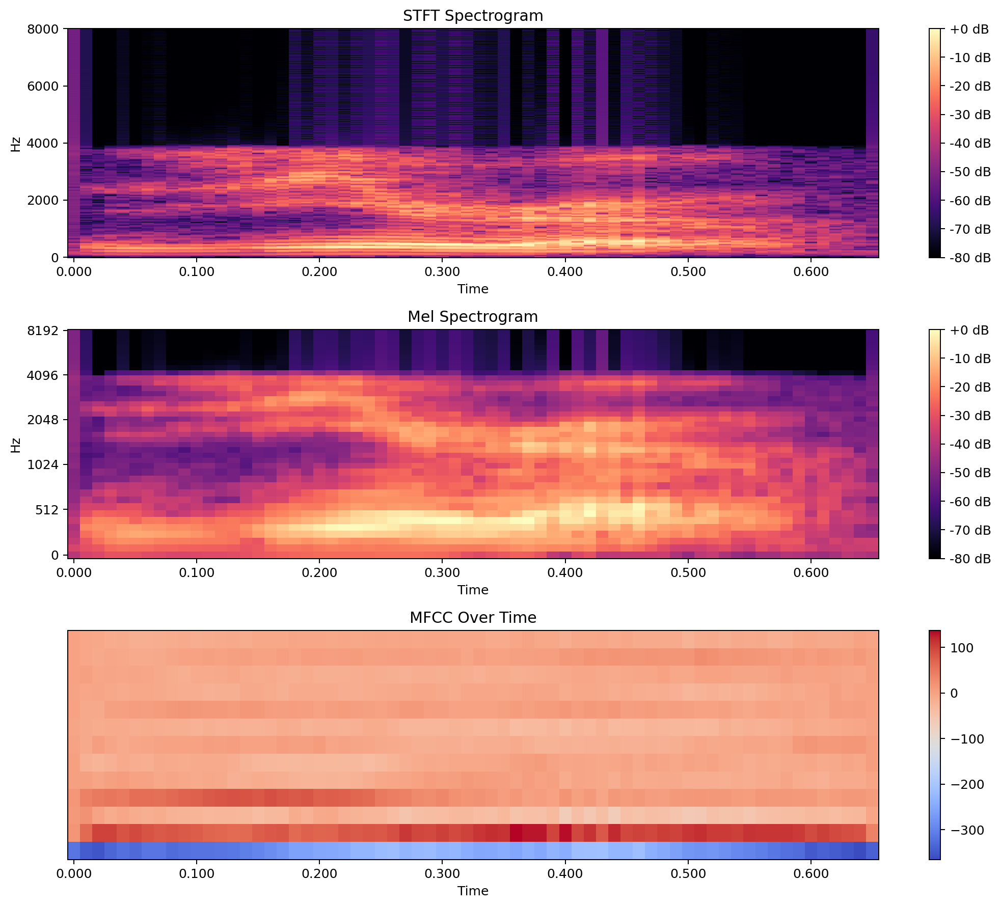

# 从人发声到 MFCC：一篇看懂语音是怎么变成特征的

语音特征提取这件事，本质上是在做一层层“压缩”和“抽象”。

人说话时，声带振动产生激励，声道形状决定哪些频率被增强，最后通过嘴唇辐射成空气中的声波。麦克风采到的波形，看起来只是随时间起伏的一条曲线，但对语音识别、说话人识别或情感分析来说，我们真正关心的不是“每个采样点具体是多少”，而是这段声音在短时间内的频谱结构，以及这种结构如何随时间变化。

本文按下面这条链路展开：

`发声机制 -> 波形 -> 短时频谱 -> filter bank -> Mel spectrogram -> MFCC`

重点会放在三个常见特征上：

- `filter bank` 特征
- `Mel spectrogram`（梅尔谱）
- `MFCC`（Mel-frequency cepstral coefficients）

文中的图片和代码都来自当前目录下的示例脚本，可直接复现。

## 1. 语音是怎么形成的

可以把人的发声过程粗略理解成一个“激励源 + 滤波器”的系统：

- 肺部提供气流
- 声带振动产生周期性激励，浊音尤其明显
- 声道形状对不同频率有不同增益，形成共振峰
- 嘴唇和鼻腔把声音辐射到空气中

这个观点非常重要，因为它解释了为什么后面的频谱特征有效：

- 激励源决定了基音和谐波结构
- 声道决定了谱包络，也就是“整体频谱外形”
- 不同音素最稳定、最有区分度的信息，通常更接近谱包络而不是某一根谐波

所以，语音特征提取并不是简单地对波形做压缩，而是在尽量保留“声道形状”相关信息，弱化对识别帮助较小的细节。

## 2. 为什么不能直接拿整段波形做分析

语音是典型的非平稳信号。整段音频从头到尾都在变化，但在很短的一段时间内，比如 `20ms ~ 30ms`，可以近似认为它是平稳的。

这就是短时分析的前提。

实际处理中，常见设置是：

- 帧长：`25ms`
- 帧移：`10ms`
- 每一帧乘一个窗函数，比如 `Hamming window`

这样做的意义是：

- 把持续变化的语音切成很多小片段
- 每个片段单独做频谱分析
- 最后得到“时间 x 频率”的二维表示

下面这张图先展示原始波形、预加重后的波形，以及单帧加窗前后的对比。



### 预加重是在做什么

语音的高频部分通常能量偏弱，而很多清辅音、齿擦音的重要信息恰好在高频区域。预加重常用一阶高通形式：

$$
y[n] = x[n] - \alpha x[n-1], \quad \alpha \approx 0.95 \sim 0.97
$$

它的作用可以理解为：

- 略微抬高高频
- 让频谱更平坦一些
- 减轻后续特征被低频能量主导的问题

## 3. 从一帧语音到频谱

对一帧加窗后的信号做 FFT，就能得到频谱。最常见的不是直接看复数频谱，而是看：

- 幅度谱
- 功率谱

功率谱描述了每个频率附近有多少能量。它已经比原始波形更接近“人耳和识别模型真正关心的信息”。

但这里还有两个问题：

1. FFT 的频率分辨率是线性的，人耳的感知却不是线性的。
2. 频谱里细密的谐波很多，直接拿来做建模既冗余，也容易受说话基频波动影响。

这时就轮到 `filter bank` 出场了。



## 4. 什么是 filter bank 特征

`filter bank` 可以理解成一组并排摆放的带通滤波器。每个滤波器只关注某一小段频率范围，把该频段的能量统计出来。

如果把功率谱记为 $P[k]$，第 $m$ 个滤波器记为 $H_m[k]$，那么对应的滤波器组能量大致是：

$$
E_m = \sum_k P[k] H_m[k]
$$

直观理解：

- FFT 给出的是非常细的频率采样点
- filter bank 把这些点重新汇总成更粗、更稳定的频带能量

在语音处理中，最常见的是三角形滤波器组：

- 相邻滤波器有重叠
- 低频更密，高频更稀
- 更接近人的听觉分辨率

很多时候，大家口中的 `fbank` 特征，指的就是“每一帧经过 Mel 滤波器组后的能量”，通常再接一个对数。

## 5. 为什么要用 Mel 尺度

人耳对频率的感知并不是线性的。比如从 `300Hz` 到 `600Hz` 的变化，和从 `5300Hz` 到 `5600Hz` 的变化，主观感受并不相同。

Mel 尺度是为了模拟这种听觉特性而设计的。常见的近似变换是：

$$
\text{mel}(f) = 2595 \log_{10}\left(1 + \frac{f}{700}\right)
$$

它带来的效果是：

- 低频区分得更细
- 高频分辨率更粗
- 整体更符合听觉感知

因此，在工程上，我们通常不会直接在 Hz 轴上做等宽统计，而是先建立一组 Mel 滤波器，再求每个 Mel 频带的能量。

这就得到 `Mel filter bank energies`，也就是很多系统中的 `fbank` 特征。

## 6. 为什么还要取对数

把 Mel 频带能量取对数后，会得到 `log-Mel` 特征，也就是常说的 `Mel spectrogram` 的核心表示。

取对数主要有三个作用：

- 更接近人耳对响度的感知方式
- 把巨大的动态范围压缩到更容易建模的区间
- 将“乘性影响”转成“加性影响”，便于后续变换

所以，一个很常见的链路是：

`功率谱 -> Mel filter bank -> log -> log-Mel`

如果把每一帧的 log-Mel 沿时间拼起来，就是梅尔谱图。

## 7. MFCC 到底比 Mel 谱多做了什么

MFCC 的核心只比 log-Mel 多一步：

`DCT`

即：

$$
\text{MFCC} = \text{DCT}(\log\text{-Mel})
$$

这一步有两个很实际的意义。

### 7.1 去相关

相邻 Mel 频带本来高度相关，因为语音谱包络通常是平滑变化的。DCT 会把这些相关的频带能量重新表达为一组系数，使特征维度之间更接近解耦。

这对早期的 GMM-HMM、对角协方差模型尤其友好。

### 7.2 把“平滑包络”和“快速细节”分开

低阶 MFCC 表示 log-Mel 上变化较慢的部分，可以理解成整体谱包络。

高阶 MFCC 更对应快速起伏的细节，比如谐波带来的锯齿状变化。

而识别中真正更稳定的信息，往往集中在低阶部分，所以经典配置通常只保留前 `12` 或 `13` 维 MFCC。

下面这张图展示了只保留部分低阶 MFCC 后，对原始 log-Mel 的重建效果。可以看到，维度越少，保留下来的越是“平滑外形”。



这正是 MFCC 广泛使用的关键原因：它不是简单压缩，而是在强调谱包络。

## 8. STFT、Mel spectrogram、MFCC 三者怎么区分

从信息量上看，可以把它们理解成一层层抽象：

### 8.1 STFT 频谱图

- 频率轴是线性的
- 保留了丰富的细节和谐波结构
- 信息最全，但冗余也更多

### 8.2 Mel spectrogram

- 把线性频率压缩到 Mel 频率
- 对局部频带做汇总
- 更贴近听觉，也更平滑

### 8.3 MFCC

- 在 log-Mel 基础上再做 DCT
- 更突出谱包络
- 维度更低，传统建模更方便

下面这张总览图把三者并排放在一起。



可以这样理解：

- `STFT` 像是“原材料”
- `Mel spectrogram` 像是“按听觉重新整理后的频谱”
- `MFCC` 像是“进一步抓住谱包络后的紧凑表示”

## 9. 一段最核心的 MFCC 代码

下面这段代码摘自当前目录中的示例，基本覆盖了从单帧功率谱到 MFCC 的关键步骤：

```python
import numpy as np
import librosa
from scipy.fftpack import dct

alpha = 0.97
x_pre = np.append(x[0], x[1:] - alpha * x[:-1])

frame_length = int(sr * 25 / 1000)
hop_length = int(sr * 10 / 1000)
frames = librosa.util.frame(
    x_pre, frame_length=frame_length, hop_length=hop_length
).copy()

window = np.hamming(frame_length).astype(np.float32)
frames_win = frames * window[:, None]

frame = frames_win[:, frames_win.shape[1] // 2]
n_fft = 1024
spec = np.fft.rfft(frame, n=n_fft)
power = (np.abs(spec) ** 2) / n_fft

n_mels = 40
mel_fb = librosa.filters.mel(
    sr=sr, n_fft=n_fft, n_mels=n_mels, fmin=0, fmax=sr / 2
)
mel_energy = mel_fb @ power
log_mel = np.log(mel_energy + 1e-10)

mfcc_full = dct(log_mel, type=2, norm="ortho")
mfcc = mfcc_full[:13]
```

如果只记这段流程，可以把它概括成：

`预加重 -> 分帧 -> 加窗 -> FFT -> 功率谱 -> Mel filter bank -> log -> DCT`

## 10. 工程里怎么选：fbank、Mel 还是 MFCC

这三个特征并不是互斥关系，而是抽象层次不同。

### 传统 ASR / 说话人识别

`MFCC` 很常见，因为它：

- 维度紧凑
- 对谱包络表达直接
- 和传统统计模型配合良好

### 现代深度学习 ASR

`log-Mel` 或 `fbank` 更常见，因为神经网络本身可以学习后续变换，不一定还需要手工做 DCT。

### 想保留更多细节时

可以优先看 `Mel spectrogram`，它通常比 MFCC 更“接近原始频谱”，可解释性也强。

## 11. 总结

语音特征提取可以理解为一个逐步抽象的过程：

1. 波形包含了所有信息，但不适合直接建模
2. 短时频谱把语音变成了局部频率结构
3. `filter bank` 对频带能量做汇总，降低冗余
4. `Mel spectrogram` 进一步贴近听觉感知
5. `MFCC` 用 DCT 提炼出更紧凑、更偏向谱包络的表示

如果只想记住一句话：

`Mel 谱是在听觉尺度上看频谱，MFCC 是对 log-Mel 再做一次压缩，重点保留谱包络。`

## 12. 参考与复现

本文相关文件位于当前目录：

- `MFCC_visible.py`
- `generate_feature_figures.py`

运行下面的命令即可重新生成文中的图片：

```bash
python docs/speech/feature_extract/generate_feature_figures.py
```
